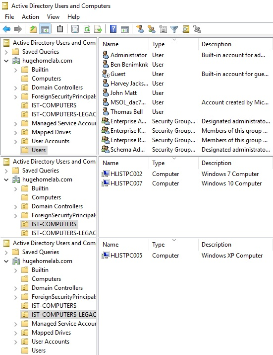
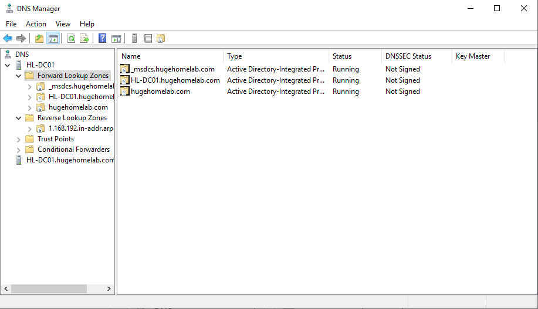
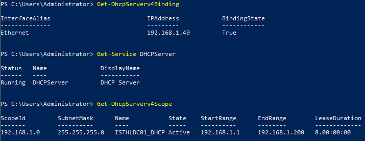
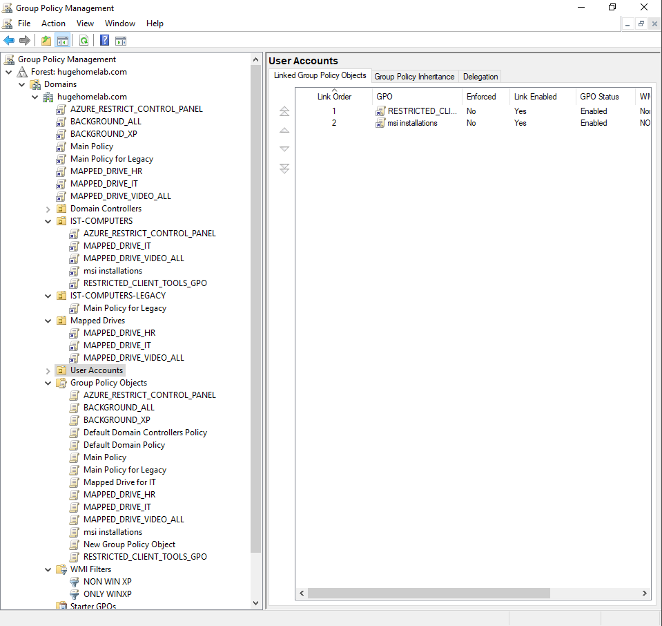
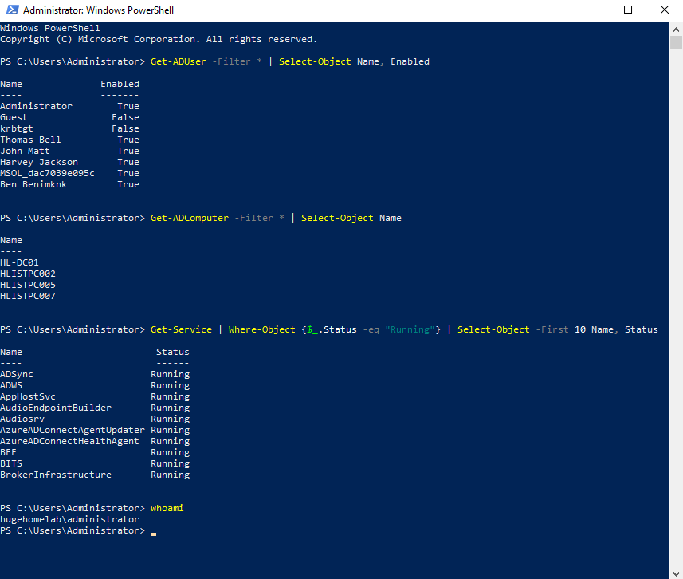
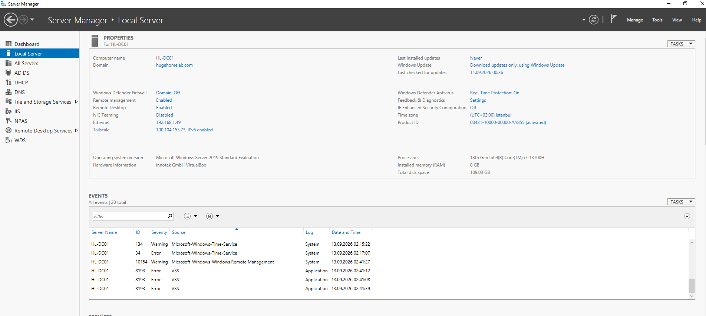
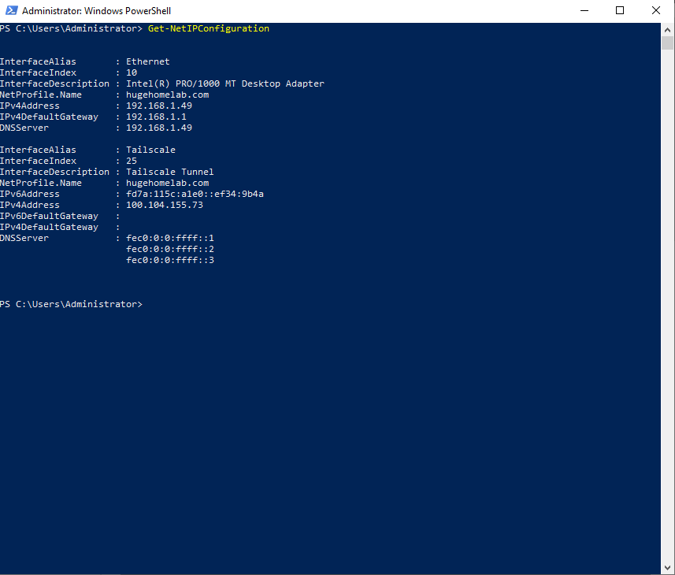

# 🪟 Active Directory Lab

A practical **on-premises Active Directory environment** built with Windows Server as part of my Cloud & DevOps homelab.

For this lab, I created a fictional **video editing agency** with three departments:

* 👥 **Human Resources**
* 🎬 **Video Editing**
* 💻 **IT**

Each department contains a dedicated user account and has its own **mapped network drive**.

The department drives are hosted on the Windows Server. Users connect to their assigned drive through the server, meaning the **server acts as the endpoint for the department's network file traffic**.

The environment was designed to demonstrate how a small organization can centrally manage **users, computers, network services, file access, security policies, and Windows clients** using Active Directory.

> **📌 Note:**
> You can find the more detailed version of this lab on my GitHub profile under **`hugehomelab`**.
> Unfortunately, I am currently unable to provide additional screenshots from the client computers. Due to hard drive damage, I no longer have access to any of the client machines used in this lab. The Windows Server remains accessible, so the available screenshots focus primarily on the server-side configuration and administration.


---

## 🏗️ Architecture


> On-premises network containing the Windows Server Domain Controller, Active Directory, DNS, DHCP, Group Policy, shared network drives, and domain-joined clients.

---

## 🏢 Active Directory Domain Services

The Windows Server is configured as an **Active Directory Domain Controller**, providing centralized identity and domain management.

### Covered

* Active Directory Domain Services (AD DS)
* Domain Controller
* Domain authentication
* Domain-joined computers
* Users and computer accounts
* Organizational Units
* Centralized administration

### 📸 Screenshot



---

## 🌐 DNS

DNS provides **internal name resolution** for the Active Directory domain and connected clients.

### Covered

* DNS Server
* Forward Lookup Zones
* DNS records
* Internal name resolution
* Active Directory-integrated DNS

### 📸 Screenshot



---

## 📡 DHCP

DHCP provides automatic network configuration for devices on the on-premises network.

### Covered

* DHCP Server
* DHCP Scope
* IP address allocation
* Default gateway
* DNS server configuration

### 📸 Screenshot



---

## 👤 Users & Computers

The lab includes practical management of **Active Directory users and computer accounts**.

The fictional company contains users representing the three departments:

* 👥 Human Resources
* 🎬 Video Editing
* 💻 IT

Each department is organized within the Active Directory structure and users are assigned according to their department.

### Covered

* User account management
* Computer accounts
* Domain membership
* Department organization
* Account properties
* Client administration

### 📸 Screenshot


> The **Computers** section is separated into two organizational groups because one contains a legacy **Windows XP** client. This separation helps distinguish the legacy system from the modern domain-joined computers.

---

## 📜 Group Policy

**Group Policy** is used as the central management mechanism for the lab.

A particular focus of this environment is the coexistence of **modern Windows clients and a legacy Windows XP machine**.

Because Windows XP cannot support all modern Windows policies and features, **WMI filters** are used to target specific policies only to compatible systems.

This allows certain settings, programs, and commands to be applied specifically to the Windows XP machine without affecting modern clients.

### GPOs implemented

* 🔐 **Main Lockdown Policy**
  Central security and restriction settings for domain clients.

* 💾 **Mapped Drive Policies**
  Department-specific network drives are automatically mapped for users.
  The shared department drives are hosted on the Windows Server, with each department receiving its assigned drive letter.

  The network drives are managed through Group Policy so users receive the correct server-hosted share automatically based on their department.

* 📦 **MSI / Program Installation Policies**
  Software packages are deployed to selected clients through Group Policy.

* ⚙️ **Settings & Feature Restrictions**
  Specific Windows settings and features are restricted according to the lab's requirements.

* ⚠️ **Logon Warning Message**
  A warning message is displayed when users sign in to the domain.

* 🔑 **Password Renewal Policy**
  Password expiration and renewal requirements are centrally managed.

* 🖼️ **Desktop Background Policy**
  A standardized desktop background is applied through Group Policy.

* 🧩 **WMI Filter Policies**
  WMI filtering is used to distinguish the legacy Windows XP machine from modern Windows systems and prevent incompatible policies from being applied to it.

### 📸 Screenshot



---

## 💻 PowerShell

**PowerShell** is used for Active Directory and Windows Server administration.

### Covered

* Active Directory PowerShell
* User management
* Computer management
* Windows Server administration
* Administrative automation

### 📸 Screenshot



---

## 🖥️ Windows Server Management

The lab also covers the administration required to operate the Windows Server environment.

The Windows Server acts as the central infrastructure point for the domain, providing services such as **Active Directory, DNS, DHCP, Group Policy, and department file shares**.

### Covered

* Server Manager
* Server roles and features
* Windows services
* Network configuration
* Administrative tools
* File sharing
* Server administration

### 📸 Screenshot



---

## 🌐 On-Premises Networking

The environment uses a local network to provide connectivity between the Windows Server infrastructure and domain-joined clients.

The Windows Server hosts the department network shares, while users access their assigned drives across the internal network.

For example:

```text
HR User
   │
   └── H: ───────┐
                 │
Video User       │
   │             │
   └── V: ───────┼──► Windows Server
                 │
IT User          │
   │             │
   └── I: ───────┘
```

The traffic for these shared drives terminates at the Windows Server hosting the corresponding shares.

### Covered

* LAN configuration
* Private IP addressing
* Subnetting
* Default gateway
* Internal DNS
* DHCP-based network configuration
* Client-to-server connectivity
* Server-hosted network shares
* Mapped network drives

### 📸 Screenshot



---

## 🛠️ Technologies

**Windows Server · Active Directory Domain Services · DNS · DHCP · Group Policy · WMI Filtering · Organizational Units · PowerShell · SMB File Sharing · Mapped Drives · On-Premises Networking**

---

## 📌 Lab Focus

This lab demonstrates practical experience with **on-premises Windows infrastructure and Active Directory administration**, including centralized identity management, network services, Group Policy, legacy client compatibility, software deployment, file sharing, mapped drives, server management, and PowerShell administration.
