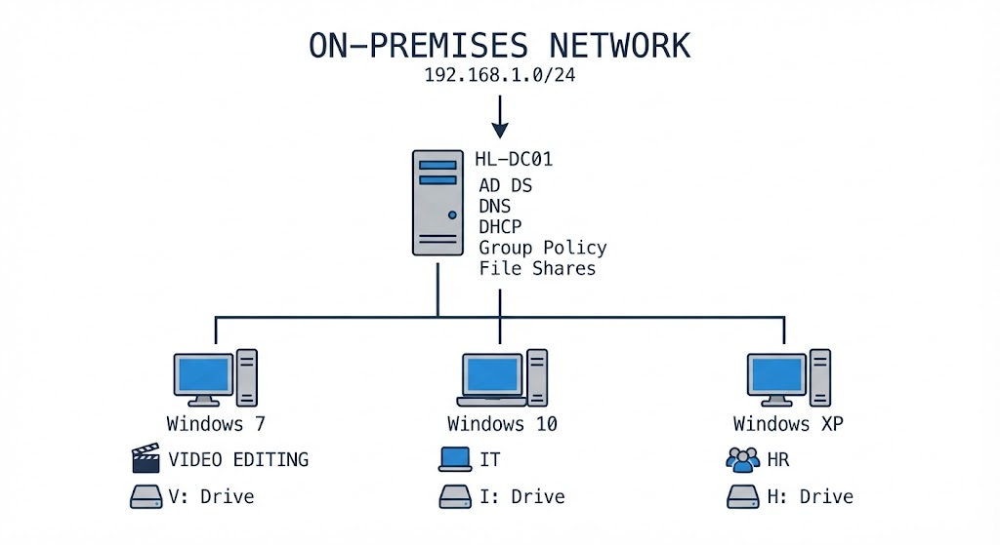

# 🪟 Active Directory Lab

Cloud & DevOps homelab'imin bir parçası olarak Windows Server kullanılarak oluşturulmuş pratik bir **on-premises Active Directory ortamı**.

Bu lab için üç departmandan oluşan kurgusal bir **video düzenleme ajansı** oluşturdum:

* 👥 **Human Resources**
* 🎬 **Video Editing**
* 💻 **IT**

Her departmanın kendine ait bir kullanıcı hesabı ve **eşlenmiş bir ağ sürücüsü** bulunmaktadır.

Departman sürücüleri Windows Server üzerinde barındırılmaktadır. Kullanıcılar kendilerine atanan sürücüye sunucu üzerinden bağlanır. Bu nedenle **sunucu, departmanların ağ üzerindeki dosya trafiğinin sonlandığı noktadır**.

Bu ortam, küçük bir organizasyonda **kullanıcıların, bilgisayarların, ağ servislerinin, dosya erişiminin, güvenlik politikalarının ve Windows istemcilerinin** Active Directory kullanılarak nasıl merkezi olarak yönetilebileceğini göstermek amacıyla tasarlanmıştır.

> **📌 Not:**
> Bu lab'ın daha detaylı versiyonuna GitHub profilimde **`hugehomelab`** adı altında ulaşabilirsiniz.
> Maalesef şu anda istemci bilgisayarlardan ek ekran görüntüleri sağlayamıyorum. Sabit disk hasarı nedeniyle bu lab'da kullanılan istemci bilgisayarların hiçbirine artık erişimim bulunmuyor. Windows Server'a hâlâ erişebildiğim için mevcut ekran görüntüleri ağırlıklı olarak sunucu tarafındaki yapılandırma ve yönetimi göstermektedir.

---

## 🏗️ Mimari



> Windows Server Domain Controller, Active Directory, DNS, DHCP, Group Policy, paylaşılan ağ sürücüleri ve domaine dahil edilmiş istemcilerden oluşan On-Premises ağ.

---

## 🏢 Active Directory Domain Services

Windows Server, merkezi kimlik ve domain yönetimi sağlayan bir **Active Directory Domain Controller** olarak yapılandırılmıştır.

### Kapsanan Konular

* Active Directory Domain Services (AD DS)
* Domain Controller
* Domain authentication
* Domaine dahil edilmiş bilgisayarlar
* Kullanıcı ve bilgisayar hesapları
* Organizational Units
* Merkezi yönetim

### 📸 Ekran Görüntüsü


---

## 🌐 DNS

DNS, Active Directory domain'i ve bağlı istemciler için **dahili isim çözümlemesi** sağlar.

### Kapsanan Konular

* DNS Server
* Forward Lookup Zones
* DNS kayıtları
* Dahili isim çözümleme
* Active Directory-integrated DNS

### 📸 Ekran Görüntüsü


---

## 📡 DHCP

DHCP, On-Premises ağındaki cihazlar için otomatik ağ yapılandırması sağlar.

### Kapsanan Konular

* DHCP Server
* DHCP Scope
* IP adresi dağıtımı
* Default gateway
* DNS server yapılandırması

### 📸 Ekran Görüntüsü


---

## 👤 Users & Computers

Lab, **Active Directory kullanıcı ve bilgisayar hesaplarının** pratik yönetimini içermektedir.

Kurgusal şirkette üç departmanı temsil eden kullanıcılar bulunmaktadır:

* 👥 Human Resources
* 🎬 Video Editing
* 💻 IT

Her departman Active Directory yapısı içerisinde organize edilmiş ve kullanıcılar kendi departmanlarına göre atanmıştır.

### Kapsanan Konular

* Kullanıcı hesabı yönetimi
* Bilgisayar hesapları
* Domain üyeliği
* Departman organizasyonu
* Hesap özellikleri
* İstemci yönetimi

📌 **Not:**
Bilgisayarlar, **"ONLY WINXP"** ve **"NON WINXP"** WMI filtrelerinin doğru şekilde çalışmasını sağlamak amacıyla farklı Organizational Unit'lere ayrılmıştır.

### 📸 Ekran Görüntüsü


> **Computers** bölümü iki ayrı organizational group'a ayrılmıştır çünkü bunlardan biri eski bir **Windows XP** istemcisi içermektedir. Bu ayrım, eski sistemi modern domaine dahil edilmiş bilgisayarlardan ayırmaya yardımcı olur.

---

## 📜 Group Policy

Lab içerisinde **Group Policy**, merkezi yönetim mekanizması olarak kullanılmaktadır.

Bu ortamın önemli bir özelliği, **modern Windows istemcileri ile eski bir Windows XP makinesinin** aynı ortamda bulunmasıdır.

Windows XP, modern Windows politikalarının ve özelliklerinin tamamını desteklemediğinden, belirli politikaların yalnızca uyumlu sistemlere uygulanması için **WMI filters** kullanılmaktadır.

Bu sayede belirli ayarlar, programlar ve komutlar Windows XP makinesine özel olarak uygulanabilirken modern istemciler etkilenmez.

### Uygulanan GPO'lar

* 🔐 **Main Lockdown Policy**
  Domain istemcileri için merkezi güvenlik ve kısıtlama ayarları.

* 💾 **Mapped Drive Policies**
  Departmana özel ağ sürücüleri kullanıcılar için otomatik olarak eşlenir.
  Departmanların ortak sürücüleri Windows Server üzerinde barındırılır ve her departmana kendisine atanmış sürücü harfi verilir.

  Ağ sürücüleri Group Policy üzerinden yönetilir. Böylece kullanıcılar departmanlarına göre doğru sunucu üzerindeki paylaşıma otomatik olarak erişebilir.

* 📦 **MSI / Program Installation Policies**
  Yazılım paketleri Group Policy üzerinden seçilen istemcilere dağıtılır.

* ⚙️ **Settings & Feature Restrictions**
  Belirli Windows ayarları ve özellikleri lab gereksinimlerine göre kısıtlanır.

* ⚠️ **Logon Warning Message**
  Kullanıcılar domaine giriş yaptığında bir uyarı mesajı görüntülenir.

* 🔑 **Password Renewal Policy**
  Parola süresi ve parola yenileme gereksinimleri merkezi olarak yönetilir.

* 🖼️ **Desktop Background Policy**
  Standart bir masaüstü arka planı Group Policy üzerinden uygulanır.

* 🧩 **WMI Filter Policies**
  WMI filtering, eski Windows XP sistemi ile modern Windows sistemlerini ayırt etmek ve uyumsuz politikaların Windows XP'ye uygulanmasını engellemek için kullanılır.

### 📸 Ekran Görüntüsü


---

## 💻 PowerShell

**PowerShell**, Active Directory ve Windows Server yönetimi için kullanılmaktadır.

### Kapsanan Konular

* Active Directory PowerShell
* Kullanıcı yönetimi
* Bilgisayar yönetimi
* Windows Server yönetimi
* Yönetim otomasyonu

### 📸 Ekran Görüntüsü


---

## 🖥️ Windows Server Management

Lab, Windows Server ortamının çalıştırılması için gerekli yönetim işlemlerini de kapsamaktadır.

Windows Server, domain'in merkezi altyapı noktası olarak görev yapmakta ve **Active Directory, DNS, DHCP, Group Policy ve departman dosya paylaşımları** gibi servisleri sağlamaktadır.

### Kapsanan Konular

* Server Manager
* Server roles and features
* Windows servisleri
* Ağ yapılandırması
* Yönetim araçları
* Dosya paylaşımı
* Sunucu yönetimi

### 📸 Ekran Görüntüsü


---

## 🌐 On-Premises Networking

Ortam, Windows Server altyapısı ile domaine dahil edilmiş istemciler arasındaki bağlantıyı sağlamak için yerel bir ağ kullanmaktadır.

Windows Server departman ağ paylaşımlarını barındırırken, kullanıcılar dahili ağ üzerinden kendilerine atanmış sürücülere erişmektedir.

Örneğin:

```text
HR User
   │
   └── H: ───────┐
                 │
Video User       │
   │             │
   └── V: ───────┼──► Windows Server
                 │
IT User          │
   │             │
   └── I: ───────┘
```

Bu paylaşılan sürücülere ait trafik, ilgili paylaşımların barındırıldığı Windows Server üzerinde sonlanmaktadır.

### Kapsanan Konular

* LAN yapılandırması
* Private IP adresleme
* Subnetting
* Default gateway
* Dahili DNS
* DHCP tabanlı ağ yapılandırması
* Client-to-server bağlantısı
* Sunucu üzerinde barındırılan ağ paylaşımları
* Eşlenmiş ağ sürücüleri

### 📸 Ekran Görüntüsü


---

## 🛠️ Technologies

**Windows Server · Active Directory Domain Services · DNS · DHCP · Group Policy · WMI Filtering · Organizational Units · PowerShell · SMB File Sharing · Mapped Drives · On-Premises Networking**

---

## 📌 Lab Focus

Bu lab, **On-Premises Windows altyapısı ve Active Directory yönetimi** konusunda pratik deneyimi göstermektedir. Merkezi kimlik yönetimi, ağ servisleri, Group Policy, eski istemci uyumluluğu, yazılım dağıtımı, dosya paylaşımı, eşlenmiş ağ sürücüleri, sunucu yönetimi ve PowerShell yönetimi gibi konuları kapsamaktadır.
