# ⚙️ Ansible Configuration Management Lab

Linux sistem yönetimi, servis yönetimi, otomasyon, firewall yapılandırması, templating ve idempotent altyapı yönetimi konularında pratik beceriler geliştirmek amacıyla oluşturulmuş uygulamalı bir Ansible laboratuvarıdır.

Bu laboratuvarın temel amacı, servisleri ve sistem yapılandırmalarını manuel olarak yönetmek yerine yeniden kullanılabilir Ansible rollerini kullanarak yaygın Linux yapılandırma görevlerini otomatikleştirmektir.

---

## 📌 Proje Genel Bakışı

Bu laboratuvar, rol tabanlı bir Ansible configuration management ortamını göstermektedir.

Proje aşağıdaki konuları kapsamaktadır:

* Ansible Playbooks
* Ansible Roles
* Inventory yönetimi
* Paket kurulumu
* Servis yönetimi
* Jinja2 Templates
* Handlers
* `notify`
* `become` ile yetki yükseltme
* UFW Firewall
* OpenSSH
* Nginx
* Idempotent yapılandırma
* Yapılandırma doğrulama

---

## 🏗️ Mimari

### Proje Yapısı

```text
ansible-lab/
│
├── ansible.cfg
├── hosts.ini
├── site.yml
│
└── roles/
    ├── common/
    │   ├── tasks/
    │   └── handlers/
    │
    ├── webserver/
    │   ├── tasks/
    │   ├── handlers/
    │   └── templates/
    │
    └── firewall/
        └── tasks/
```

Laboratuvar yerel bir Linux ortamı kullanmakta ve sistemi Ansible'ın local connection özelliği üzerinden yönetmektedir.

Yapılandırma, ortamı daha modüler ve yönetilebilir hale getirmek için yeniden kullanılabilir rollere ayrılmıştır.

### 📸 Screenshot 01 — Ansible Proje Yapısı

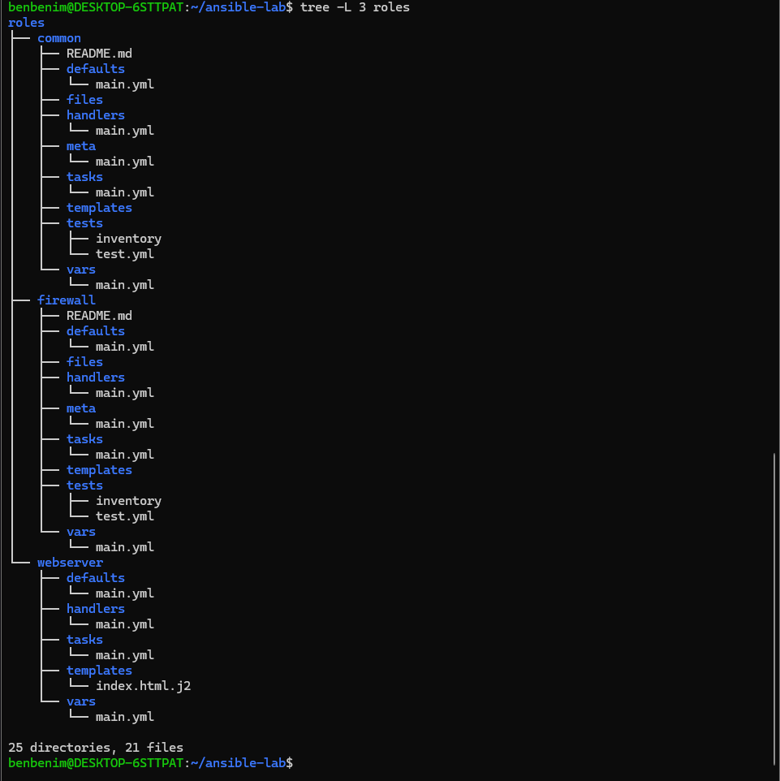

---

## 1. 📋 Inventory & Playbook

Ansible Inventory yönetilen host'u tanımlarken, ana playbook hangi rollerin uygulanacağını belirlemektedir.

### Yapılandırma

| Dosya         | Amaç                      |
| ------------- | ------------------------- |
| `hosts.ini`   | Yönetilen host'u tanımlar |
| `site.yml`    | Ana Ansible playbook      |
| `ansible.cfg` | Ansible yapılandırması    |

Playbook aşağıdaki rolleri uygular:

* `common`
* `webserver`
* `firewall`

### 📸 Screenshot 02 — Inventory

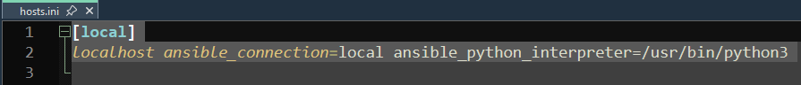

### 📸 Screenshot 03 — Ana Playbook

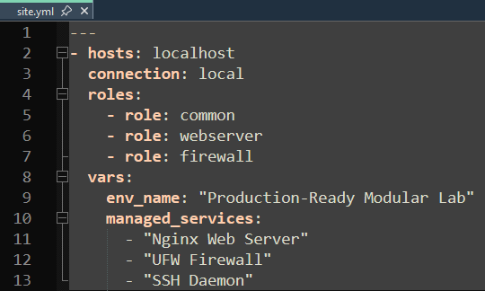

---

## 2. 🧩 Ansible Roles

Yapılandırma, modüler configuration management yaklaşımını göstermek amacıyla ayrı Ansible rollerine ayrılmıştır.

### Common Role

`common` rolü OpenSSH servisini yönetmektedir.

Görevleri:

* OpenSSH paketinin kurulumu
* SSH servisinin yönetimi
* Servisin etkinleştirilmesi

### Webserver Role

`webserver` rolü Nginx web sunucusunu yönetmektedir.

Görevleri:

* Nginx kurulumu
* Nginx servis yönetimi
* Servisin etkinleştirilmesi
* Web sitesi yapılandırması
* Jinja2 template'lerinin dağıtılması
* Handler üzerinden Nginx restart işlemi

### Firewall Role

`firewall` rolü UFW firewall'ını yönetmektedir.

Görevleri:

* UFW kurulumu
* TCP/22 üzerinden SSH erişimi
* TCP/80 üzerinden HTTP erişimi
* Firewall'ın etkinleştirilmesi

### 📸 Screenshot 04 — Ansible Roles

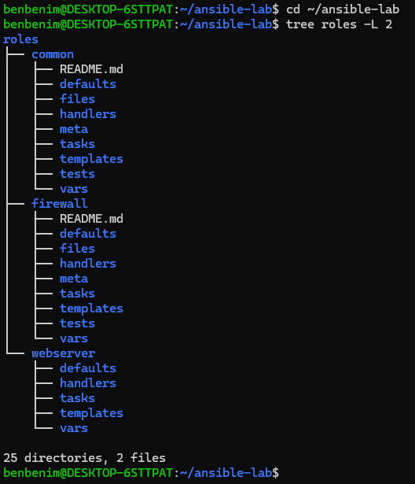

---

## 3. 🌐 Nginx Web Server

Nginx, `webserver` rolü üzerinden otomatik olarak kurulmuş ve yapılandırılmıştır.

Yapılandırma, web sunucusu dosyalarını manuel olarak düzenlemek yerine Jinja2 template kullanmaktadır.

### Yapılandırma

| Servis       | Yapılandırma    |
| ------------ | --------------- |
| Web Server   | Nginx           |
| HTTP Portu   | `80`            |
| Yapılandırma | Jinja2 Template |
| Yönetim      | Ansible         |

Oluşturulan web sayfası daha sonra yerel bir HTTP isteği üzerinden doğrulanmıştır.

### 📸 Screenshot 05 — Nginx Service

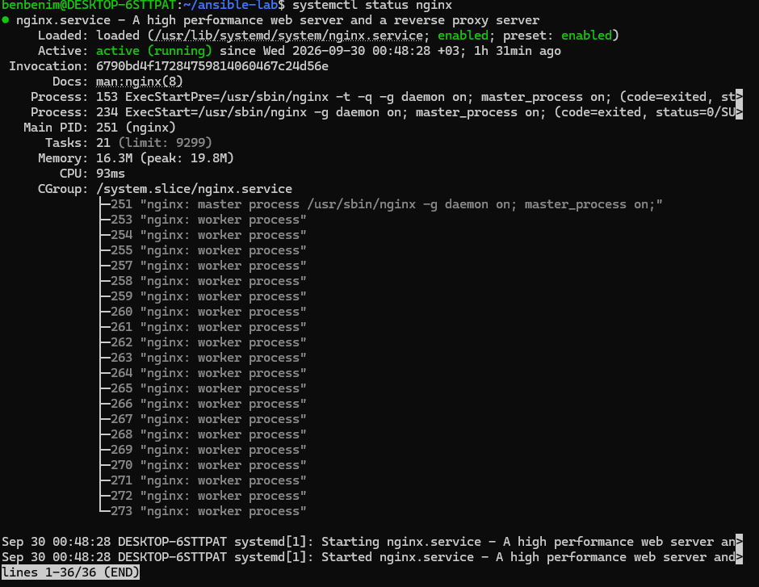

### 📸 Screenshot 06 — Nginx Web Sayfası

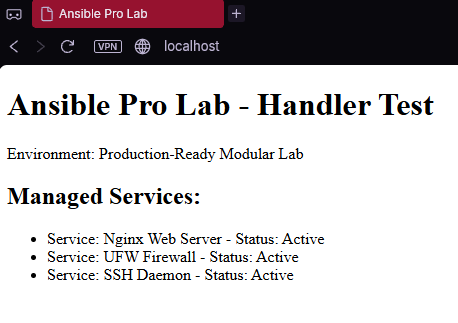

---

## 4. 🔥 UFW Firewall

UFW, Ansible'ın `firewall` rolü üzerinden yapılandırılmıştır.

### Yapılandırma

| Kural | Port | Protokol |
| ----- | ---- | -------- |
| SSH   | `22` | TCP      |
| HTTP  | `80` | TCP      |

Firewall etkinleştirilmiş ve playbook çalıştırıldıktan sonra doğrulanmıştır.

### 📸 Screenshot 07 — UFW Status

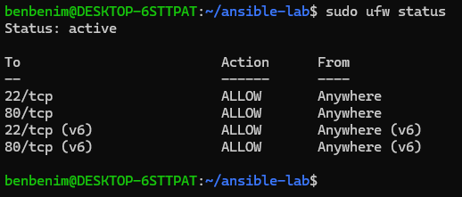

---

## 5. 🔔 Templates & Handlers

Laboratuvar, bir yapılandırma değiştiğinde Ansible handler'larının nasıl tetiklenebileceğini göstermektedir.

Nginx web sitesi yapılandırması bir template üzerinden dağıtılmaktadır.

Template değiştiğinde task, `notify` kullanarak Nginx restart handler'ını tetiklemektedir.

### İş Akışı

```text
Jinja2 Template
      │
      ▼
Yapılandırma Değişti
      │
      ▼
    notify
      │
      ▼
Nginx Restart Handler
```

Handler yalnızca ilgili task bir değişiklik bildirdiğinde çalıştırılır.

### 📸 Screenshot 08 — Template Yapılandırması

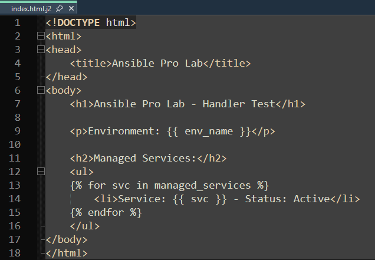

### 📸 Screenshot 09 — Handler Çalıştırılması

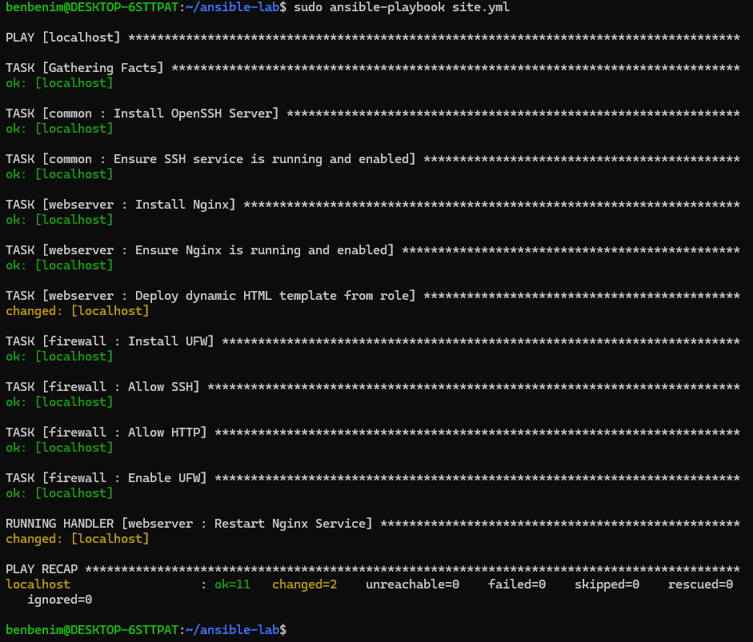

---

## 6. 🔐 Privilege Escalation

Yönetici yetkisi gerektiren görevlerde Ansible'ın `become` mekanizması kullanılmıştır.

Bu sayede her komutu manuel olarak root yetkisiyle çalıştırmaya gerek kalmadan sistem kaynakları Ansible üzerinden yönetilebilmektedir.

Yönetici yetkisi gerektiren görevler:

* Paket kurulumu
* Servis yönetimi
* Firewall yapılandırması
* Korunan sistem dosyaları

### 📸 Screenshot 10 — Become Yapılandırması

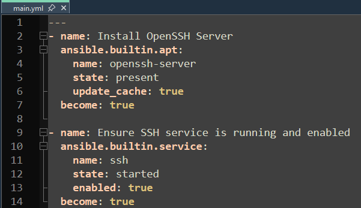

---

## 7. 🔄 Idempotency

Idempotency, Ansible playbook'un birden fazla kez çalıştırılmasıyla test edilmiştir.

İlk çalıştırmada gerekli yapılandırma uygulanır ve değişiklikler raporlanır.

Aynı sistem üzerinde ikinci çalıştırmada:

```text
changed=0
```

sonucunun alınması beklenir.

Bu, sistem istenen duruma zaten ulaştığında Ansible'ın kaynakları gereksiz yere tekrar değiştirmediğini gösterir.

### 📸 Screenshot 11 — İlk Playbook Çalıştırması

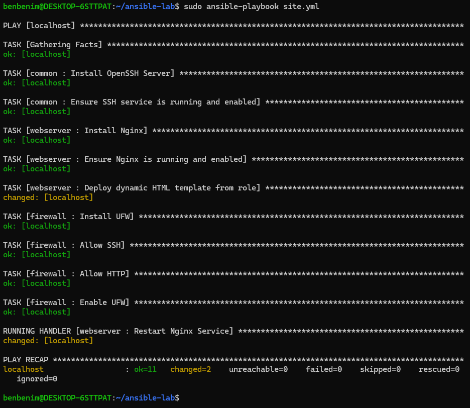

### 📸 Screenshot 12 — Idempotent İkinci Çalıştırma

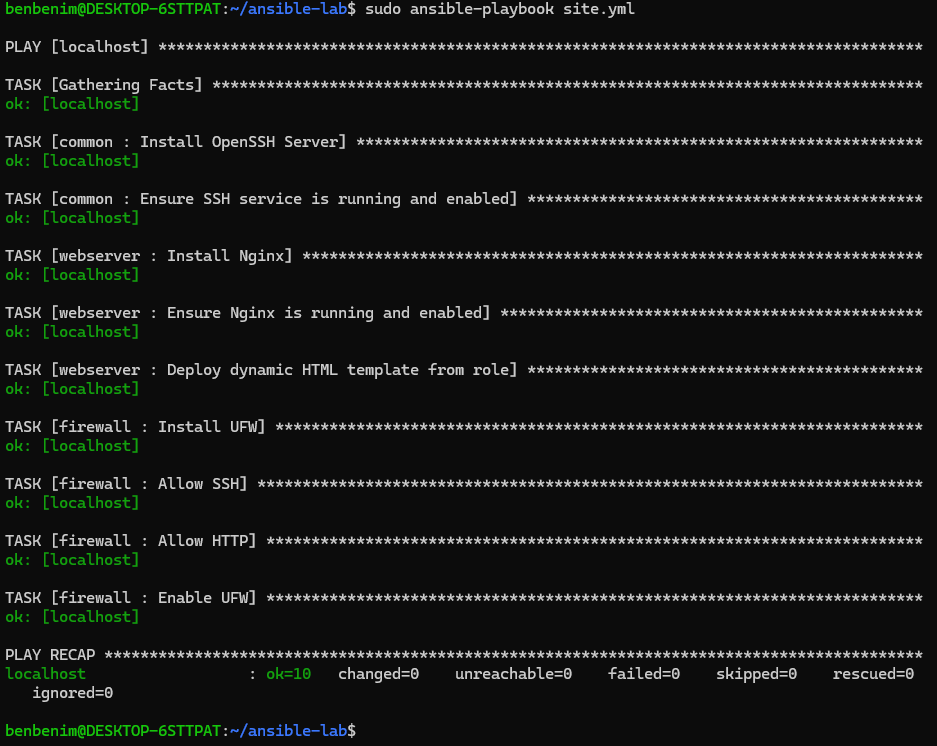

---

## 8. 🧪 Test & Doğrulama

Son yapılandırma; servis, firewall ve web sunucusu kontrolleri üzerinden doğrulanmıştır.

Testler şunları kapsamaktadır:

* Nginx servis durumu
* SSH servis durumu
* UFW firewall durumu
* HTTP bağlantısı
* Ansible playbook çalıştırılması
* Handler çalıştırılması
* Idempotency doğrulaması
* Rol tabanlı yapılandırma

### Doğrulama Komutları

```bash
systemctl status nginx
systemctl status ssh
sudo ufw status
curl http://localhost
```

### 📸 Screenshot 13 — Servis Doğrulaması

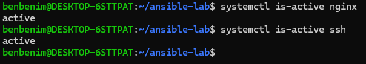

### 📸 Screenshot 14 — HTTP Bağlantı Testi

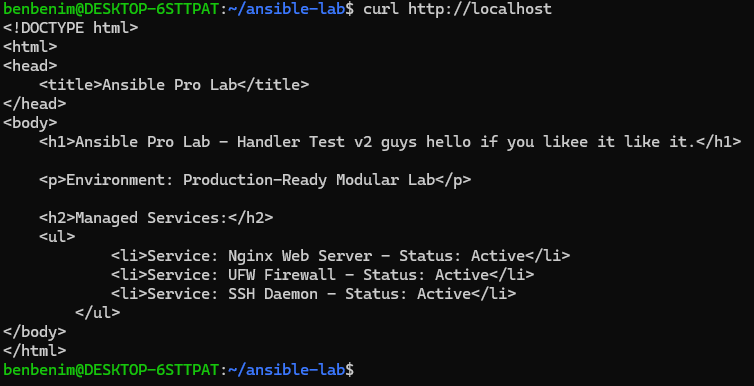

---

## 🛠️ Teknolojiler

**Configuration Management**

Ansible

**İşletim Sistemi**

Linux

**Web Server**

Nginx

**Firewall**

UFW

**Servisler**

OpenSSH · systemd

**Yapılandırma**

YAML · Jinja2

**Otomasyon Konseptleri**

Roles · Playbooks · Templates · Handlers · `notify` · `become` · Idempotency

---

## 📚 Gösterilen Beceriler

* Ansible Configuration Management
* Role-based Automation
* Playbook geliştirme
* Inventory yönetimi
* Linux sistem yönetimi
* Paket yönetimi
* Servis yönetimi
* Nginx yapılandırması
* UFW firewall yapılandırması
* Jinja2 templating
* Ansible Handlers
* `notify` kullanımı
* `become` ile yetki yükseltme
* Idempotent yapılandırma
* Infrastructure Automation
* Configuration Troubleshooting

---

## 🚀 Sonraki Adımlar

Ansible laboratuvarı için planlanan geliştirmeler:

* Birden fazla Linux host'un yönetimi
* Remote host yapılandırması
* Dynamic Inventory
* Ansible Vault
* Daha fazla yeniden kullanılabilir role
* Cloud Infrastructure Automation
* CI/CD pipeline'ları ile entegrasyon
* Ansible ve Terraform entegrasyonu

---

## 📌 Proje Durumu

Bu laboratuvar tamamlanmış bir uygulamalı Ansible Configuration Management projesidir.

Ortam; role-based configuration, servis yönetimi, firewall otomasyonu, templating, handler'lar, privilege escalation ve idempotent yapılandırmayı başarıyla göstermektedir.

Laboratuvar ileride ek otomasyon ve cloud infrastructure senaryolarıyla genişletilebilir.
