# ☁️ Amazon Web Services Infrastructure Lab

Cloud altyapısı, ağ, güvenlik, yük dengeleme, kimlik, izleme, yedekleme ve Infrastructure as Code alanlarında uygulamalı beceriler geliştirmek amacıyla oluşturulmuş pratik AWS altyapı laboratuvarı.

Laboratuvarın temel amacı gerçekçi bir AWS altyapısının kurulması, yapılandırılması, test edilmesi ve sorunlarının giderilmesidir.

---

## 📌 Proje Genel Bakış

Bu laboratuvar, küçük ölçekli ve çoklu Availability Zone yapısına sahip bir AWS altyapı ortamının kurulmasını ve yönetilmesini kapsamaktadır.

Projede aşağıdaki konular ele alınmaktadır:

* Amazon VPC
* Public ve private subnet'ler
* Internet Gateway
* Route Tables
* EC2
* Security Groups
* Application Load Balancer
* IAM
* CloudWatch
* AWS Backup
* Multi-AZ mimarisi
* Terraform
* Network troubleshooting

---

## 🏗️ Mimari

### Mimari Diyagram

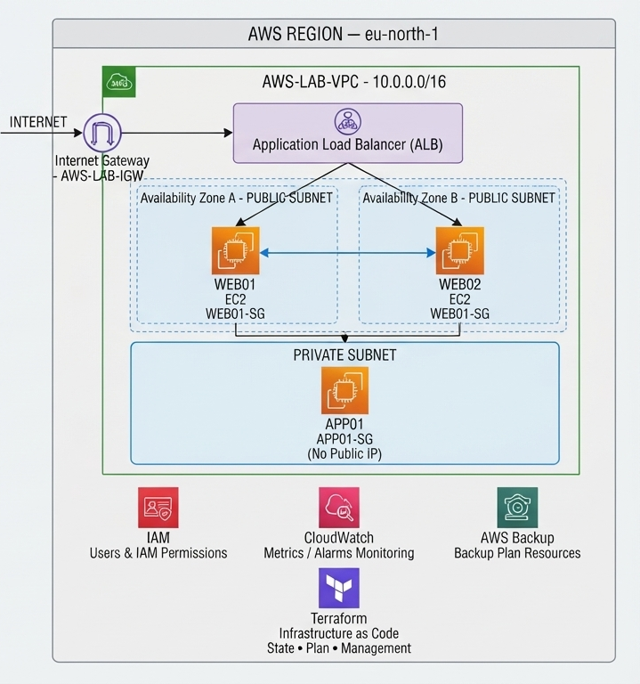

Ortam; public ve private subnet'lerden oluşan bir VPC, iki web sunucusu, bir private application sunucusu ve public-facing Application Load Balancer mimarisinden oluşmaktadır.

WEB01 ve WEB02 farklı Availability Zone'larda çalışmakta ve Application Load Balancer üzerinden gelen trafiği karşılamaktadır.

APP01 private subnet içerisinde çalışmakta ve public internet erişimine sahip değildir.

---

## 1. 🌐 VPC & Subnet'ler

AWS ağ altyapısı, özel bir VPC ve public/private subnet mimarisi kullanılarak oluşturulmuştur.

### Yapılandırma

| Kaynak           | Yapılandırma     |
| ---------------- | ---------------- |
| Region           | `eu-north-1`     |
| VPC              | `AWS-LAB-VPC`    |
| CIDR             | `10.0.0.0/16`    |
| Public Subnets   | `WEB01`, `WEB02` |
| Private Subnet   | `APP01`          |
| Internet Gateway | `AWS-LAB-IGW`    |

WEB01 ve WEB02 public subnet'lerde, APP01 ise private subnet içerisinde konumlandırılmıştır.

WEB02 farklı bir Availability Zone içerisinde çalıştırılarak Multi-AZ yapı oluşturulmuştur.

### 📸 Screenshot 01 — VPC

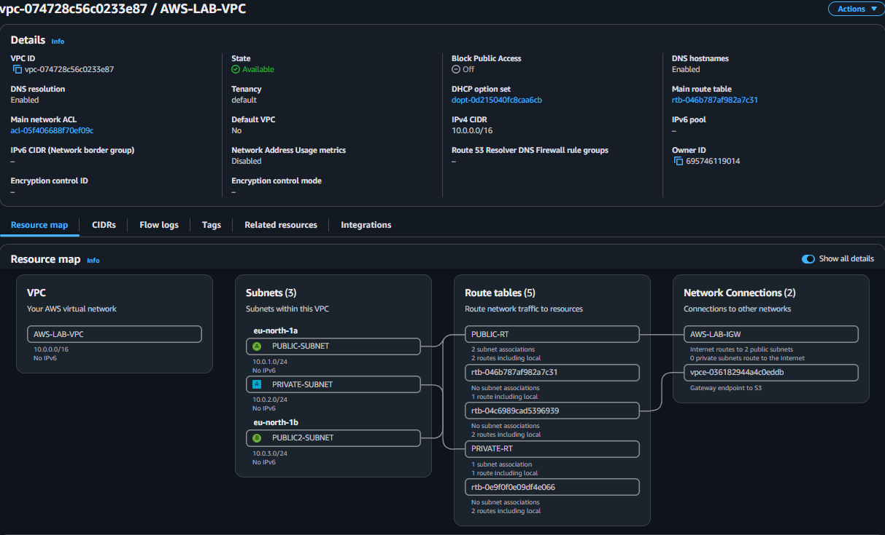

### 📸 Screenshot 02 — Subnets

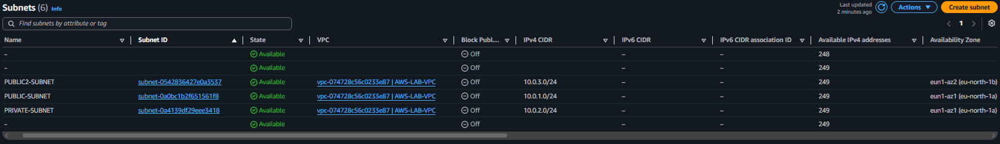

### 📸 Screenshot 03 — Route Tables

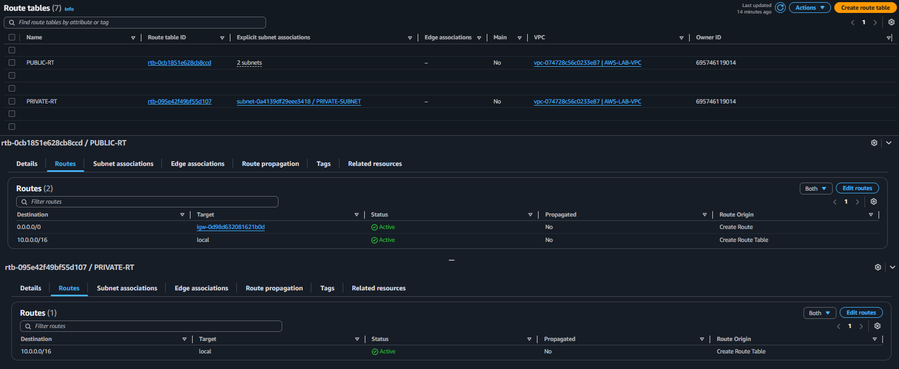

### 📸 Screenshot 04 — Internet Gateway

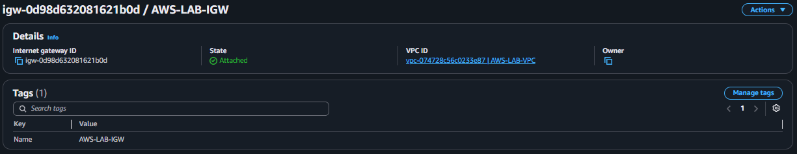

---

## 2. 🖥️ EC2 Infrastructure

AWS ortamında web ve application katmanlarını temsil eden EC2 instance'ları oluşturulmuştur.

### Yapılandırma

| Sunucu  | Rol                | Network        |
| ------- | ------------------ | -------------- |
| `WEB01` | Web Server         | Public Subnet  |
| `WEB02` | Web Server         | Public Subnet  |
| `APP01` | Application Server | Private Subnet |

WEB01 ve WEB02 public-facing web katmanını oluştururken APP01 private application katmanını temsil etmektedir.

### 📸 Screenshot 05 — WEB01

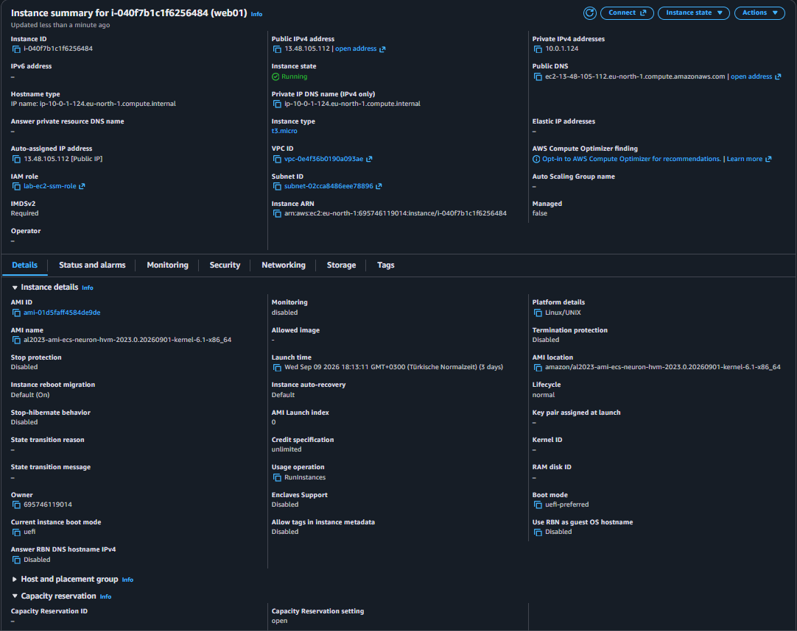

### 📸 Screenshot 06 — WEB02

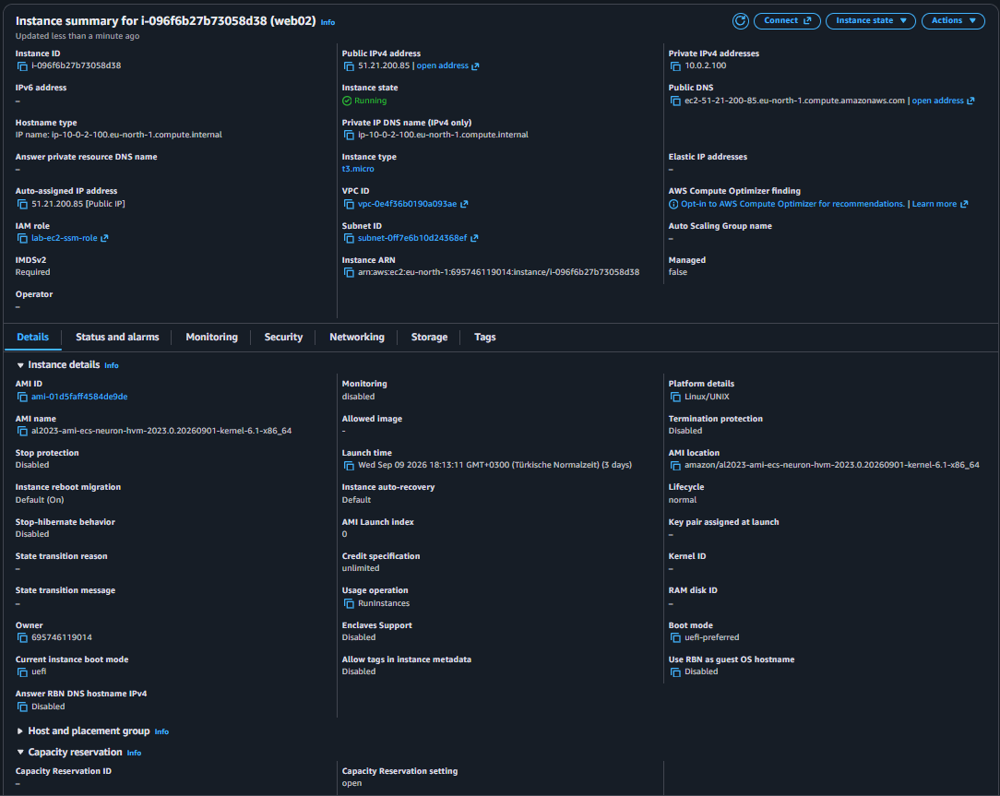

### 📸 Screenshot 07 — APP01

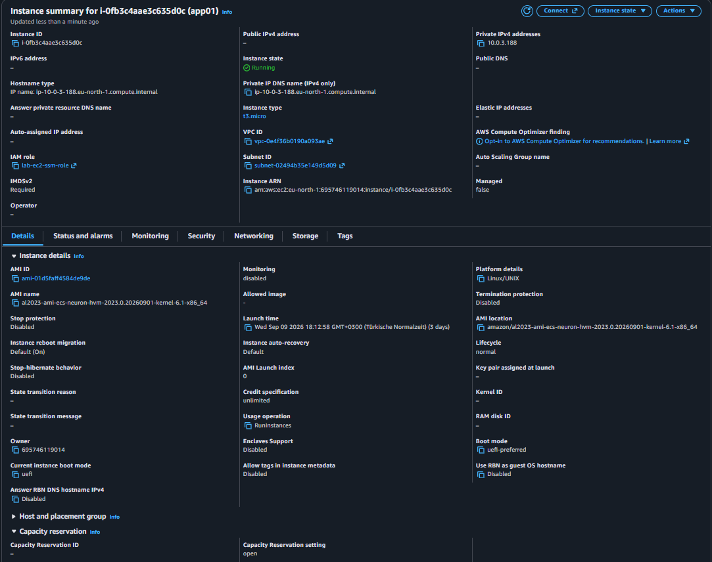

---

## 3. 🔐 Security Groups

EC2 instance'larının ağ erişimleri Security Groups kullanılarak kontrol edilmiştir.

Web ve application sunucuları için ayrı güvenlik politikaları oluşturulmuştur.

### Yapılandırma

* `WEB01-SG`
* `APP01-SG`
* Web sunucularının gerekli network erişimleri
* APP01'in private network içerisinde çalışması
* Security Group kuralları üzerinden trafik kontrolü

APP01 üzerinde public IP bulunmamaktadır.

### 📸 Screenshot 08 — WEB01 Security Group

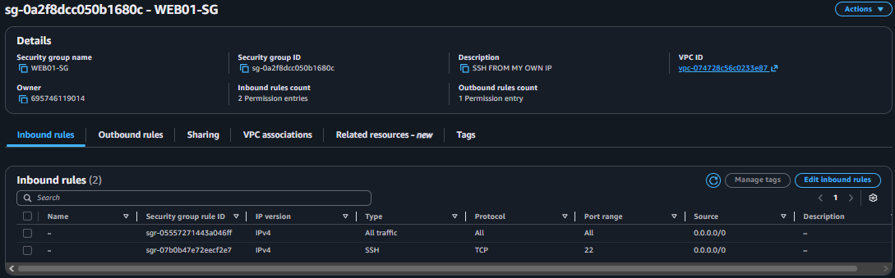

### 📸 Screenshot 09 — APP01 Security Group

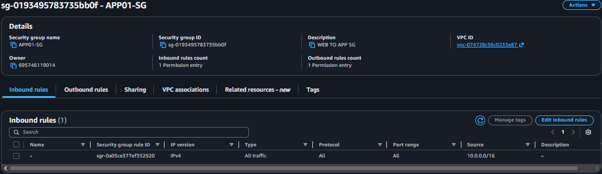

---

## 4. ⚖️ Application Load Balancer

Web katmanının yüksek erişilebilirliğini göstermek amacıyla Application Load Balancer yapılandırılmıştır.

ALB, WEB01 ve WEB02 instance'larını target olarak kullanmaktadır.

Trafik iki farklı Availability Zone içerisindeki web sunucularına dağıtılmaktadır.

### Yapılandırma

| Kaynak             | Yapılandırma              |
| ------------------ | ------------------------- |
| Load Balancer      | Application Load Balancer |
| Targets            | `WEB01`, `WEB02`          |
| Availability Zones | Multi-AZ                  |
| Backend            | EC2 Web Servers           |

### 📸 Screenshot 10 — Application Load Balancer

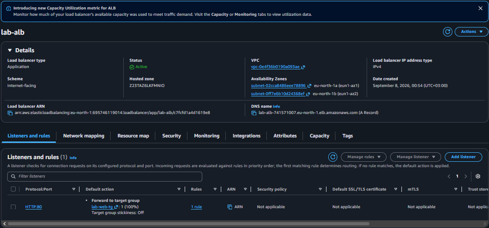

### 📸 Screenshot 11 — Target Group

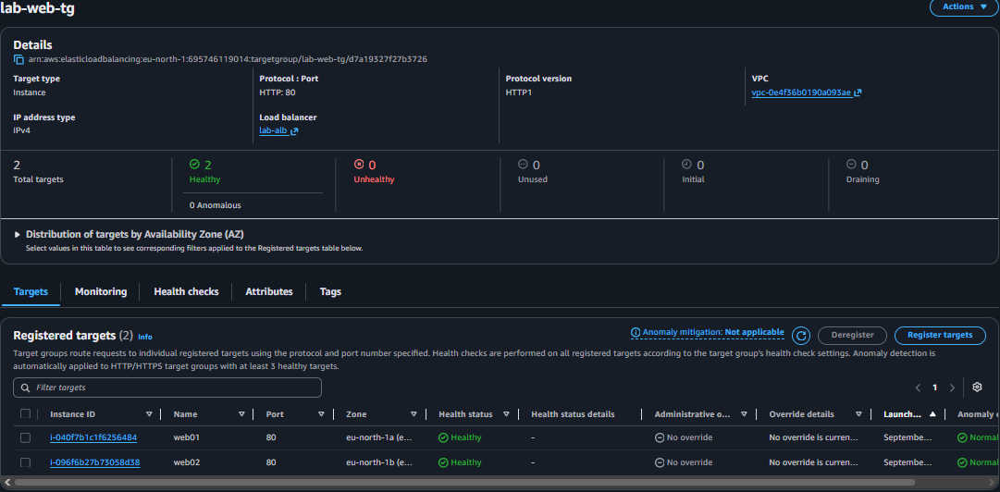

---

## 5. 🆔 IAM

AWS kaynaklarına erişimi kontrol etmek amacıyla Identity and Access Management kullanılmıştır.

IAM kullanıcıları ve izinleri oluşturularak AWS kaynaklarına erişim yetkilendirmesi gerçekleştirilmiştir.

### Ele alınan konular

* IAM Users
* IAM Permissions
* Access control
* Least privilege yaklaşımı

### 📸 Screenshot 12 — IAM Users

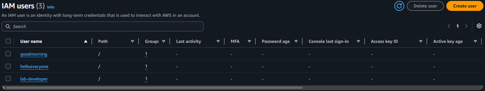

### 📸 Screenshot 13 — IAM Permissions

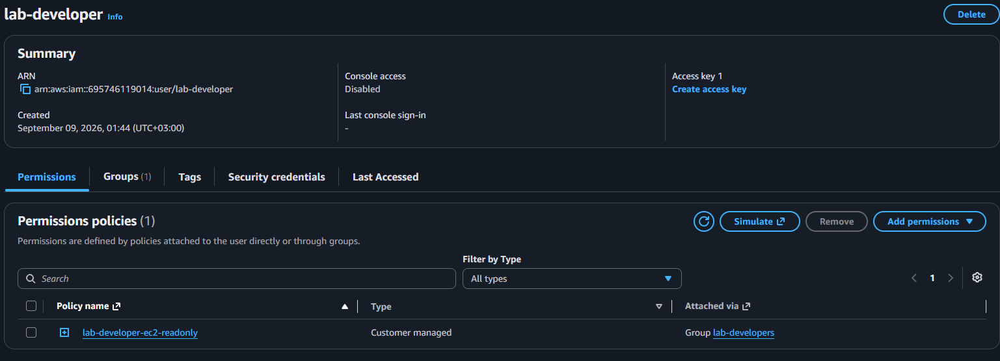

---

## 6. 📊 Monitoring & CloudWatch

AWS altyapısının izlenmesi amacıyla Amazon CloudWatch kullanılmıştır.

EC2 kaynaklarının metrikleri incelenmiş ve belirli bir metrik için alarm yapılandırılmıştır.

### Ele alınan konular

* CloudWatch Metrics
* Monitoring
* Metric Alarms
* Infrastructure monitoring

### 📸 Screenshot 14 — CloudWatch Metric

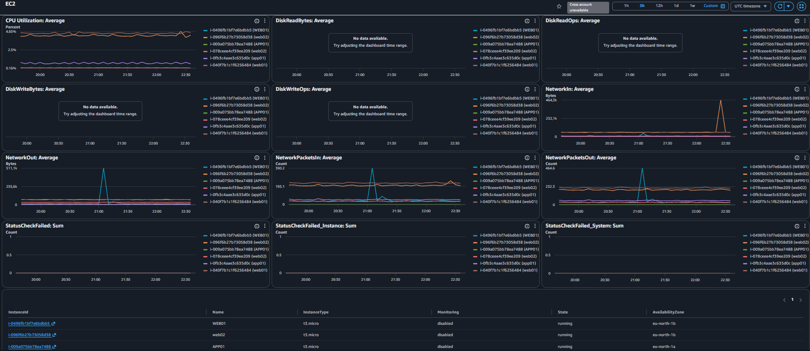

### 📸 Screenshot 15 — CloudWatch Alarm

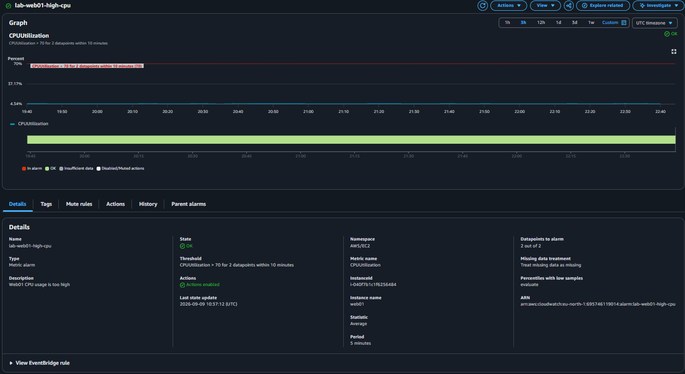

---

## 7. 💾 AWS Backup

AWS kaynaklarının yedeklenmesini ve merkezi backup yönetimini göstermek amacıyla AWS Backup kullanılmıştır.

Bir Backup Plan oluşturulmuş ve ilgili kaynak için backup yapılandırması gerçekleştirilmiştir.

### Ele alınan konular

* Backup Plan
* Backup configuration
* Resource assignment
* Backup management

### 📸 Screenshot 16 — Backup Plan

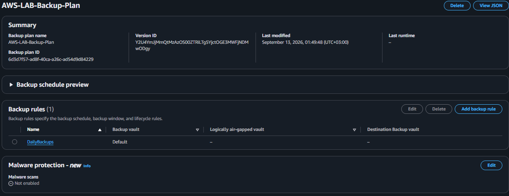

### 📸 Screenshot 17 — Backup Resource

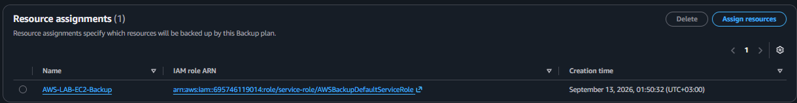

---

## 8. 🧪 Test & Troubleshooting

AWS ortamı gerçekçi network ve infrastructure troubleshooting senaryoları üzerinden test edilmiştir.

Gerçekleştirilen testler:

* VPC network connectivity
* Public subnet erişimi
* Private subnet erişimi
* WEB01 → APP01 bağlantısı
* WEB02 → APP01 bağlantısı
* Security Group kontrolleri
* Route Table kontrolleri
* Internet Gateway erişimi
* Load Balancer erişimi
* Target health kontrolleri
* EC2 network troubleshooting

APP01'in public IP olmadan private network üzerinden erişilebilirliği test edilmiştir.

### 📸 Screenshot 20 — Network Connectivity Test

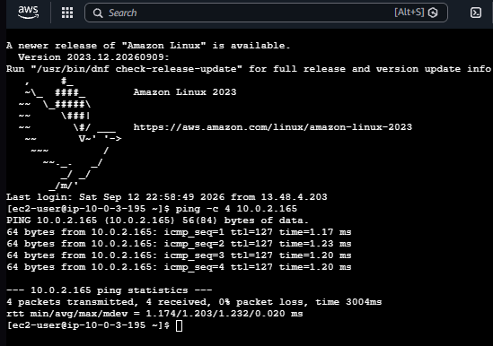

### 📸 Screenshot 21 — Load Balancer Test

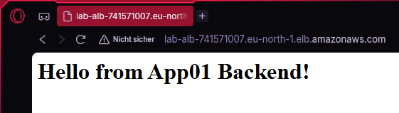

### 📸 Screenshot 22 — Target Health

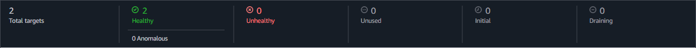

---

## 🛠️ Teknolojiler

**Cloud**

AWS

**Infrastructure**

Amazon VPC · EC2 · AWS Backup

**Networking**

VPC · Subnets · Route Tables · Internet Gateway · Security Groups · Load Balancing · Multi-AZ

**Identity**

IAM

**Monitoring**

CloudWatch

**Infrastructure as Code**

Terraform

**Operating Systems**

Windows Server · Linux

---

## 📚 Gösterilen Yetkinlikler

* AWS altyapısı oluşturma
* VPC tasarımı
* Public ve private subnet tasarımı
* Route Table yönetimi
* Internet Gateway yapılandırması
* EC2 yönetimi
* Security Group yapılandırması
* Application Load Balancer
* Multi-AZ mimarisi
* IAM yönetimi
* CloudWatch monitoring
* AWS Backup
* Terraform
* Infrastructure as Code
* Network troubleshooting
* Cloud infrastructure troubleshooting

---

## 🚀 Sonraki Adımlar

AWS laboratuvarı için planlanan geliştirmeler:

* AWS ve Azure arasında Hybrid Connectivity
* Active Directory entegrasyonu
* Terraform altyapısının genişletilmesi
* Container teknolojileri
* Docker
* Kubernetes
* Cloud automation
* AWS + Azure Hybrid Cloud

---

## 📌 Proje Durumu

Bu laboratuvar, sürekli geliştirilen uygulamalı bir cloud infrastructure projesidir.

Ortam; yeni AWS servisleri, networking senaryoları, otomasyon, Infrastructure as Code ve troubleshooting çalışmaları eklenerek geliştirilmeye devam edecektir.
