# ☁️ Microsoft Azure Altyapı Laboratuvarı

Cloud altyapısı, ağ, güvenlik, kimlik, depolama ve sistem yönetimi alanlarında uygulamalı beceriler geliştirmek için oluşturulmuş pratik Azure altyapı laboratuvarı.

Laboratuvar; gerçekçi bir altyapı ortamında Azure kaynaklarının tasarlanması, yapılandırılması, test edilmesi, sorunlarının giderilmesi ve yönetilmesine odaklanmaktadır.

---

## 📌 Proje Genel Bakışı

Bu laboratuvar, küçük ölçekli bir Azure altyapı ortamının dağıtımını ve yapılandırılmasını kapsamaktadır.

Proje şunları içermektedir:

* Azure Virtual Network
* Alt ağlar
* Network Security Groups
* Ağ yönlendirmesi
* Linux Virtual Machine
* Azure Storage
* Private Endpoint
* Private DNS
* Managed Identity
* Azure CLI
* Role-Based Access Control
* Azure Backup
* Management Locks
* Ağ sorunlarının giderilmesi

---

## 🏗️ Mimari

### Mimari Diyagram

Ortam; yapılandırılmış bir alt ağ mimarisine, ağ güvenlik kontrollerine, bir Linux Virtual Machine'a ve Azure Storage'a özel bağlantıya sahip bir Azure Virtual Network içermektedir.

Kısaca diyagramı burada;
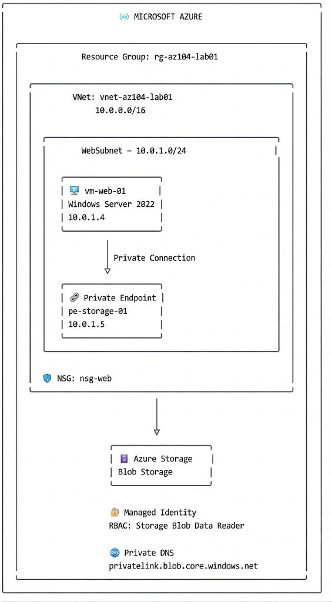


---

## 1. 🌐 Virtual Network & Alt Ağlar

Azure ağ ortamı, özel bir Virtual Network ve yapılandırılmış bir alt ağ mimarisi kullanılarak oluşturulmuştur.

### Yapılandırma

| Kaynak          | Yapılandırma      |
| --------------- | ----------------- |
| Resource Group  | `rg-az104-lab01`  |
| Virtual Network | `vnet-az104-tf01` |
| Address Space   | `10.10.0.0/16`    |
| Alt Ağ          | `WebSubnet`       |
| Alt Ağ Aralığı  | `10.10.1.0/24`    |
| Bölge           | Sweden Central    |

### 📸 Ekran Görüntüsü 01 — Resource Group
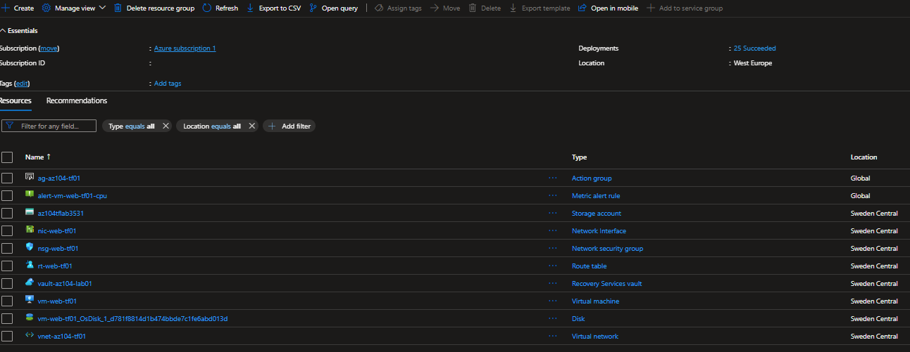

### 📸 Ekran Görüntüsü 02 — Virtual Network
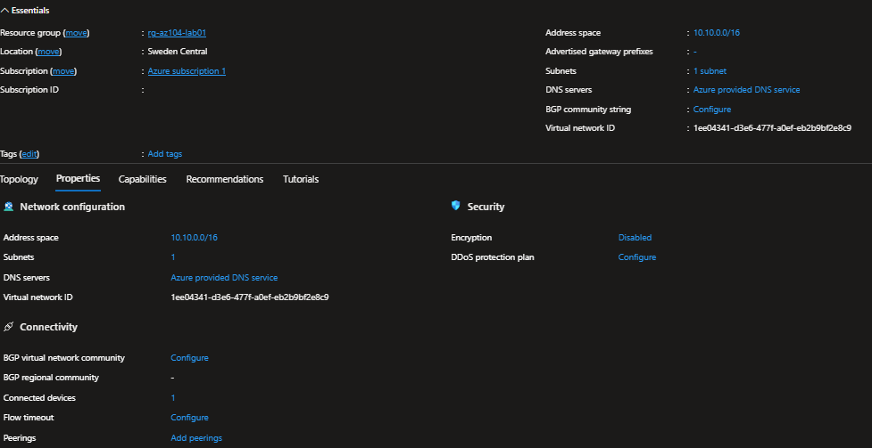

### 📸 Ekran Görüntüsü 03 — Alt Ağ Yapılandırması
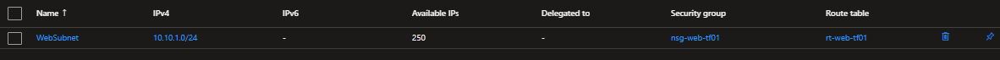

---

## 2. 🔐 Ağ Güvenliği

Ağ trafiği Network Security Groups kullanılarak kontrol edilmiştir.

Gelen ve giden ağ trafiğini kontrol etmek amacıyla WebSubnet'e bir NSG atanmıştır.

### Yapılandırma

* Network Security Group: `nsg-web-tf01`
* Alt ağ bağlantısı: `WebSubnet`
* RDP erişimi güvenlik kuralları üzerinden kontrol edilmektedir
* HTTP erişimi güvenlik kuralları üzerinden kontrol edilmektedir
* Ağ erişimi NSG kuralları üzerinden kontrol edilmektedir

### 📸 Ekran Görüntüsü 04 — Network Security Group
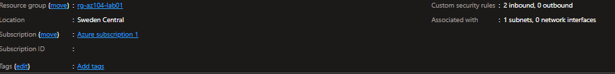

### 📸 Ekran Görüntüsü 05 — NSG Gelen Trafik Kuralları
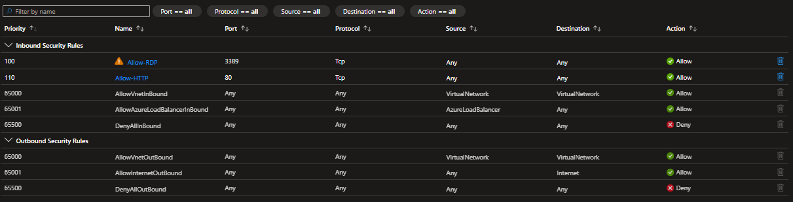

---

## 3. 🖥️ Linux Virtual Machine

Azure Virtual Network içerisinde bir Linux Virtual Machine dağıtılmıştır.

### Yapılandırma

| Kaynak           | Yapılandırma        |
| ---------------- | ------------------- |
| VM Adı           | `vm-web-tf01`       |
| İşletim Sistemi  | Ubuntu 24.04 LTS    |
| Boyut            | `Standard_B2ats_v2` |
| Private IP       | `10.10.1.4`         |
| Managed Identity | System-assigned     |

VM; ağ bağlantısını, Azure servislerini, kimlik doğrulamayı, private DNS çözümlemesini ve Storage erişimini test etmek için kullanılmıştır.

### 📸 Ekran Görüntüsü 06 — Virtual Machine Genel Bakış
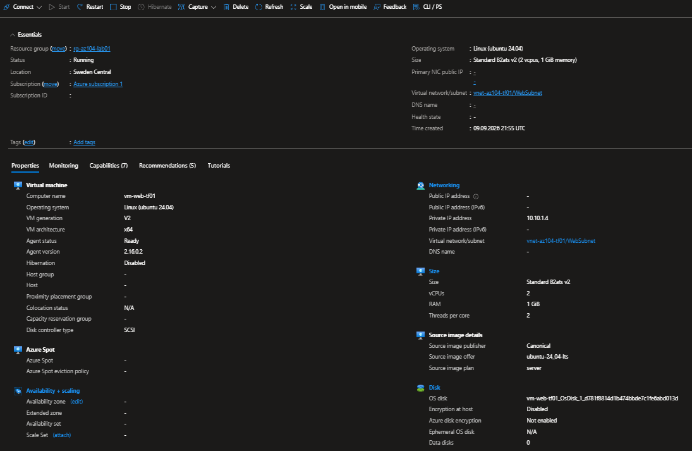

### 📸 Ekran Görüntüsü 07 — VM Ağ Yapılandırması
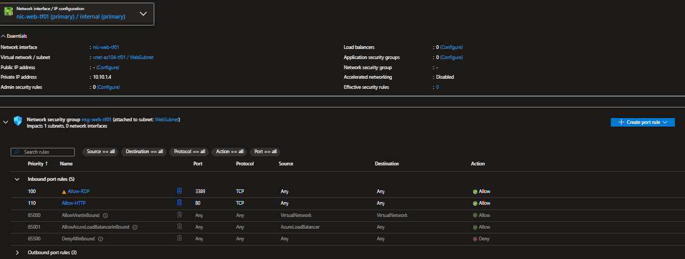

---

## 4. 🛣️ Routing

Azure ağ trafiğini ve sonraki hop davranışını göstermek amacıyla özel bir routing yapılandırılmıştır.

### Yapılandırma

| Ayar          | Değer       |
| ------------- | ----------- |
| Route         | `0.0.0.0/0` |
| Next Hop Type | Internet    |

Routing yapılandırması, ağ laboratuvarının ve pratik sorun giderme çalışmalarının bir parçası olarak kullanılmıştır.

### 📸 Ekran Görüntüsü 08 — Route Table
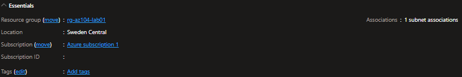

### 📸 Ekran Görüntüsü 09 — Route Yapılandırması
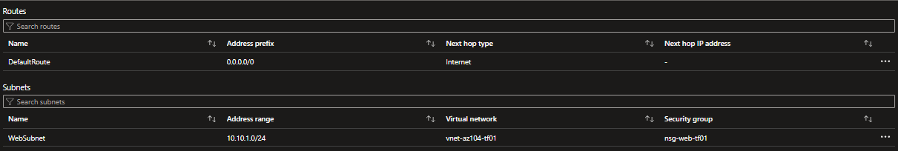

---

## 5. 📦 Azure Storage

Azure Virtual Machine üzerinden güvenli erişimi test etmek amacıyla bir Azure Storage Account dağıtılmış ve kullanılmıştır.

Storage ortamı Blob Storage, blob sürümlendirme, soft-delete saklama özelliği ve private bağlantı içermektedir.

### 📸 Ekran Görüntüsü 10 — Storage Account
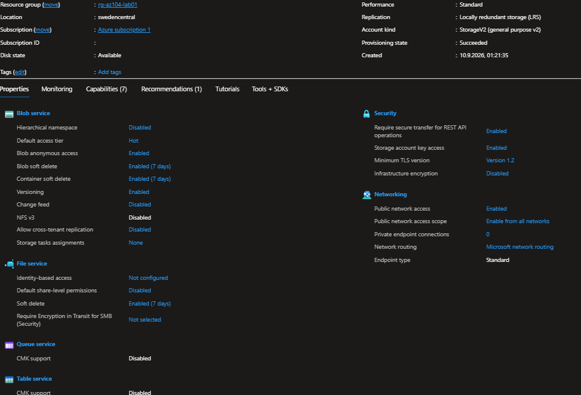

### 📸 Ekran Görüntüsü 11 — Blob Storage
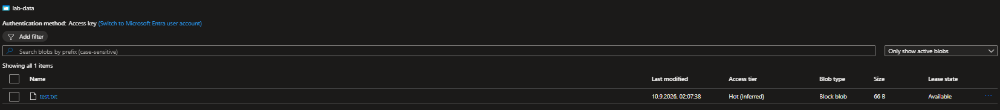

---

## 6. 🔗 Private Endpoint & Private DNS

Azure Blob Storage'a özel ağ bağlantısı sağlamak amacıyla bir Private Endpoint yapılandırılmıştır.

### Yapılandırma

| Kaynak           | Yapılandırma                        |
| ---------------- | ----------------------------------- |
| Private Endpoint | `pe-storage-tf01`                   |
| Hedef            | Azure Storage Blob                  |
| Private IP       | `10.10.1.5`                         |
| Private DNS Zone | `privatelink.blob.core.windows.net` |

Private DNS Zone, `rg-network-prod` Resource Group içerisinde merkezi olarak yönetilmekte ve lab Virtual Network'üne bağlanmaktadır.

Bu yapılandırma, public bir endpoint'e ihtiyaç duymadan Azure PaaS servislerine private erişimi göstermektedir.

### 📸 Ekran Görüntüsü 12 — Private Endpoint
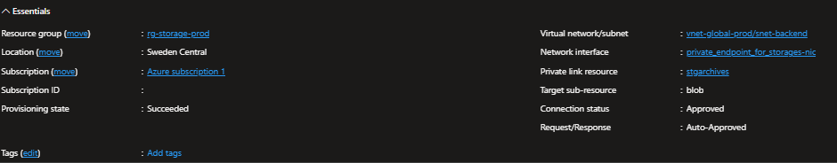

### 📸 Ekran Görüntüsü 13 — Private DNS Zone
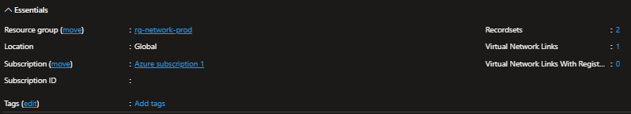

---

## 7. 🆔 Managed Identity & RBAC

Kimlik bilgilerini doğrudan VM üzerinde saklamaya gerek kalmadan Virtual Machine'a Azure kaynaklarına kontrollü erişim sağlamak amacıyla sistem tarafından atanmış bir Managed Identity kullanılmıştır.

VM kimliğine Blob Storage erişimi için gerekli Azure RBAC yetkisi atanmıştır.

### Rol Ataması

* System-assigned Managed Identity
* Azure Storage
* `Storage Blob Data Reader`

Lab içerisinde ayrıca yapılandırılmış Azure AD / Microsoft Entra grubu için `Resource Group Reader` rol ataması bulunmaktadır.

### 📸 Ekran Görüntüsü 14 — Managed Identity
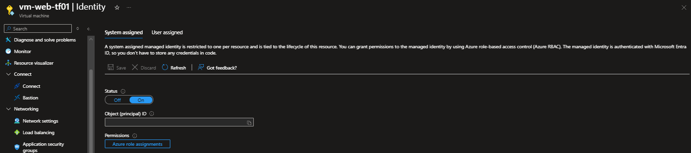

### 📸 Ekran Görüntüsü 15 — Rol Ataması
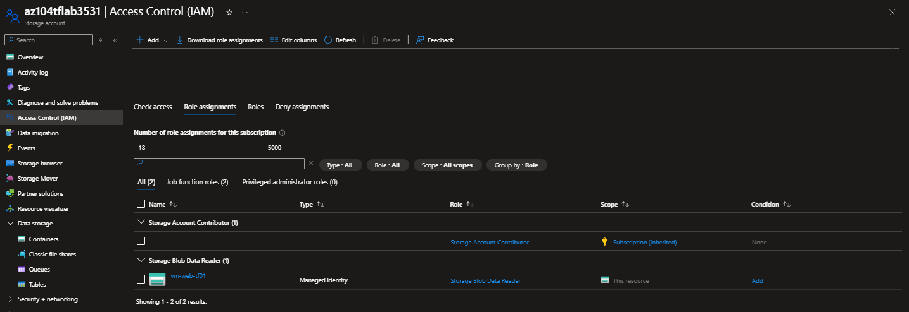

---

## 8. 🔒 Management Lock & Backup

Lab Resource Group'un yanlışlıkla silinmesini önlemek amacıyla bir Resource Lock yapılandırılmıştır.

### Yapılandırma

* Management Lock: `lock-az104-tf01`
* Lock Type: `CanNotDelete`

Azure Backup ayrıca Virtual Machine için yapılandırılmış ve backup durumu başarıyla doğrulanmıştır.

### 📸 Ekran Görüntüsü 16 — Management Lock
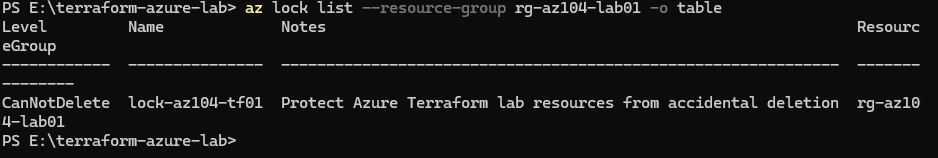

### 📸 Ekran Görüntüsü 17 — Backup / Recovery
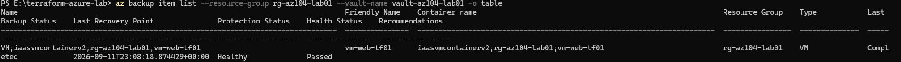

---

## 9. 🧪 Test & Sorun Giderme

Ortam, pratik troubleshooting senaryoları kullanılarak test edilmiştir.

Testler şunları kapsamaktadır:

* Ağ bağlantıları
* Private IP adresleri üzerinden iletişim
* NSG kurallarının doğrulanması
* Routing doğrulaması
* Private Endpoint bağlantısı
* Private DNS çözümlemesi
* Managed Identity ile kimlik doğrulama
* Azure Storage erişimi
* Azure Backup doğrulaması
* Management Lock doğrulaması

Private DNS çözümlemesi doğrudan Ubuntu VM üzerinden `nslookup` kullanılarak test edilmiştir.

Storage Account endpoint'i, Private Link DNS namespace üzerinden Private Endpoint'in private IP adresine çözümlenmiştir.

```text
az104tflab3531.blob.core.windows.net
        ↓
az104tflab3531.privatelink.blob.core.windows.net
        ↓
10.10.1.5
```

Ardından Storage erişimi, VM'in sistem tarafından atanmış Managed Identity'si kullanılarak test edilmiştir.

```bash id="cvbqdk"
az login --identity

az storage blob list \
  --account-name az104tflab3531 \
  --container-name lab-data \
  --auth-mode login \
  -o table
```

Komut, `lab-data` container'ında bulunan blob'u başarıyla döndürmüştür.

### 📸 Ekran Görüntüsü 18 — SSH Bağlantı Testi

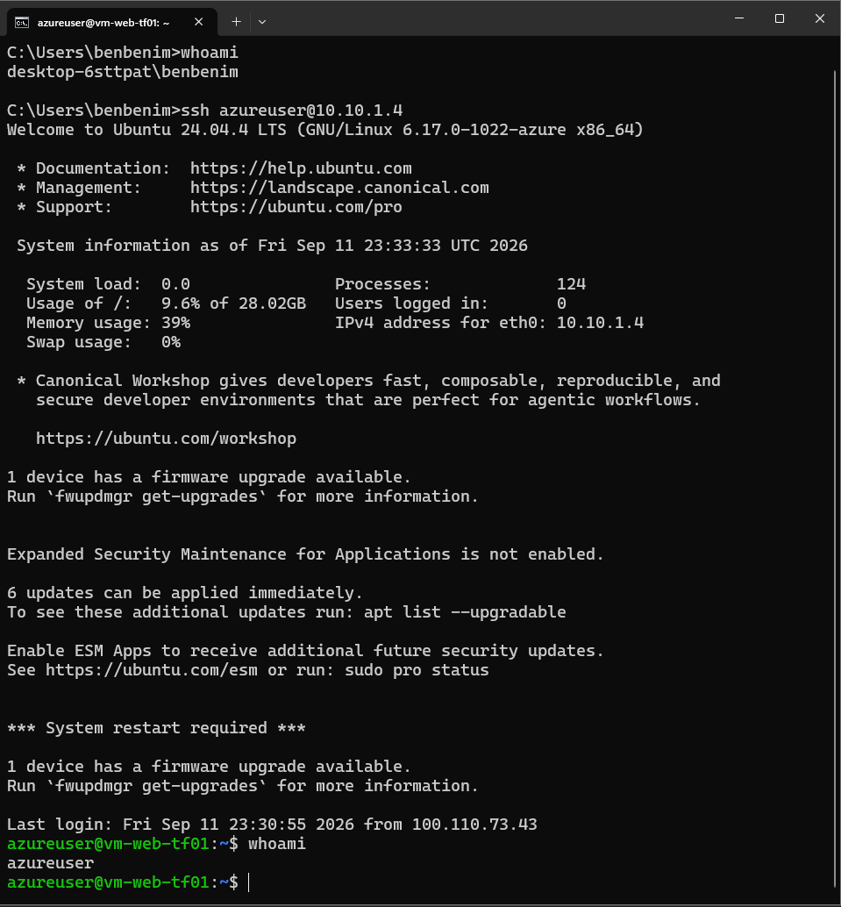

### 📸 Ekran Görüntüsü 19 — Private DNS Çözümlemesi

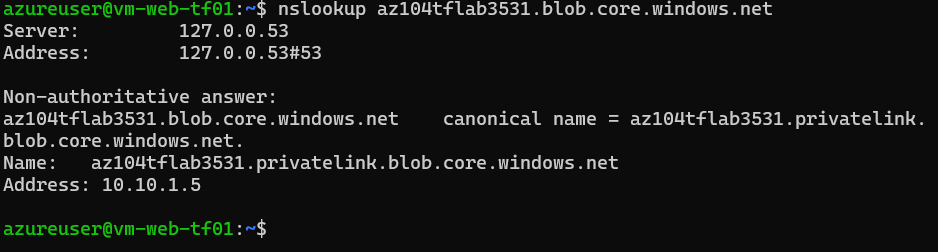

### 📸 Ekran Görüntüsü 20 — Storage Erişim Testi

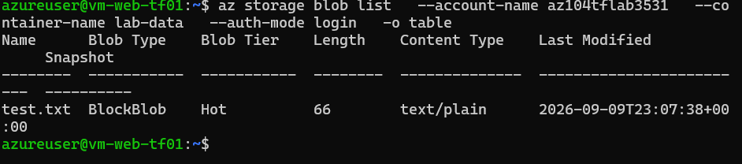

---

## 🛠️ Teknolojiler

**Cloud**

Azure

**Altyapı**

Azure Virtual Network · Virtual Machines · Azure Storage · Azure Backup

**Ağ**

VNet · Alt Ağlar · Routing · NSGs · Private Endpoints · Private DNS

**Kimlik**

Managed Identity · Azure RBAC · Microsoft Entra ID

**İşletim Sistemleri**

Ubuntu 24.04 LTS

**Otomasyon / Yönetim**

Azure CLI · PowerShell · Terraform

---

## 📚 Gösterilen Beceriler

* Azure altyapısı dağıtımı
* Sanal ağlar
* Alt ağ tasarımı
* Ağ güvenliği
* Routing
* Linux / Ubuntu VM yönetimi
* Azure Storage
* Private Endpoint yapılandırması
* Private DNS
* Managed Identity
* RBAC
* Microsoft Entra ID
* Azure Backup
* Management Locks
* Azure CLI
* Terraform
* Ağ sorunlarının giderilmesi
* Cloud altyapısı sorunlarının giderilmesi

---

## 🚀 Sonraki Adımlar

Azure laboratuvarı için planlanan genişletmeler:

* Azure Active Directory / Microsoft Entra ID entegrasyonu
* Yerel Active Directory ile hibrit kimlik
* Azure ağ altyapısının genişletilmesi
* Azure Monitoring
* Terraform ile gelişmiş Infrastructure as Code
* AWS + Azure Hybrid Connectivity

---

## 📌 Proje Durumu

Bu laboratuvar devam eden pratik bir cloud altyapı projesidir.

Ortam; yeni Azure servisleri, ağ senaryoları, otomasyon, Infrastructure as Code ve troubleshooting senaryoları ile sürekli olarak genişletilmektedir.
