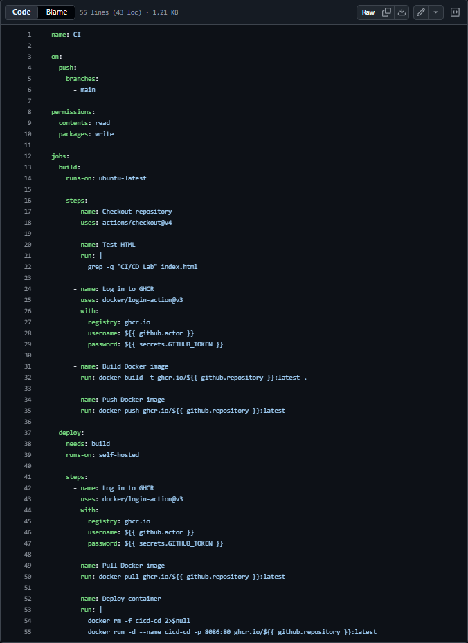
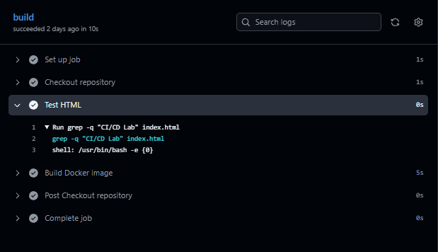
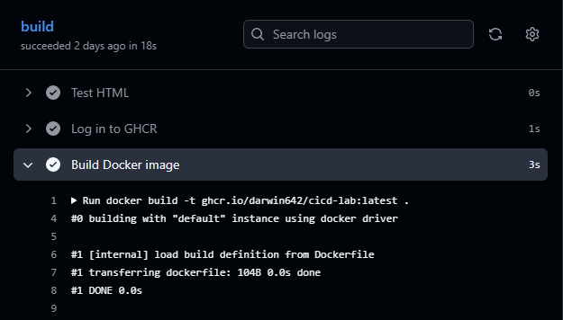
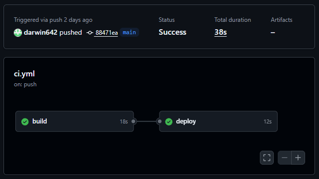
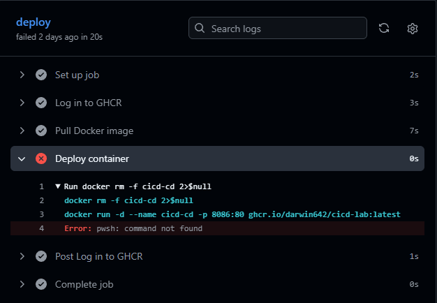
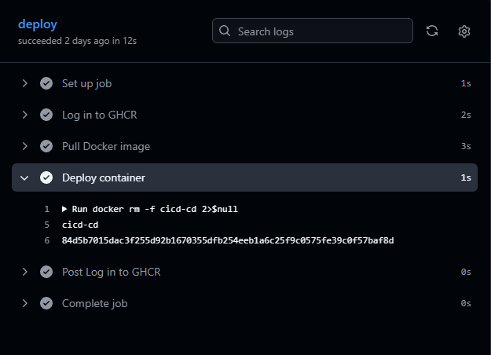
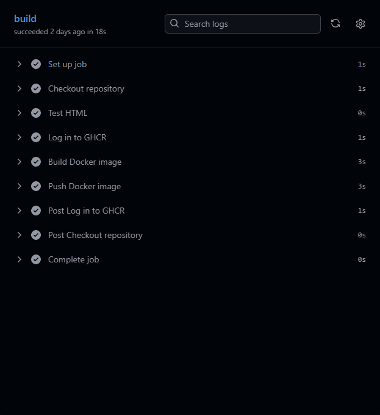

# 🔄 CI/CD Pipeline Lab

A practical CI/CD laboratory created to develop hands-on skills in continuous integration, automated testing, workflow automation, Docker image building, and pipeline troubleshooting.

The main goal of this laboratory is to automate the software validation and build process using GitHub Actions instead of performing these tasks manually.

---

## 📌 Project Overview

This laboratory demonstrates a GitHub Actions-based CI/CD workflow.

The project covers the following areas:

* Git and GitHub
* GitHub Actions
* Workflow configuration
* Automated testing
* Continuous Integration
* Docker image building
* Pipeline execution
* Workflow logs
* Failure handling
* Build verification

---

## 1. 📦 Repository & Project Structure

The project source code is maintained in a GitHub repository.

Git is used to track source code changes, while GitHub provides the repository and GitHub Actions execution environment.

### Project Structure

| Component            | Purpose                           |
| -------------------- | --------------------------------- |
| Source Code          | Application source files          |
| `Dockerfile`         | Defines the Docker image build    |
| `.github/workflows/` | Contains GitHub Actions workflows |
| Workflow YAML        | Defines the CI/CD pipeline        |
| Git Repository       | Tracks project changes            |

### 📸 Screenshot 01 — Project Structure


---

## 2. ⚙️ GitHub Actions Workflow

GitHub Actions is used to automate the CI/CD pipeline.

The workflow is defined using a YAML configuration file inside the `.github/workflows/` directory.

### Workflow Configuration

| Component     | Configuration        |
| ------------- | -------------------- |
| CI Platform   | GitHub Actions       |
| Configuration | YAML                 |
| Trigger       | Git repository event |
| Testing       | Automated            |
| Docker Build  | Automated            |
| Logs          | GitHub Actions       |

### Workflow Structure

```text
.github/
└── workflows/
    └── ci.yml
```

The workflow defines the sequence of automated tasks that are executed when the configured repository event occurs.

### 📸 Screenshot 02 — GitHub Actions Workflow



---

## 3. 🧪 Automated Testing

The CI pipeline automatically executes the configured tests after the workflow is triggered.

This allows code changes to be validated automatically before the pipeline continues.

### Testing Process

```text
Code Change
     │
     ▼
GitHub Actions
     │
     ▼
Automated Tests
     │
 ┌───┴────┐
 ▼        ▼
PASS     FAIL
 │        │
 ▼        ▼
Continue  Stop
```

### Test Results

| Result      | Pipeline Behavior          |
| ----------- | -------------------------- |
| Tests pass  | Continue workflow          |
| Tests fail  | Workflow reports failure   |
| Test output | Available in workflow logs |

### 📸 Screenshot 03 — Automated Tests



---

## 4. 🐳 Docker Image Build

Docker is integrated into the CI/CD workflow to automatically build a container image.

The Docker image is created using the project's `Dockerfile`.

### Docker Configuration

| Component      | Purpose                          |
| -------------- | -------------------------------- |
| Dockerfile     | Defines image build instructions |
| Docker Build   | Creates the container image      |
| GitHub Actions | Automates the build              |
| Build Logs     | Provide build output and errors  |

### Build Process

```text
Source Code
     │
     ▼
Dockerfile
     │
     ▼
Docker Build
     │
     ▼
Docker Image
```

The Docker build stage demonstrates how container image creation can be integrated into an automated CI workflow.

### 📸 Screenshot 04 — Docker Build



---

## 5. 🚀 Pipeline Execution

After a repository event triggers the workflow, GitHub Actions executes the configured pipeline stages.

Each stage reports its execution status and provides logs for troubleshooting.

### Pipeline Stages

| Stage        | Purpose                          | Result            |
| ------------ | -------------------------------- | ----------------- |
| Checkout     | Retrieves repository source code | Source available  |
| Test         | Validates the project            | Pass / Fail       |
| Docker Build | Builds the container image       | Success / Failure |
| Workflow     | Reports final pipeline state     | Success / Failure |

A successful pipeline indicates that all required stages completed without errors.

### 📸 Screenshot 05 — Successful Pipeline



---

## 6. ❌ Failure Handling

CI/CD pipelines must detect failures and provide useful feedback.

If a test or Docker build fails, GitHub Actions reports the workflow as unsuccessful.

The workflow logs can then be used to identify the failed step and investigate the problem.

### Failure Handling

| Situation            | Result                   |
| -------------------- | ------------------------ |
| Test failure         | Pipeline reports failure |
| Docker build failure | Pipeline reports failure |
| Successful step      | Pipeline continues       |
| Failed step          | Error available in logs  |

### Failure Workflow

```text
Code Change
     │
     ▼
GitHub Actions
     │
     ▼
Test / Docker Build
     │
     ▼
   Failure
     │
     ▼
Review Workflow Logs
     │
     ▼
Fix Code
     │
     ▼
Push Changes
```

### 📸 Screenshot 06 — Failed Pipeline



---

## 7. 🔁 Pipeline Verification

After correcting the issue, the workflow can be executed again.

The successful execution verifies that the problem was resolved and that the complete pipeline can finish correctly.

### Verification

| Check           | Expected Result      |
| --------------- | -------------------- |
| Workflow starts | Successful           |
| Tests           | Pass                 |
| Docker build    | Successful           |
| Workflow status | Success              |
| Logs            | No unresolved errors |

### 📸 Screenshot 07 — Successful Pipeline Verification



---

## 8. 📋 Workflow Logs

GitHub Actions provides detailed logs for every workflow step.

These logs were used to verify the execution and troubleshoot pipeline failures.

### Log Verification

| Log Information | Purpose                          |
| --------------- | -------------------------------- |
| Step status     | Determines whether a step passed |
| Test output     | Verifies automated tests         |
| Docker output   | Verifies image build             |
| Error messages  | Helps identify failures          |
| Final status    | Confirms pipeline result         |

### 📸 Screenshot 08 — Workflow Logs



---

## 🛠️ Technologies

**CI/CD**

GitHub Actions

**Version Control**

Git · GitHub

**Containers**

Docker

**Configuration**

YAML

**Automation**

GitHub Actions Workflows

---

## 📚 Skills Demonstrated

* Git version control
* GitHub repository management
* GitHub Actions
* CI/CD workflow development
* YAML configuration
* Automated testing
* Docker image building
* Pipeline troubleshooting
* Workflow log analysis
* Failure handling
* Continuous Integration
* Automated build verification

---

## 🚀 Next Steps

Planned improvements for the CI/CD laboratory:

* Docker image publishing
* Container registry integration
* Pull request validation
* Secrets management
* Deployment automation
* Environment-specific workflows
* Terraform integration
* Kubernetes deployment
* Cloud-based deployment pipelines

---

## 📌 Project Status

This laboratory demonstrates a practical GitHub Actions CI/CD workflow with automated testing, Docker image building, pipeline verification, and failure troubleshooting.

The project provides hands-on experience with automated software validation, workflow automation, and container-based build processes.

The laboratory may continue to evolve with additional deployment and cloud automation scenarios.
