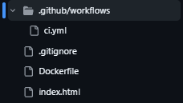

# 🔄 CI/CD Pipeline Lab

Sürekli entegrasyon, otomatik testler, workflow otomasyonu, Docker image oluşturma ve pipeline sorunlarını giderme konularında pratik deneyim kazanmak amacıyla oluşturulmuş uygulamalı bir CI/CD laboratuvarıdır.

Bu laboratuvarın temel amacı, yazılım doğrulama ve build süreçlerini manuel olarak gerçekleştirmek yerine GitHub Actions kullanarak otomatikleştirmektir.

---

## 📌 Proje Genel Bakış

Bu laboratuvar, GitHub Actions tabanlı bir CI/CD workflow'unu göstermektedir.

Projede aşağıdaki konular ele alınmaktadır:

* Git ve GitHub
* GitHub Actions
* Workflow yapılandırması
* Otomatik testler
* Continuous Integration
* Docker image oluşturma
* Pipeline çalıştırma
* Workflow logları
* Hata yönetimi
* Build doğrulama

---

## 1. 📦 Repository ve Proje Yapısı

Projenin kaynak kodu bir GitHub repository'sinde yönetilmektedir.

Git, kaynak kodu değişikliklerini takip etmek için kullanılırken GitHub, repository ve GitHub Actions çalışma ortamını sağlar.

### Proje Yapısı

| **Bileşen**          | **Amaç**                              |
| -------------------- | ------------------------------------- |
| Kaynak Kod           | Uygulamanın kaynak dosyaları          |
| `Dockerfile`         | Docker image build sürecini tanımlar  |
| `.github/workflows/` | GitHub Actions workflow'larını içerir |
| Workflow YAML        | CI/CD pipeline'ını tanımlar           |
| Git Repository       | Proje değişikliklerini takip eder     |

### 📸 Screenshot 01 — Proje Yapısı



---

## 2. ⚙️ GitHub Actions Workflow

GitHub Actions, CI/CD pipeline'ını otomatikleştirmek için kullanılmaktadır.

Workflow, `.github/workflows/` dizini içerisinde bulunan bir YAML yapılandırma dosyası ile tanımlanmıştır.

### Workflow Yapılandırması

| **Bileşen**  | **Yapılandırma**      |
| ------------ | --------------------- |
| CI Platformu | GitHub Actions        |
| Yapılandırma | YAML                  |
| Tetikleyici  | Git repository eventi |
| Testler      | Otomatik              |
| Docker Build | Otomatik              |
| Loglar       | GitHub Actions        |

### Workflow Yapısı

```text
.github/
└── workflows/
    └── ci.yml
```

Workflow, yapılandırılmış repository eventi tetiklendiğinde çalıştırılacak otomatik görevlerin sırasını tanımlar.

### 📸 Screenshot 02 — GitHub Actions Workflow

[GitHub Actions Workflow](02-workflow.png)

---

## 3. 🧪 Otomatik Testler

CI pipeline, workflow tetiklendikten sonra yapılandırılmış testleri otomatik olarak çalıştırır.

Bu sayede kod değişiklikleri pipeline devam etmeden önce otomatik olarak doğrulanabilir.

### Test Süreci

```text
Kod Değişikliği
     │
     ▼
GitHub Actions
     │
     ▼
Otomatik Testler
     │
 ┌───┴────┐
 ▼        ▼
BAŞARILI  HATA
 │        │
 ▼        ▼
Devam     Dur
```

### Test Sonuçları

| **Sonuç**         | **Pipeline Davranışı**      |
| ----------------- | --------------------------- |
| Testler başarılı  | Workflow devam eder         |
| Testler başarısız | Workflow hata bildirir      |
| Test çıktısı      | Workflow loglarında bulunur |

### 📸 Screenshot 03 — Otomatik Testler

[Otomatik Testler](03-tests.png)

---

## 4. 🐳 Docker Image Build

Docker, container image'larının otomatik olarak oluşturulması için CI/CD workflow'una entegre edilmiştir.

Docker image, projenin `Dockerfile` dosyası kullanılarak oluşturulur.

### Docker Yapılandırması

| **Bileşen**    | **Amaç**                             |
| -------------- | ------------------------------------ |
| Dockerfile     | Image build talimatlarını tanımlar   |
| Docker Build   | Container image oluşturur            |
| GitHub Actions | Build sürecini otomatikleştirir      |
| Build Logları  | Build çıktısını ve hataları gösterir |

### Build Süreci

```text
Kaynak Kod
     │
     ▼
Dockerfile
     │
     ▼
Docker Build
     │
     ▼
Docker Image
```

Docker build aşaması, container image oluşturma sürecinin otomatik bir CI workflow'una nasıl entegre edilebileceğini göstermektedir.

### 📸 Screenshot 04 — Docker Build

[Docker Build](04-docker-build.png) 

---

## 5. 🚀 Pipeline Çalıştırma

Bir repository eventi workflow'u tetikledikten sonra GitHub Actions, yapılandırılmış pipeline aşamalarını çalıştırır.

Her aşama kendi çalışma durumunu bildirir ve troubleshooting için loglar sağlar.

### Pipeline Aşamaları

| **Aşama**    | **Amaç**                         | **Sonuç**            |
| ------------ | -------------------------------- | -------------------- |
| Checkout     | Repository kaynak kodunu alır    | Kaynak kod hazır     |
| Test         | Projeyi doğrular                 | Başarılı / Başarısız |
| Docker Build | Container image oluşturur        | Başarılı / Başarısız |
| Workflow     | Final pipeline durumunu bildirir | Başarılı / Başarısız |

Başarılı bir pipeline, gerekli tüm aşamaların herhangi bir hata olmadan tamamlandığını gösterir.

### 📸 Screenshot 05 — Başarılı Pipeline

[Başarılı Pipeline](05-pipeline-success.png) 

---

## 6. ❌ Hata Yönetimi

CI/CD pipeline'ları hataları tespit etmeli ve anlamlı geri bildirim sağlamalıdır.

Bir test veya Docker build başarısız olduğunda GitHub Actions workflow'u başarısız olarak raporlar.

Workflow logları daha sonra başarısız olan adımı belirlemek ve sorunu incelemek için kullanılabilir.

### Hata Yönetimi

| **Durum**           | **Sonuç**                      |
| ------------------- | ------------------------------ |
| Test hatası         | Pipeline hata bildirir         |
| Docker build hatası | Pipeline hata bildirir         |
| Başarılı adım       | Pipeline devam eder            |
| Başarısız adım      | Hata loglarda görüntülenebilir |

### Hata Akışı

```text
Kod Değişikliği
     │
     ▼
GitHub Actions
     │
     ▼
Test / Docker Build
     │
     ▼
    Hata
     │
     ▼
Workflow Loglarını İncele
     │
     ▼
Hatayı Düzelt
     │
     ▼
Değişiklikleri Push Et
```

### 📸 Screenshot 06 — Başarısız Pipeline

[Başarısız Pipeline](06-pipeline-failure.png) 

---

## 7. 🔁 Pipeline Doğrulama

Sorun düzeltildikten sonra workflow tekrar çalıştırılabilir.

Başarılı bir çalıştırma, sorunun giderildiğini ve pipeline'ın tamamen başarılı şekilde tamamlanabildiğini doğrular.

### Doğrulama

| **Kontrol**     | **Beklenen Sonuç**  |
| --------------- | ------------------- |
| Workflow başlar | Başarılı            |
| Testler         | Başarılı            |
| Docker Build    | Başarılı            |
| Workflow durumu | Başarılı            |
| Loglar          | Çözülmemiş hata yok |

### 📸 Screenshot 07 — Başarılı Pipeline Doğrulaması

[Pipeline Doğrulaması](07-pipeline-verification.png) 

---

## 8. 📋 Workflow Logları

GitHub Actions, her workflow adımı için detaylı loglar sağlar.

Bu loglar workflow'un çalışmasını doğrulamak ve pipeline hatalarını analiz etmek için kullanılmıştır.

### Log Doğrulama

| **Log Bilgisi** | **Amaç**                                     |
| --------------- | -------------------------------------------- |
| Adım durumu     | Bir adımın başarılı olup olmadığını belirler |
| Test çıktısı    | Otomatik testleri doğrular                   |
| Docker çıktısı  | Image build sürecini doğrular                |
| Hata mesajları  | Sorunların belirlenmesine yardımcı olur      |
| Final durum     | Pipeline sonucunu doğrular                   |

### 📸 Screenshot 08 — Workflow Logları

[Workflow Logları](08-workflow-logs.png) 

---

## 🛠️ Teknolojiler

**CI/CD**

GitHub Actions

**Versiyon Kontrolü**

Git · GitHub

**Container**

Docker

**Yapılandırma**

YAML

**Otomasyon**

GitHub Actions Workflows

---

## 📚 Gösterilen Yetkinlikler

* Git versiyon kontrolü
* GitHub repository yönetimi
* GitHub Actions
* CI/CD workflow geliştirme
* YAML yapılandırması
* Otomatik testler
* Docker image oluşturma
* Pipeline troubleshooting
* Workflow log analizi
* Hata yönetimi
* Continuous Integration
* Otomatik build doğrulama

---

## 🚀 Sonraki Adımlar

CI/CD laboratuvarı için planlanan geliştirmeler:

* Docker image'larının yayınlanması
* Container Registry entegrasyonu
* Pull Request doğrulaması
* Secret yönetimi
* Deployment otomasyonu
* Ortama özel workflow'lar
* Terraform entegrasyonu
* Kubernetes deployment
* Cloud tabanlı deployment pipeline'ları

---

## 📌 Proje Durumu

Bu laboratuvar; otomatik testler, Docker image oluşturma, pipeline doğrulama ve hata analizi içeren pratik bir GitHub Actions CI/CD workflow'unu göstermektedir.

Proje; otomatik yazılım doğrulama, workflow otomasyonu ve container tabanlı build süreçleri konusunda pratik deneyim sağlamaktadır.

Laboratuvar gelecekte ek deployment ve cloud otomasyonu senaryolarıyla geliştirilebilir.
