# 🐳 Docker Uygulama & Containerization Laboratuvarı

Containerization, uygulama dağıtımı, ağ, depolama, Docker Compose, CI/CD ve container güvenliği alanlarında pratik beceriler geliştirmek amacıyla hazırlanmış uygulamalı Docker laboratuvarı.

Laboratuvar; gerçekçi bir DevOps ortamında container'lı uygulamaların oluşturulması, yapılandırılması, test edilmesi, troubleshooting işlemleri, otomasyonu ve güvenliğini kapsamaktadır.

---

## 📌 Proje Genel Bakış

Bu laboratuvar, Docker kullanılarak container'lı uygulamaların dağıtılmasını ve yönetilmesini kapsamaktadır.

Proje aşağıdaki konuları içermektedir:

* Docker Images
* Docker Containers
* Dockerfiles
* Container yaşam döngüsü yönetimi
* Port Mapping
* Bind Mounts
* Named Volumes
* Docker Networks
* Container'lar arası iletişim
* Docker Compose
* Multi-Container uygulamalar
* PostgreSQL kalıcılığı
* Healthchecks
* Multi-Stage Builds
* Nginx Reverse Proxy
* Kaynak limitleri
* Logging
* Restart Policies
* Docker Hub
* Manuel CI/CD Pipeline
* Semantic Versioning
* Container güvenliği
* Vulnerability Scanning

---

## 🏗️ Mimari

### Mimari Diyagram

Ana uygulama ortamı; ayrı container'lar olarak çalışan bir Nginx Reverse Proxy, backend uygulaması ve PostgreSQL veritabanından oluşmaktadır.

Uygulama, servisler arası iletişim için Docker networking ve veritabanı depolaması için kalıcı bir volume kullanmaktadır.

Diyagram;

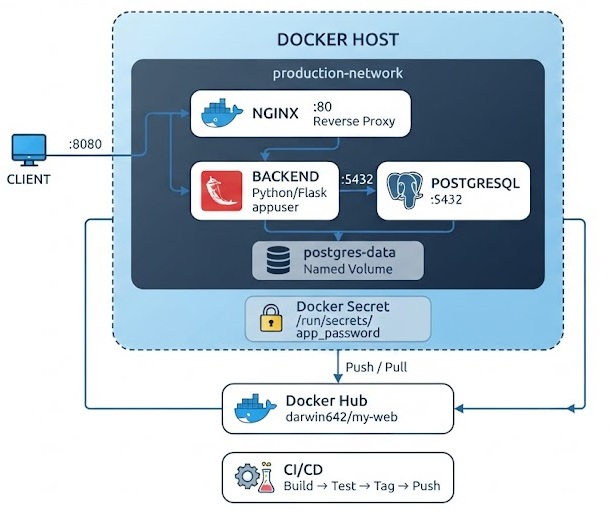

```text
                         CLIENT
                            │
                            ▼
                    ┌──────────────┐
                    │    Nginx     │
                    │ Reverse Proxy│
                    │    :8080     │
                    └──────┬───────┘
                           │
                           ▼
                    ┌──────────────┐
                    │   Backend    │
                    │    :5000     │
                    └──────┬───────┘
                           │
                           ▼
                    ┌──────────────┐
                    │  PostgreSQL  │
                    │    :5432     │
                    └──────┬───────┘
                           │
                           ▼
                    postgres-data
                       Volume
```

---

## 1. 🖼️ Docker Images

Container dağıtımının temel bileşenleri olarak Docker Image'lar oluşturuldu ve yönetildi.

Laboratuvar kapsamında hem resmi Docker Image'ları hem de Dockerfile kullanılarak oluşturulan özel Image'lar kullanıldı.

### Yapılandırma

| Kaynak                | Yapılandırma              |
| --------------------- | ------------------------- |
| Base Image            | `nginx:alpine`            |
| Uygulama Image'ı      | `my-web:v1` / `my-web:v2` |
| Backend Image'ı       | `my-backend:v1`           |
| Registry              | Docker Hub                |
| Docker Hub Repository | `darwin642/my-web`        |

### 📸 Screenshot 01 — Docker Images

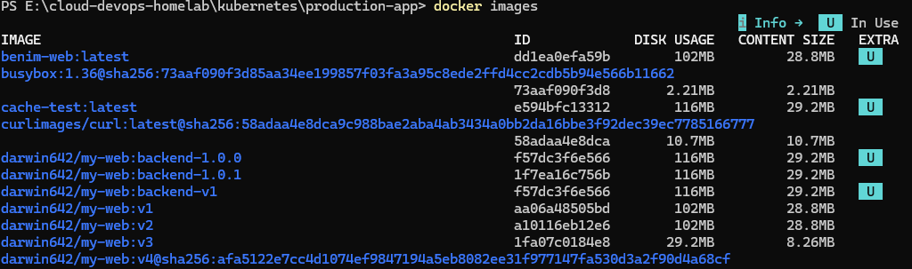

### 📸 Screenshot 02 — Özel Docker Image

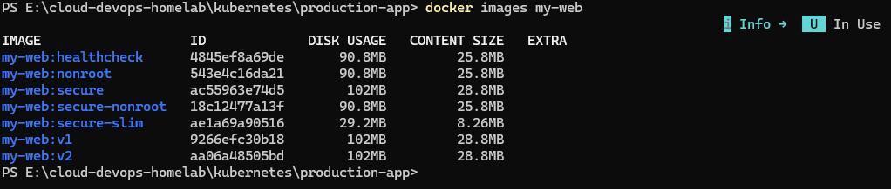

### 📸 Screenshot 03 — Docker Image History

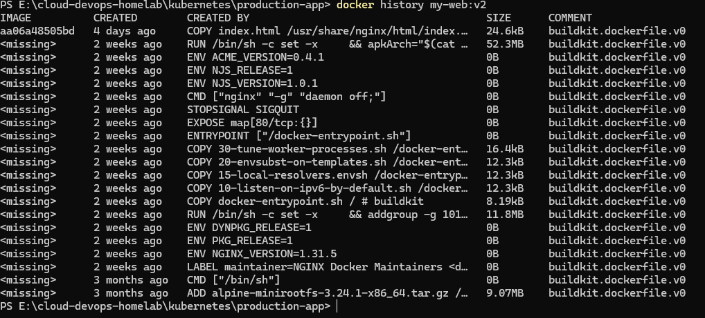

---

## 2. 📦 Docker Containers

Container yaşam döngüsünü göstermek amacıyla Docker Container'lar oluşturuldu, başlatıldı, durduruldu, incelendi ve silindi.

Laboratuvar sırasında birden fazla Nginx container'ı çalıştırıldı.

### Yapılandırma

| Container | Image          | Port   |
| --------- | -------------- | ------ |
| `web01`   | `nginx:alpine` | `8080` |
| `web02`   | `my-web:v1`    | `8081` |
| `web03`   | `my-web:v2`    | `8082` |

### 📸 Screenshot 04 — Çalışan Container'lar

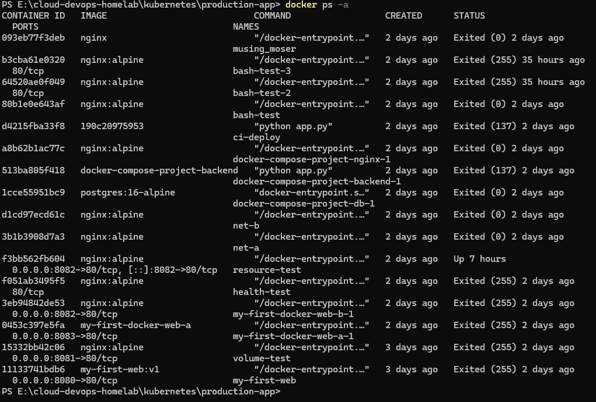

### 📸 Screenshot 05 — Container Detayları

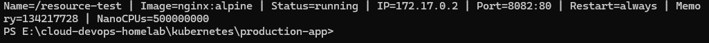

### 📸 Screenshot 06 — Container Yaşam Döngüsü

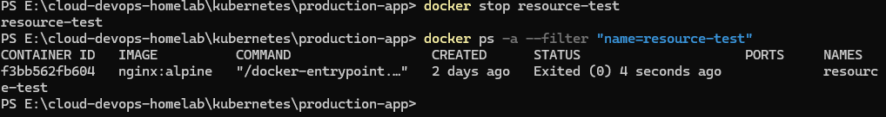

---

## 3. 🐳 Dockerfile & Uygulama Containerization

Dockerfile kullanılarak özel bir uygulama Image'ı oluşturuldu.

Dockerfile; uygulama ortamını, çalışma dizinini, bağımlılıkları, dosyaları ve başlangıç komutunu tanımlamak için kullanıldı.

Uygulama daha sonra bir Docker Image içerisine paketlenerek container olarak çalıştırıldı.

### 📸 Screenshot 07 — Dockerfile

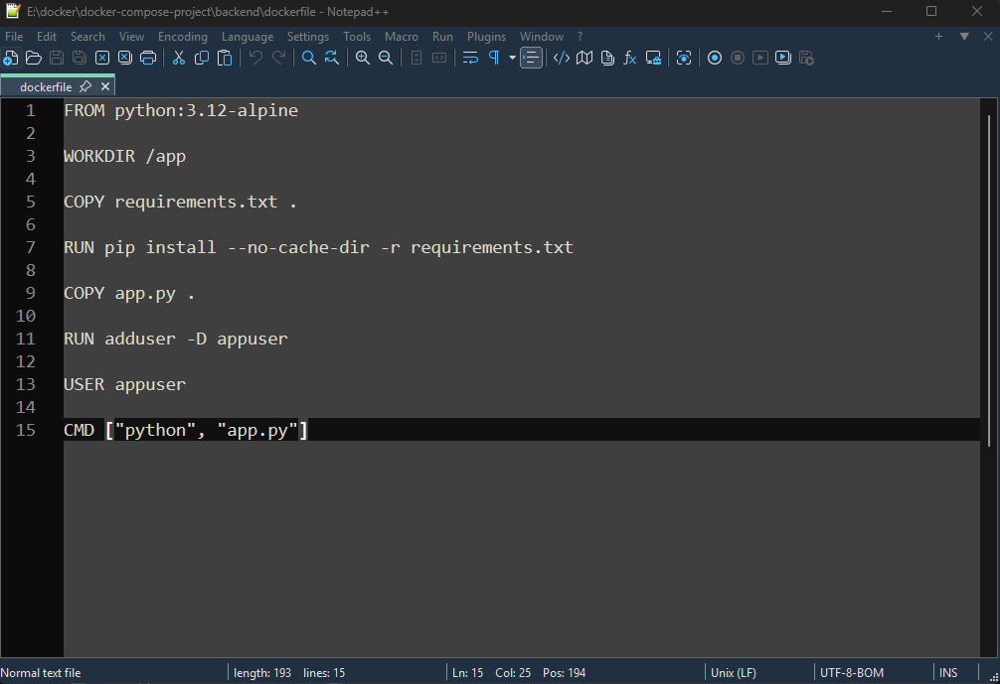

### 📸 Screenshot 08 — Docker Build

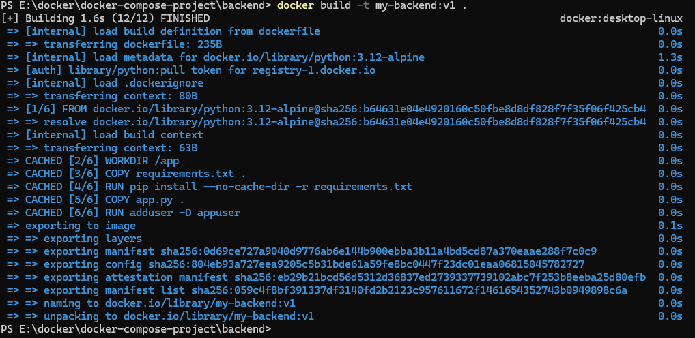

### 📸 Screenshot 09 — Container'laştırılmış Uygulama

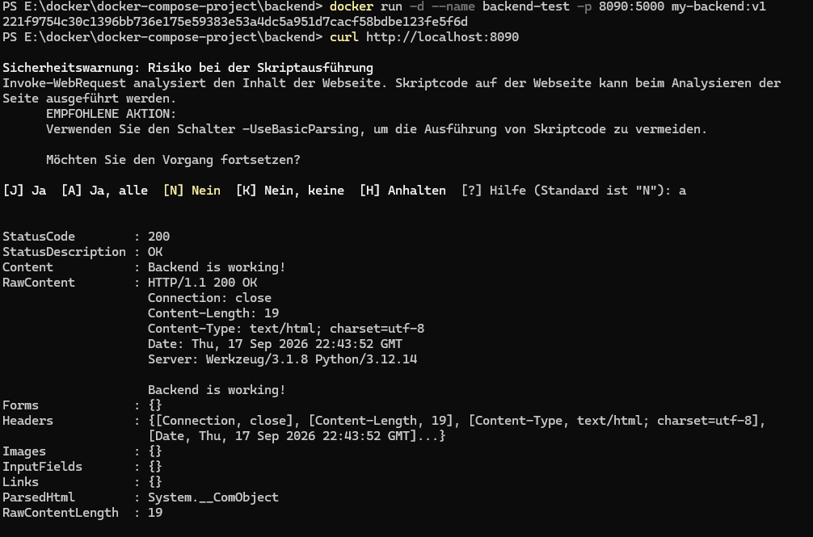

---

## 4. 🔌 Port Mapping

Container'laştırılmış uygulamaları host sistem üzerinden erişilebilir hale getirmek için Docker Port Mapping yapılandırıldı.

Laboratuvar sırasında birden fazla uygulama container'ının aynı anda çalıştırılabilmesi için farklı host portları kullanıldı.

### Yapılandırma

| Container | Container Port | Host Port |
| --------- | -------------- | --------- |
| `web01`   | `80`           | `8080`    |
| `web02`   | `80`           | `8081`    |
| `web03`   | `80`           | `8082`    |

### 📸 Screenshot 10 — Port Mapping

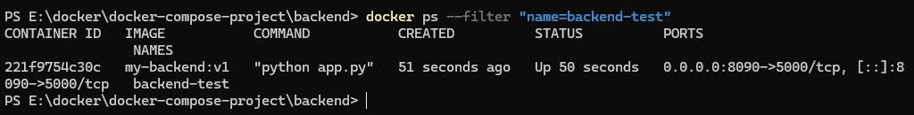

### 📸 Screenshot 11 — Uygulama Erişimi

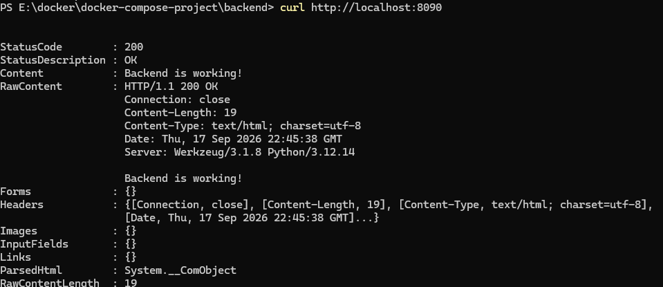

---

## 5. 💾 Volumes & Bind Mounts

Docker Storage hem Named Volume hem de Bind Mount kullanılarak test edildi.

Bir Named Volume kalıcı container depolaması için kullanılırken, Bind Mount ile host üzerindeki bir dizin container içerisine bağlandı.

### Yapılandırma

| Storage Türü   | Örnek                    |
| -------------- | ------------------------ |
| Named Volume   | `nginx-data`             |
| Bind Mount     | `E:\docker\compose-demo` |
| Container Path | `/usr/share/nginx/html`  |

### 📸 Screenshot 12 — Docker Volume

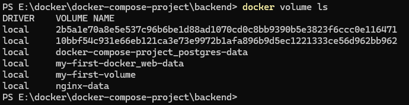

### 📸 Screenshot 13 — Volume Mount

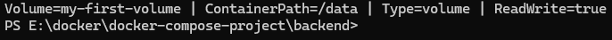

### 📸 Screenshot 14 — Bind Mount

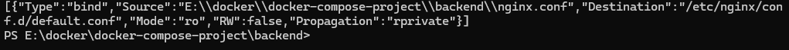

---

## 6. 🌐 Docker Networks

Container'ların Docker'ın dahili networking yapısı ve servis isimleri üzerinden iletişim kurabilmesi için özel bir Docker Bridge Network oluşturuldu.

Container'lar arası iletişim başarıyla test edildi.

### Yapılandırma

| Kaynak             | Yapılandırma           |
| ------------------ | ---------------------- |
| Network            | `app-network`          |
| Network Type       | Bridge                 |
| Communication      | Container-to-container |
| Service Resolution | Docker DNS             |

Backend container'ları host IP adresleri kullanmadan container veya servis isimleri üzerinden birbirleriyle iletişim kurabildi.

### 📸 Screenshot 15 — Docker Network

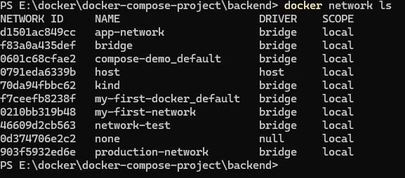

### 📸 Screenshot 16 — Network Container'ları

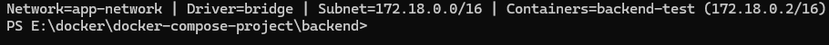

### 📸 Screenshot 17 — Container'lar Arası İletişim

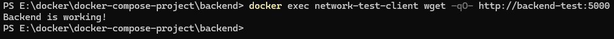

---

## 7. 🧩 Docker Compose

Multi-Container uygulama ortamını tanımlamak ve yönetmek için Docker Compose kullanıldı.

Compose ortamı; kalıcı storage ve healthcheck yapılandırmasına sahip bir backend uygulaması ve PostgreSQL veritabanı içermektedir.

### Yapılandırma

| Service    | Amaç                         |
| ---------- | ---------------------------- |
| Backend    | Uygulama servisi             |
| PostgreSQL | Veritabanı                   |
| Nginx      | Reverse Proxy                |
| Volume     | Kalıcı veritabanı depolaması |
| Network    | Servisler arası iletişim     |

Uygulama ve veritabanı servislerini yapılandırmak için environment variable'lar da kullanıldı.

### 📸 Screenshot 18 — Docker Compose Dosyası

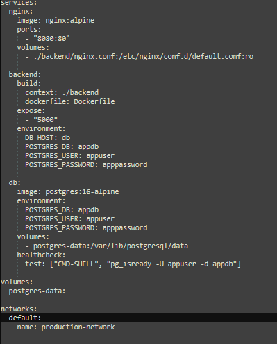

### 📸 Screenshot 19 — Compose Servisleri

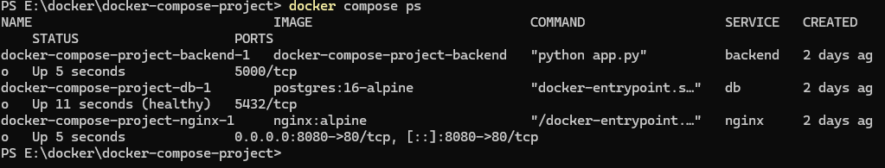

### 📸 Screenshot 20 — Compose Uygulaması

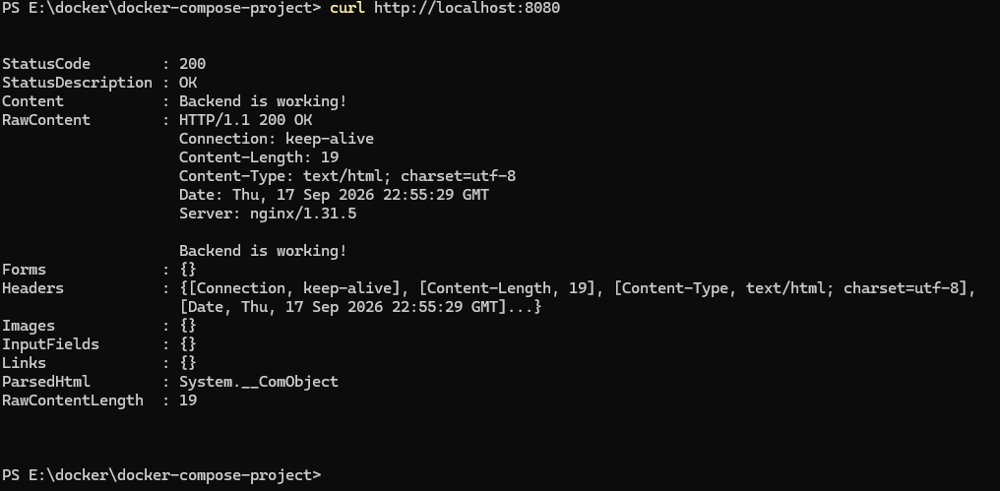

---

## 8. 🗄️ PostgreSQL & Kalıcı Uygulama Verileri

Multi-Container uygulama ortamına PostgreSQL container'ı entegre edildi.

Veritabanı, container yaşam döngüsünden bağımsız olarak verilerin korunmasını sağlamak için Named Volume kullandı.

Container'lar yeniden oluşturulurken veritabanı volume'ünün korunması test edildi.

### Yapılandırma

| Kaynak           | Yapılandırma         |
| ---------------- | -------------------- |
| Database         | PostgreSQL           |
| Image            | `postgres:16-alpine` |
| Database Volume  | `postgres-data`      |
| Database Port    | `5432`               |
| Database Network | `production-network` |

### 📸 Screenshot 21 — PostgreSQL Container

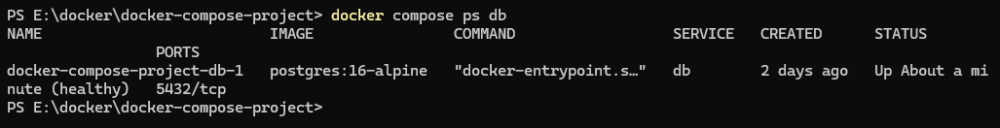

### 📸 Screenshot 22 — PostgreSQL Volume

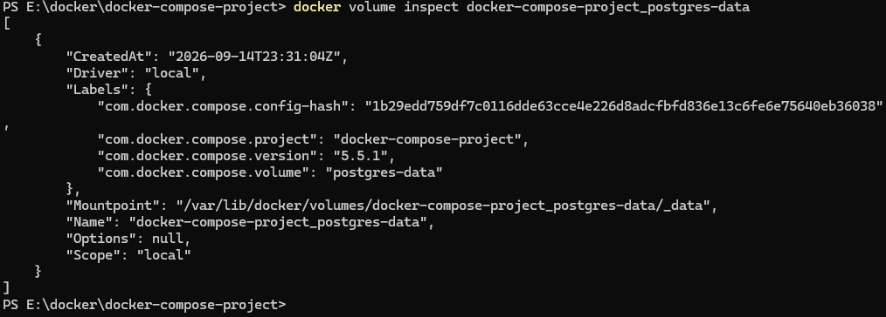

### 📸 Screenshot 23 — Kalıcı Veriler

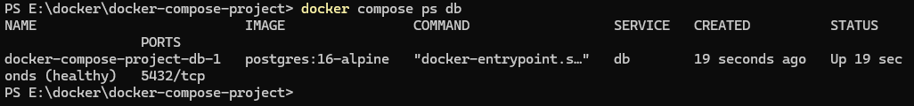

---

## 9. 🩺 Healthchecks & Servis Bağımlılıkları

PostgreSQL veritabanının kullanılabilirliğini kontrol etmek için Docker Healthcheck yapılandırıldı.

Backend servisi, başlamadan önce veritabanının başarılı bir healthcheck durumuna gelmesini bekleyecek şekilde yapılandırıldı.

### Yapılandırma

```yaml
healthcheck:
  test: ["CMD-SHELL", "pg_isready -U appuser -d appdb"]
  interval: 5s
  timeout: 2s
  retries: 5
```

Application Stack başlatılarak backend servisinin veritabanı sağlıklı hale geldikten sonra kullanılabilir olduğu doğrulandı.

### 📸 Screenshot 24 — PostgreSQL Healthcheck

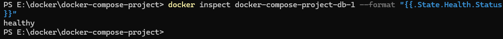

### 📸 Screenshot 25 — Service Health

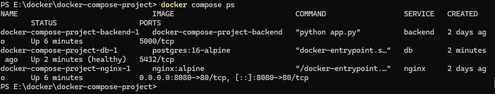

---

## 10. 🔀 Nginx Reverse Proxy

Nginx, backend uygulamasının önünde Reverse Proxy olarak yapılandırıldı.

Reverse Proxy, gelen HTTP isteklerini Docker Network üzerinden backend container'ına yönlendirmektedir.

### Yapılandırma

| Ayar            | Değer     |
| --------------- | --------- |
| Proxy           | Nginx     |
| External Port   | `8080`    |
| Backend Port    | `5000`    |
| Backend Service | `backend` |

Backend servisi host sistemine doğrudan açılmadı. Nginx dış erişim noktası olarak kullanıldı.

### 📸 Screenshot 26 — Nginx Yapılandırması

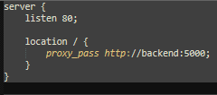

### 📸 Screenshot 27 — Reverse Proxy Stack

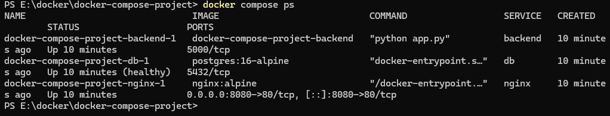

### 📸 Screenshot 28 — HTTP 200 Response

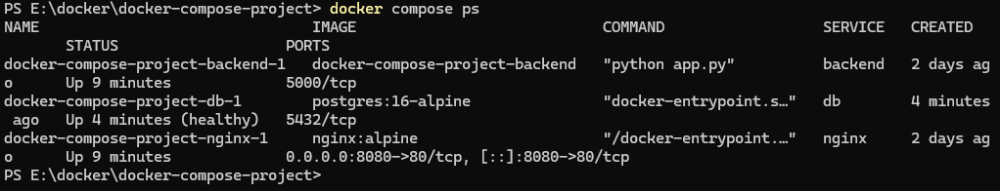

---

## 11. 🏗️ Multi-Stage Docker Build

Build ortamını final runtime ortamından ayırmak için Multi-Stage Dockerfile oluşturuldu.

Final Image yalnızca gerekli runtime bileşenlerini içererek gereksiz Image içeriğinin azaltılmasını sağlar.

### 📸 Screenshot 29 — Multi-Stage Dockerfile

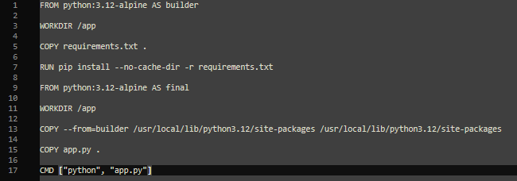

### 📸 Screenshot 30 — Multi-Stage Build

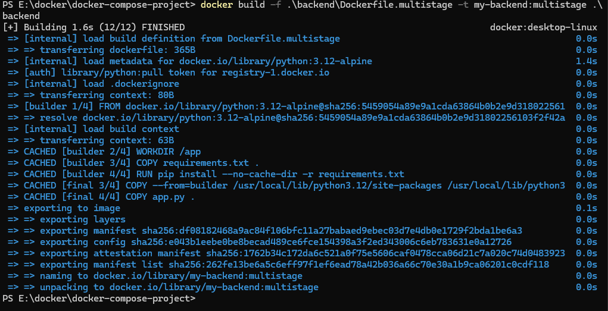

---

## 12. ⚡ Docker Build Optimizasyonu

Image oluşturma sürecini daha verimli hale getirmek ve gereksiz build verilerini azaltmak amacıyla Docker Build optimizasyon teknikleri uygulandı.

Projede aşağıdaki yöntemler kullanıldı:

* `.dockerignore`
* Layer-aware Dockerfile yapısı
* `pip --no-cache-dir`
* Alpine tabanlı Image'lar
* Multi-Stage Builds
* Docker Build Cache

### 📸 Screenshot 31 — Dockerignore

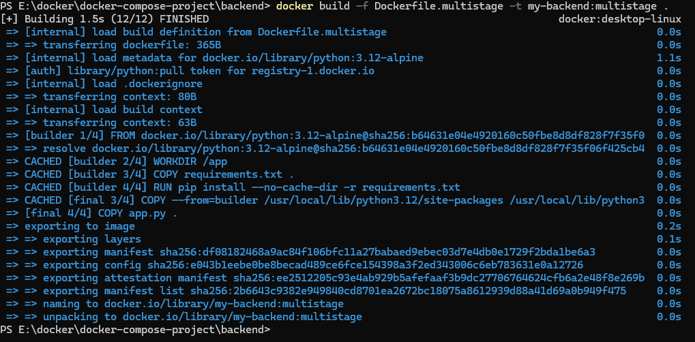

### 📸 Screenshot 32 — Optimize Edilmiş Dockerfile

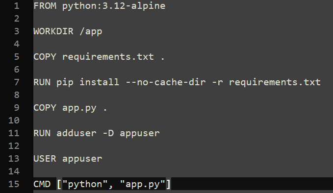

---

## 13. 📊 Kaynak Limitleri

Container'ların CPU ve Memory kullanımını kontrol etmek amacıyla kaynak limitleri test edildi.

### Yapılandırma

| Kaynak       | Yapılandırma |
| ------------ | ------------ |
| CPU Limit    | `500m`       |
| Memory Limit | `128Mi`      |

Kaynak limitleri, bir container'ın host sistem kaynaklarını sınırsız şekilde tüketmesini önlemek için kullanıldı.

### 📸 Screenshot 33 — Resource Limits

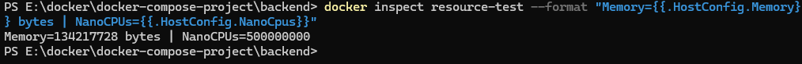

### 📸 Screenshot 34 — Docker Stats

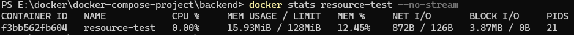

---

## 14. 📝 Logging & Restart Policies

Troubleshooting sırasında Docker container logları incelendi ve filtrelendi.

Ayrıca container'ların otomatik olarak yeniden başlatılmasını göstermek amacıyla Restart Policy'ler yapılandırıldı.

### Yapılandırma

* `docker logs`
* Log filtreleme için `grep`
* Log görüntüleme için `tail`
* Container Restart Policies

### 📸 Screenshot 35 — Container Logs

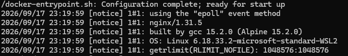

### 📸 Screenshot 36 — Restart Policy

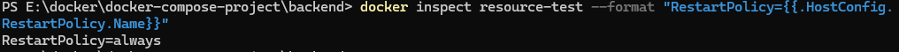

---

## 15. 🔄 Manuel CI/CD Pipeline

Docker ve PowerShell kullanılarak manuel bir CI/CD pipeline uygulandı.

Pipeline; uygulama Image'ını otomatik olarak build eder, geçici bir test container'ı başlatır, HTTP response'u kontrol eder, Image'ı tag'ler ve Docker Hub'a gönderir.

### Pipeline

```text
Code
  ↓
Build
  ↓
Test
  ↓
Tag
  ↓
Push
  ↓
Deploy
```

Otomatik PowerShell pipeline aşağıdaki işlemleri gerçekleştirmektedir:

* Docker Image Build
* Geçici test container'ı oluşturma
* HTTP Health Test
* Test container'ını temizleme
* Docker Image Tagging
* Docker Hub'a Push

### 📸 Screenshot 37 — CI/CD Script

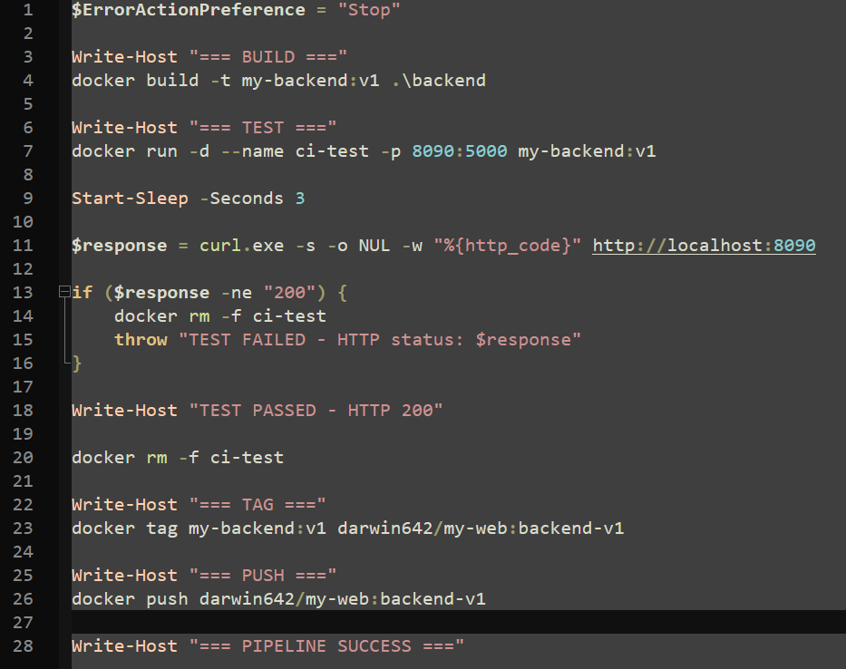

### 📸 Screenshot 38 — CI/CD Build & Test

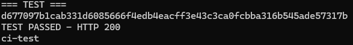

### 📸 Screenshot 39 — CI/CD Pipeline Başarılı

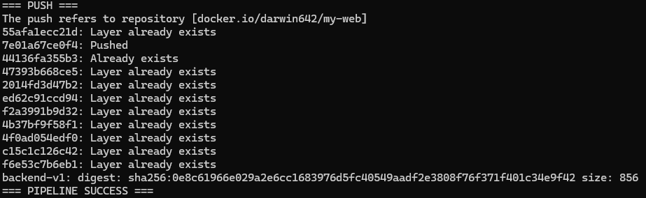

---

## 16. 📦 Docker Hub & Image Registry

Docker Image'ları Docker Hub'a gönderildi ve registry tabanlı bir deployment workflow'unu simüle etmek amacıyla tekrar local ortama çekildi.

### Yapılandırma

| Kaynak     | Yapılandırma       |
| ---------- | ------------------ |
| Registry   | Docker Hub         |
| Repository | `darwin642/my-web` |
| Örnek Tag  | `backend-v1`       |

Image registry'ye push edildi, local ortamdan silindi, tekrar pull edildi ve başarıyla deploy edildi.

### 📸 Screenshot 40 — Docker Hub Repository

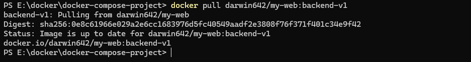

### 📸 Screenshot 41 — Docker Push

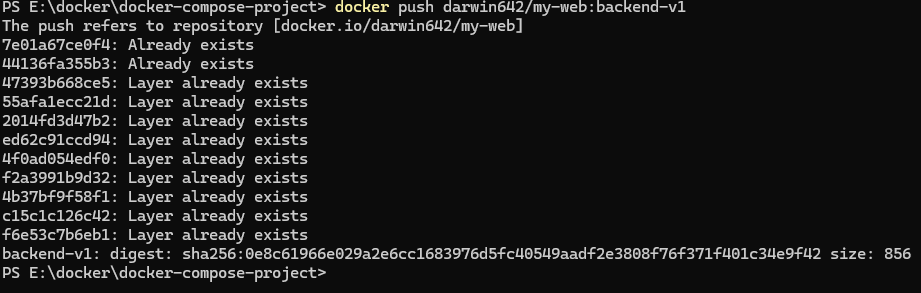

### 📸 Screenshot 42 — Docker Pull

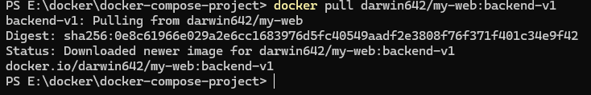

---

## 17. 🔢 Semantic Versioning

Container Image release'leri için Semantic Versioning kullanıldı.

### Versiyonlama

```text
1.0.0 → Initial release
1.0.1 → Patch
1.1.0 → Geriye dönük uyumlu özellik
2.0.0 → Breaking Change
```

Deployment sırasında farklı uygulama versiyonlarını ayırt etmek için Docker Image Tag'leri kullanıldı.

### 📸 Screenshot 43 — Image Tags

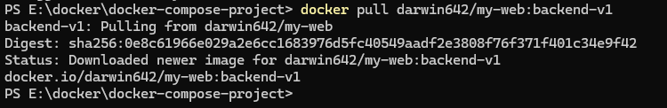

---

## 18. 🔐 Docker Güvenliği

Gereksiz yetkileri azaltmak ve Image güvenliğini artırmak amacıyla container güvenlik uygulamaları gerçekleştirildi.

Backend container'ı root olmayan bir kullanıcı ile çalışacak şekilde yapılandırıldı.

Ek güvenlik uygulamaları:

* Non-root Container
* Read-only Configuration Mounts
* Docker Secrets
* `.dockerignore`
* Image Vulnerability Scanning
* Minimal Base Image'lar

### 📸 Screenshot 44 — Non-Root User

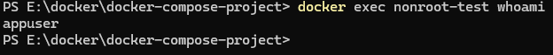

### 📸 Screenshot 45 — Docker Secrets

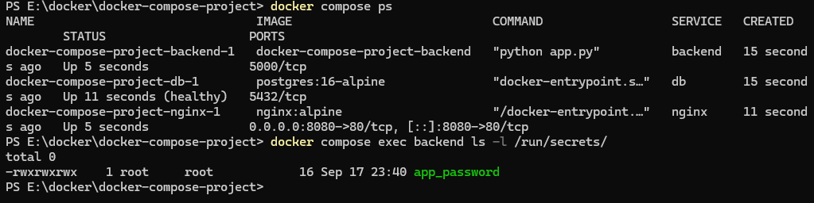

### 📸 Screenshot 46 — Vulnerability Scan

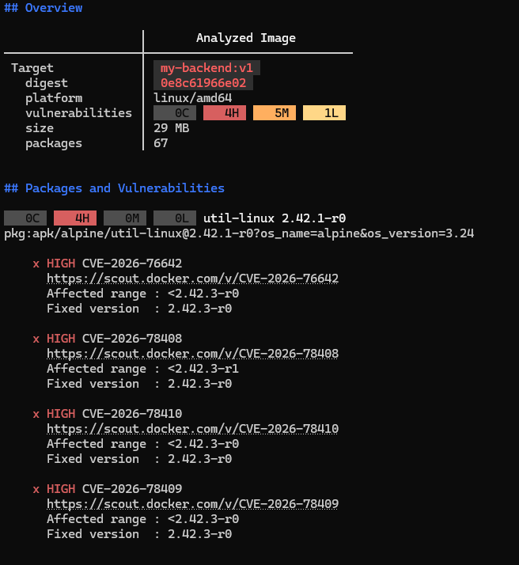

---

## 19. 🧪 Test & Troubleshooting

Docker ortamı pratik troubleshooting senaryoları üzerinden test edildi.

Testler aşağıdaki konuları kapsamaktadır:

* Container yaşam döngüsü yönetimi
* Port Mapping
* Volume kalıcılığı
* Bind Mount davranışı
* Container Networking
* Container'lar arası iletişim
* Docker Compose deployment
* PostgreSQL kalıcılığı
* Healthchecks
* Nginx Reverse Proxy
* Container kaynak kullanımı
* Container Logs
* Restart Policies
* Image Pull ve Deployment
* CI/CD doğrulaması
* Container güvenliği
* Vulnerability Scanning

Production Compose uygulaması Nginx Reverse Proxy üzerinden başarıyla deploy edildi ve test edildi.

```text
localhost:8080
      ↓
Nginx :80
      ↓
Backend :5000
      ↓
PostgreSQL :5432
      ↓
postgres-data
```

Final HTTP response Reverse Proxy üzerinden başarıyla alındı.

### 📸 Screenshot 47 — Production Stack

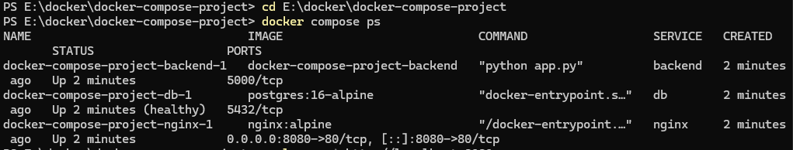

### 📸 Screenshot 48 — Production HTTP Test

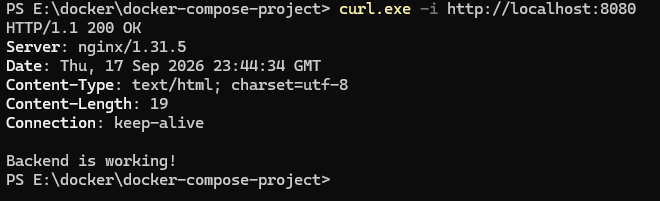

### 📸 Screenshot 49 — Container Status

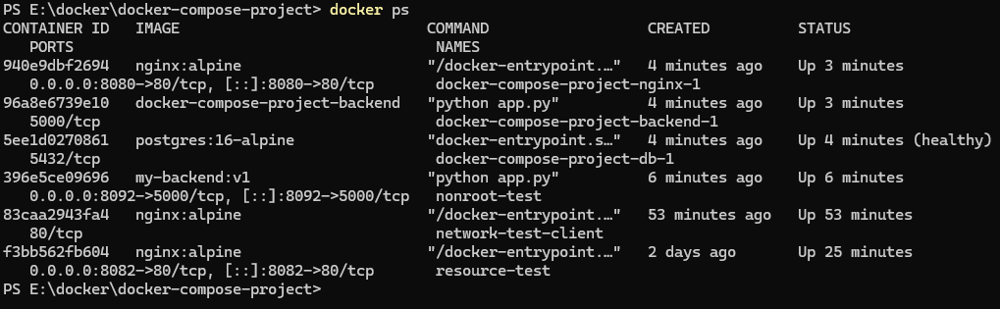

---

## 🛠️ Teknolojiler

**Containerization**

Docker · Docker Compose · Dockerfile

**Containers**

Nginx · Python · PostgreSQL

**Networking**

Docker Bridge Networks · Container DNS · Port Mapping · Reverse Proxy

**Storage**

Docker Volumes · Bind Mounts

**CI/CD**

PowerShell · Docker Build · Docker Hub · Automated Testing

**Security**

Non-root Containers · Docker Secrets · `.dockerignore` · Vulnerability Scanning

**Application**

Flask · PostgreSQL · Nginx

**Operating System**

Windows 11 · WSL2

---

## 📚 Gösterilen Beceriler

* Docker Containerization
* Docker Image yönetimi
* Dockerfile geliştirme
* Application Containerization
* Container yaşam döngüsü yönetimi
* Port Mapping
* Docker Networking
* Container'lar arası iletişim
* Docker DNS
* Docker Volumes
* Bind Mounts
* Docker Compose
* Multi-Container uygulama deployment
* PostgreSQL Containerization
* Kalıcı uygulama verileri
* Healthchecks
* Nginx Reverse Proxy
* Multi-Stage Docker Builds
* Docker Build optimizasyonu
* Container kaynak yönetimi
* Docker Logging
* Restart Policies
* Docker Hub
* Manuel CI/CD
* Semantic Versioning
* Container Security
* Vulnerability Scanning
* DevOps otomasyonu
* Application Troubleshooting

---

## 🚀 Sonraki Adımlar

Docker laboratuvarı için planlanan genişletmeler:

* Kubernetes Container Orchestration
* Kubernetes Deployments ve Services
* Kubernetes Networking
* Kubernetes Persistent Storage
* Kubernetes Security
* Helm tabanlı uygulama deployment
* Cloud Container Deployments
* Gelişmiş CI/CD otomasyonu

---

## 📌 Proje Durumu

Bu laboratuvar, devam eden uygulamalı bir Containerization ve DevOps projesidir.

Ortam; temel Docker container'larından başlayarak Multi-Container uygulamalarına, kalıcı storage, networking, Reverse Proxy mimarisi, CI/CD otomasyonu, Image Registry'leri ve container güvenliğine kadar genişletilmiştir.

Docker laboratuvarı, bu repository içerisindeki Kubernetes ve Cloud Infrastructure projeleri için temel oluşturmaktadır.
