# ☁️ Google Cloud Platform Altyapı Laboratuvarı

Bulut altyapısı, ağ, güvenlik, yük dengeleme, kimlik, izleme, yedekleme, depolama, otomatik ölçeklendirme ve hibrit bağlantı konularında uygulamalı beceriler geliştirmek amacıyla oluşturulmuş pratik bir GCP altyapı laboratuvarıdır.

Bu laboratuvarın temel amacı gerçekçi bir GCP altyapı ortamı oluşturmak, yapılandırmak, test etmek ve sorunlarını gidermektir.

---

## 📌 Proje Genel Bakış

Bu laboratuvar, public ve private subnet'ler kullanılarak küçük ölçekli bir GCP altyapı ortamının tasarlanmasını ve yönetilmesini kapsar.

Proje aşağıdaki konuları kapsamaktadır:

* Google Cloud VPC
* Public ve private subnet'ler
* Firewall Rules
* Compute Engine
* Global Application Load Balancer
* Managed Instance Group
* Autoscaling
* Cloud Storage
* IAM
* Service Accounts
* Cloud DNS
* Private Google Access
* Cloud Monitoring
* Alerting
* Backup ve DR
* Storage Lifecycle Management
* Resource Protection
* AWS ↔ GCP private bağlantısı
* Ağ sorun giderme

---

## 🏗️ Mimari

### Mimari Diyagram

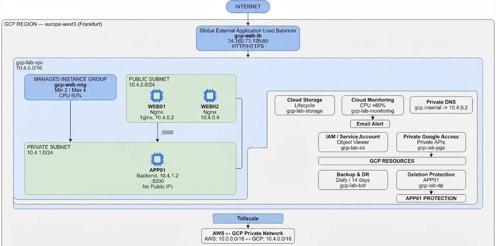

Ortam; public ve private subnet'lere sahip bir VPC, iki web sunucusu, private bir application sunucusu ve internete açık bir Global Application Load Balancer'dan oluşmaktadır.

WEB01 ve WEB02, Load Balancer üzerinden gelen web trafiğini karşılar.

APP01 private subnet içerisinde çalışır ve public IP adresine sahip değildir.

Ortam ayrıca CPU tabanlı autoscaling yapılandırmasına sahip bir Managed Instance Group içermektedir.

AWS ve GCP private ağları, cloud'lar arası bağlantı testleri için Tailscale üzerinden birbirine bağlanmıştır.

---

## 1. 🌐 VPC ve Subnet'ler

GCP ağ altyapısı, ayrı public ve private subnet'lere sahip özel bir VPC kullanılarak oluşturulmuştur.

### Yapılandırma

| Kaynak         | Yapılandırma         |
| -------------- | -------------------- |
| Region         | `europe-west3`       |
| VPC            | `gcp-lab-vpc`        |
| Public Subnet  | `gcp-public-subnet`  |
| Public CIDR    | `10.4.0.0/24`        |
| Private Subnet | `gcp-private-subnet` |
| Private CIDR   | `10.4.1.0/24`        |

WEB01 ve WEB02 public subnet içerisinde, APP01 ise private subnet içerisinde bulunmaktadır.

### 📸 Screenshot 01 — VPC

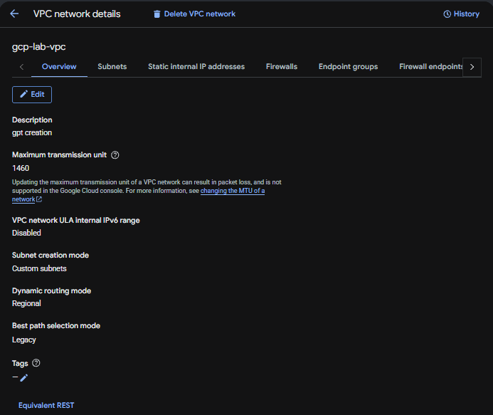

### 📸 Screenshot 02 — Subnet'ler

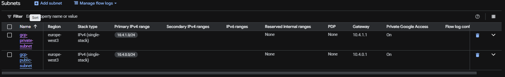

### 📸 Screenshot 03 — Firewall Kuralları

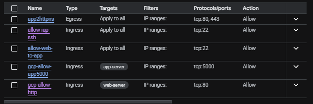

---

## 2. 🖥️ Compute Engine Altyapısı

GCP ortamının web ve application katmanlarını temsil etmek üzere Compute Engine instance'ları oluşturulmuştur.

### Yapılandırma

| Sunucu      | Rol                  | Ağ             |
| ----------- | -------------------- | -------------- |
| `gcp-web01` | Web Sunucusu         | Public Subnet  |
| `gcp-web02` | Web Sunucusu         | Public Subnet  |
| `gcp-app01` | Application Sunucusu | Private Subnet |

WEB01 ve WEB02 web katmanını, APP01 ise private backend application katmanını sağlar.

### 📸 Screenshot 04 — WEB01

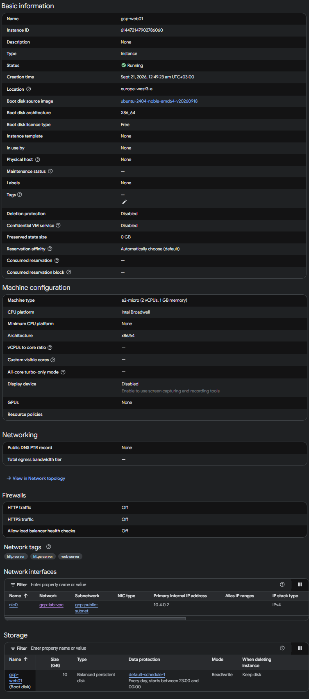

### 📸 Screenshot 05 — WEB02

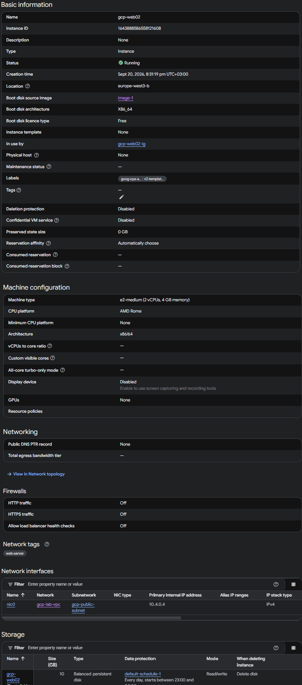

### 📸 Screenshot 06 — APP01

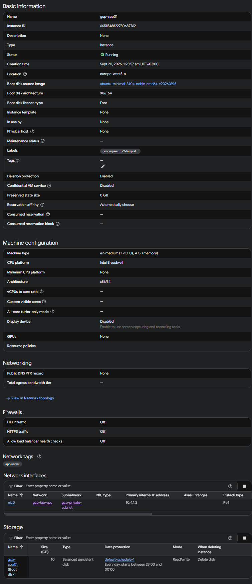

---

## 3. ⚖️ Global Application Load Balancer

Web katmanına gelen HTTP trafiğini dağıtmak amacıyla bir Global External Application Load Balancer yapılandırılmıştır.

Load Balancer, backend olarak Managed Instance Group'u kullanır ve `/health` endpoint'i üzerinden HTTP health check gerçekleştirir.

### Yapılandırma

| Kaynak        | Yapılandırma                              |
| ------------- | ----------------------------------------- |
| Load Balancer | Global External Application Load Balancer |
| Frontend      | HTTP                                      |
| Backend       | `gcp-web-backend`                         |
| Health Check  | `gcp-web-health`                          |
| Backend       | `gcp-web-mig`                             |

### 📸 Screenshot 07 — Load Balancer

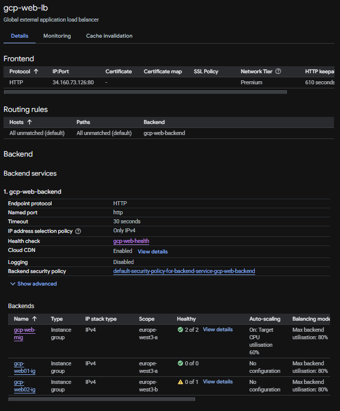

### 📸 Screenshot 08 — Backend Service

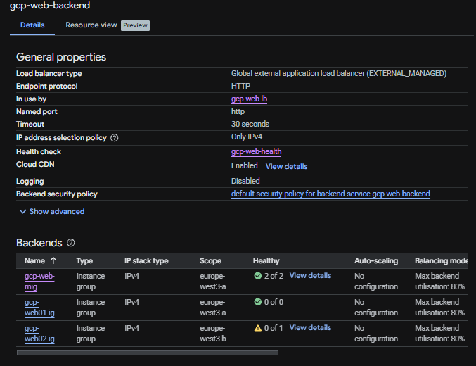

### 📸 Screenshot 09 — Health Check

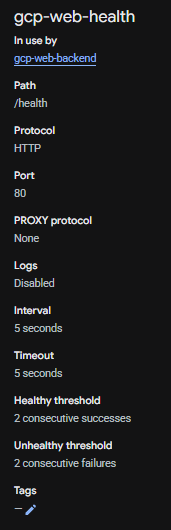

---

## 4. 📈 Managed Instance Group ve Autoscaling

Web katmanı için bir Managed Instance Group yapılandırılmıştır.

MIG, bir instance template kullanır ve CPU kullanımı yapılandırılmış hedefi aştığında otomatik olarak yeni instance'lar oluşturur.

### Yapılandırma

| Kaynak            | Yapılandırma          |
| ----------------- | --------------------- |
| MIG               | `gcp-web-mig`         |
| Region            | `europe-west3`        |
| Zone              | `europe-west3-a`      |
| Minimum instance  | `2`                   |
| Maximum instance  | `4`                   |
| CPU hedefi        | `60%`                 |
| Instance template | `gcp-web-template-v2` |

Autoscaling, bir MIG instance'ı üzerinde CPU yükü oluşturularak test edilmiştir.

Grup başarıyla **2 instance'tan 4 instance'a** ölçeklenmiştir.

### 📸 Screenshot 10 — Managed Instance Group

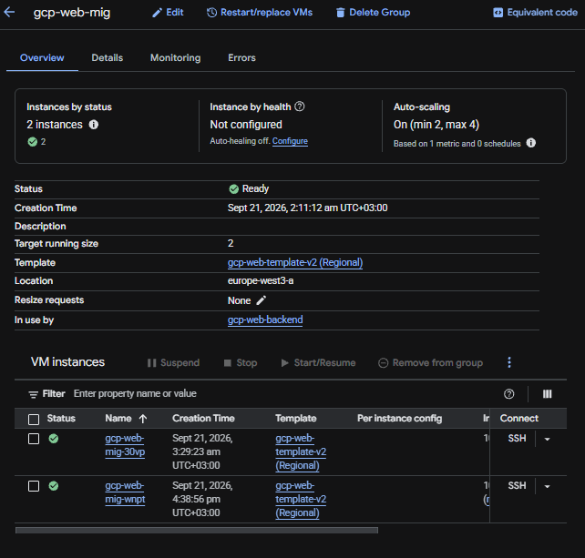

### 📸 Screenshot 11 — Autoscaling

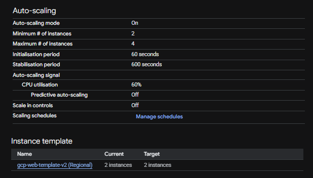

---

## 5. 🗄️ Cloud Storage

Cloud Storage, ortamın object storage katmanı olarak yapılandırılmıştır.

### Yapılandırma

| Kaynak         | Yapılandırma                |
| -------------- | --------------------------- |
| Bucket         | `gcp-lab-storage-20260920`  |
| Location       | `europe-west3`              |
| Storage Class  | Standard                    |
| Public Access  | Public değil                |
| Access Control | Uniform bucket-level access |

Bir test objesi oluşturulmuş ve özel VM Service Account kullanılarak APP01 üzerinden erişilmiştir.

### 📸 Screenshot 12 — Cloud Storage Bucket

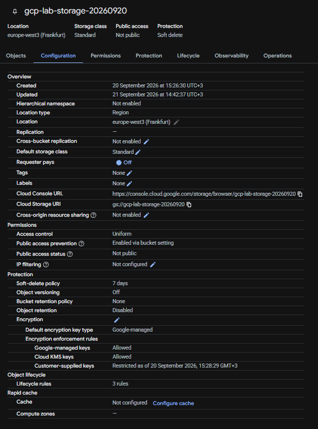

### 📸 Screenshot 13 — Storage Object

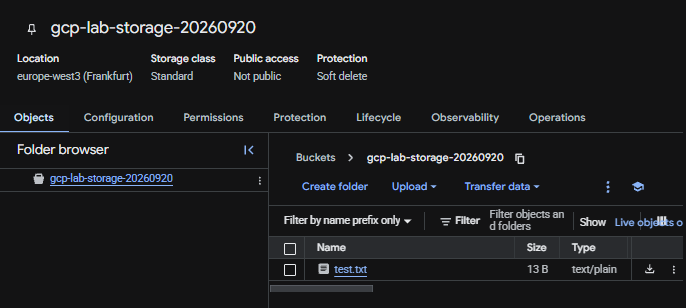

---

## 6. ♻️ Storage Lifecycle Management

Cloud Storage Lifecycle Management, objelerin yaşına bağlı olarak daha düşük maliyetli storage class'lara otomatik olarak taşınması için yapılandırılmıştır.

### Lifecycle Kuralları

| Obje Yaşı | Storage Class |
| --------- | ------------- |
| 30+ gün   | Nearline      |
| 60+ gün   | Coldline      |
| 90+ gün   | Archive       |

Bu yapılandırma, uzun süreli veri saklama için otomatik storage tier yönetimini göstermektedir.

### 📸 Screenshot 14 — Lifecycle Kuralları

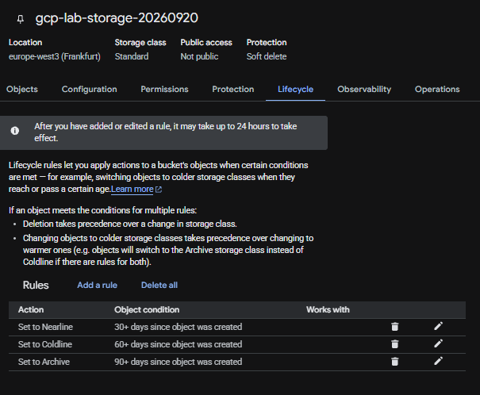

---

## 7. 🆔 IAM ve Service Accounts

Google Cloud IAM, cloud kaynaklarına erişimi kontrol etmek için kullanılmıştır.

GCP lab VM'i için özel bir Service Account oluşturulmuş ve Cloud Storage'a gerekli minimum erişim verilmiştir.

### Kapsanan Konular

* IAM Users
* Least privilege
* Bucket-level permissions
* Service Accounts
* VM identity
* Storage Object Viewer

VM Service Account, APP01/WEB01 tarafından kullanıcı kimlik bilgileri kullanılmadan Cloud Storage bucket'ına erişmek için kullanılmıştır.

### 📸 Screenshot 15 — IAM

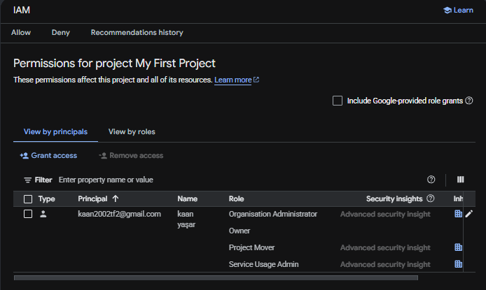

### 📸 Screenshot 16 — Service Account

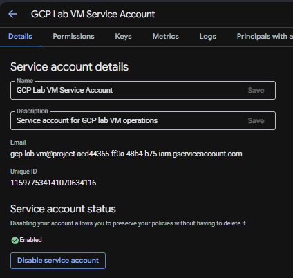

### 📸 Screenshot 17 — Bucket Permissions

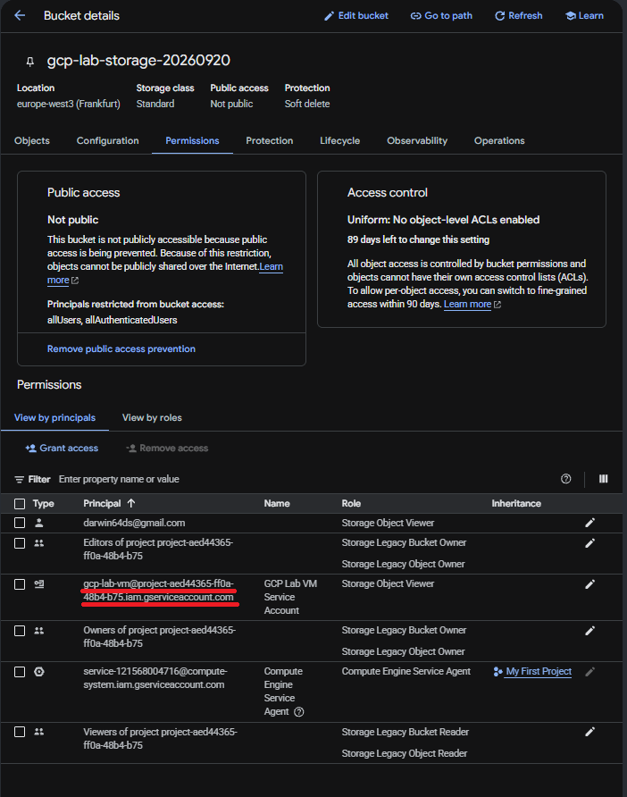

---

## 8. 🌐 Private DNS

GCP VPC için private bir DNS zone kullanılarak Cloud DNS yapılandırılmıştır.

### Yapılandırma

| Kaynak   | Yapılandırma                    |
| -------- | ------------------------------- |
| DNS Zone | `gcp-private-zone`              |
| DNS Name | `gcp.internal.`                 |
| Network  | `gcp-lab-vpc`                   |
| Record   | `web01.gcp.internal → 10.4.0.2` |

Private DNS adı VPC içerisinden başarıyla çözümlenmiştir.

### 📸 Screenshot 18 — Private DNS Zone

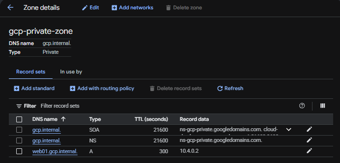

### 📸 Screenshot 19 — DNS Record

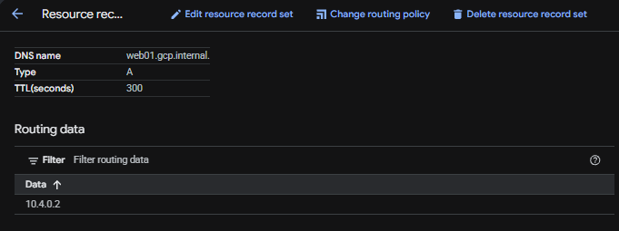

---

## 9. 🔒 Private Google Access

Private Google Access private subnet üzerinde etkinleştirilmiştir.

Bu özellik, external IP adresi olmayan instance'ların desteklenen Google API ve servislerine erişmesini sağlar.

APP01, public IP adresine ihtiyaç duymadan Cloud Storage'a başarıyla erişmiştir.

### 📸 Screenshot 20 — Private Google Access

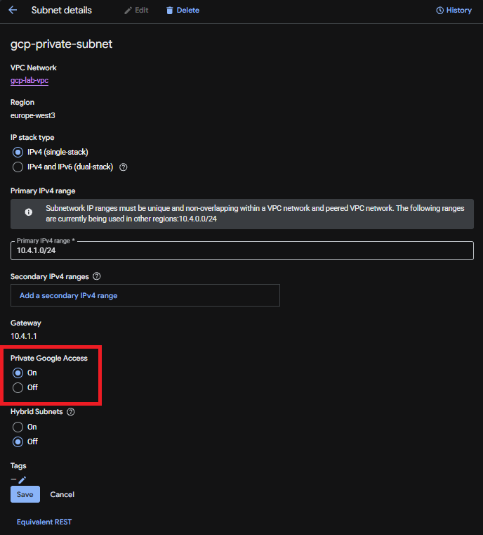

---

## 10. 📊 Monitoring ve Alerting

Cloud Monitoring, Compute Engine metriklerini izlemek için kullanılmıştır.

WEB01 için CPU kullanımına dayalı bir alert policy yapılandırılmıştır.

### Kapsanan Konular

* Metrics Explorer
* VM CPU monitoring
* Alert policies
* Email notifications
* Threshold-based alerting

Alerting sistemi test edilmiş ve email bildirimleri başarıyla alınmıştır.

### 📸 Screenshot 21 — Monitoring Metric

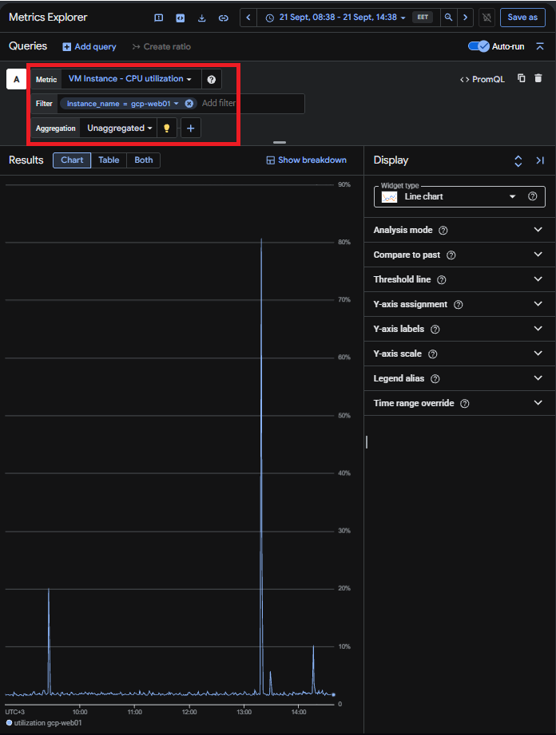

### 📸 Screenshot 22 — Alert Policy

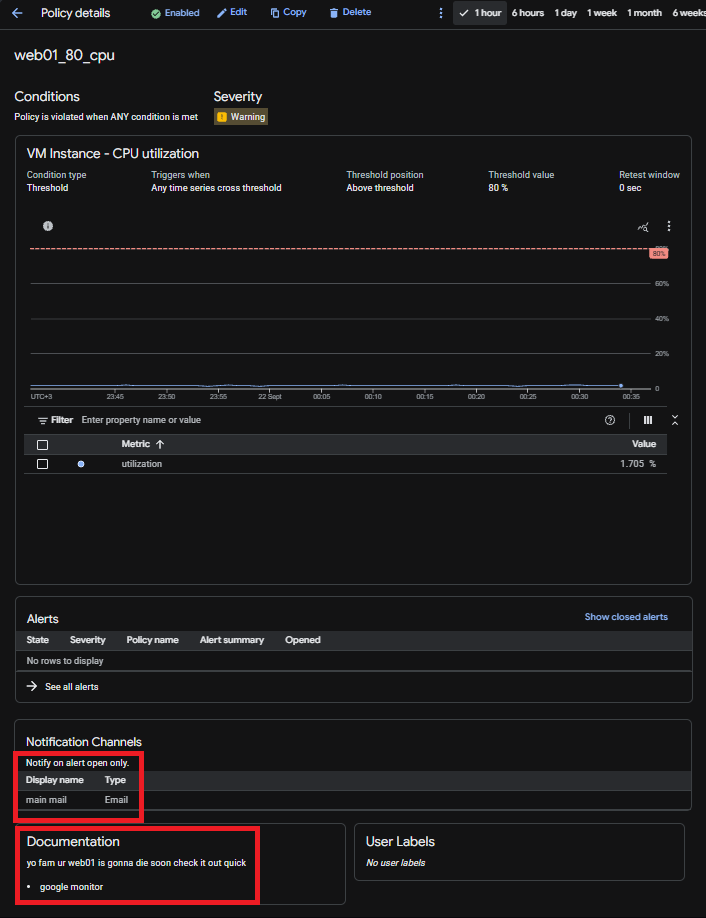

---

## 11. 💾 Backup ve Disaster Recovery

APP01'i korumak amacıyla Google Cloud Backup and DR yapılandırılmıştır.

Planlı günlük backup'lar için bir Backup Vault ve backup plan oluşturulmuştur.

### Yapılandırma

| Kaynak         | Yapılandırma       |
| -------------- | ------------------ |
| Backup Vault   | `gcp-lab-vault`    |
| Location       | `europe-west3`     |
| Backup Plan    | `gcp-app01-backup` |
| Schedule       | Daily              |
| Retention      | 14 days            |
| Disk Inclusion | All disks          |

### 📸 Screenshot 23 — Backup Vault

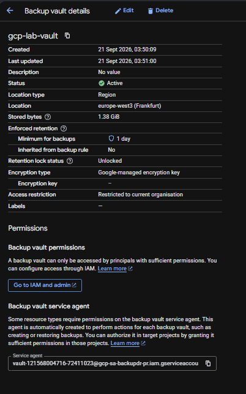

### 📸 Screenshot 24 — Backup Plan

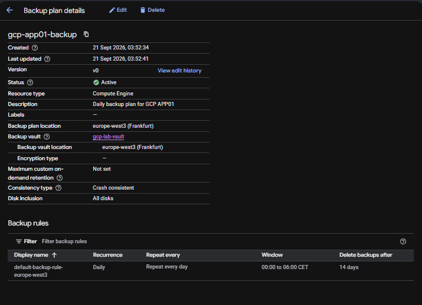

### 📸 Screenshot 25 — Protected Resource

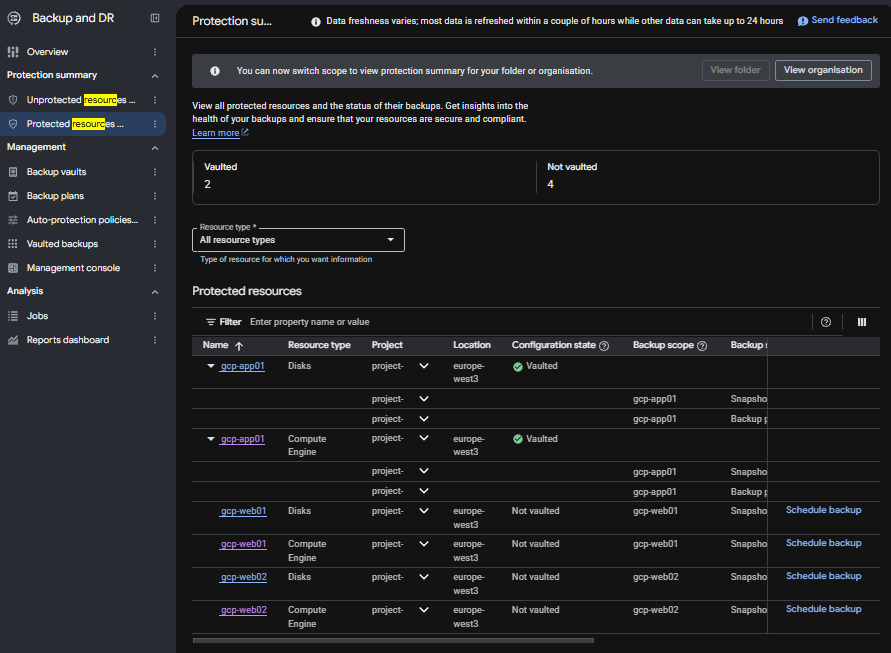

---

## 12. 🛡️ Resource Protection

Yanlışlıkla VM silinmesini önlemek amacıyla APP01 üzerinde deletion protection etkinleştirilmiştir.

### Yapılandırma

| Kaynak      | Koruma                      |
| ----------- | --------------------------- |
| `gcp-app01` | Deletion Protection Enabled |

### 📸 Screenshot 26 — Deletion Protection

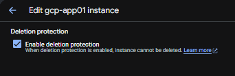

---

## 13. 🔗 AWS ↔ GCP Private Connectivity

AWS ve GCP arasında private ağ bağlantısı Tailscale kullanılarak yapılandırılmıştır.

Bağlantı, web sunucularının private IP adresleri kullanılarak test edilmiştir.

### Yapılandırma

| Cloud     | Private IP   | Tailscale IP    |
| --------- | ------------ | --------------- |
| AWS WEB01 | `10.0.1.124` | `100.64.158.13` |
| GCP WEB01 | `10.4.0.2`   | `100.64.235.92` |

AWS ve GCP private ağları arasındaki routing yapılandırılmış ve başarıyla test edilmiştir.

### 📸 Screenshot 27 — Tailscale Connectivity

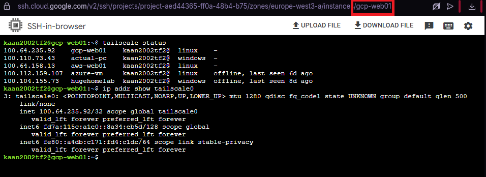

### 📸 Screenshot 28 — Private IP Connectivity Test

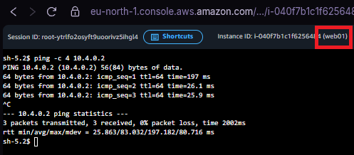

---

## 14. 🧪 Testing ve Troubleshooting

GCP ortamı; gerçekçi network, storage, load balancing ve altyapı troubleshooting senaryoları üzerinden test edilmiştir.

Testler şunları kapsamaktadır:

* VPC connectivity
* Public ve private subnet connectivity
* WEB → APP connectivity
* Load Balancer connectivity
* Backend health validation
* Cloud Storage access
* Service Account permissions
* Private DNS resolution
* Private Google Access
* Autoscaling
* AWS ↔ GCP connectivity
* Backup configuration validation
* Firewall rule validation

### 📸 Screenshot 29 — Network Connectivity Test

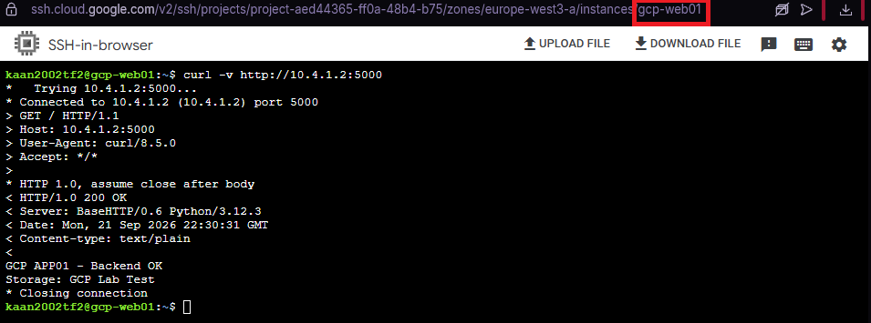

### 📸 Screenshot 30 — Load Balancer Test

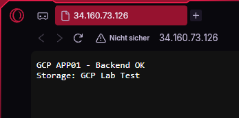

### 📸 Screenshot 31 — Autoscaling Test

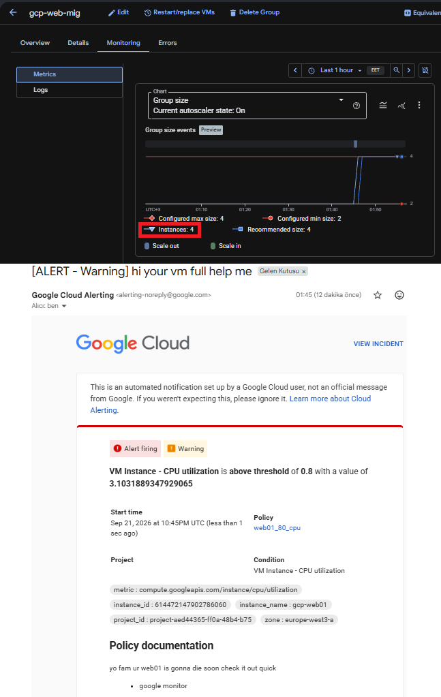

---

## 🛠️ Teknolojiler

**Cloud**

Google Cloud Platform

**Compute**

Compute Engine · Managed Instance Groups

**Networking**

VPC · Subnets · Firewall Rules · Cloud DNS · Load Balancing · Tailscale

**Storage**

Cloud Storage · Nearline · Coldline · Archive · Lifecycle Management

**Identity**

IAM · Service Accounts

**Monitoring**

Cloud Monitoring · Alerting

**Backup**

Backup and DR · Backup Vault

**Operating Systems**

Ubuntu Linux

---

## 📚 Gösterilen Beceriler

* GCP altyapı deployment
* VPC ve subnet tasarımı
* Firewall yapılandırması
* Compute Engine yönetimi
* Global Load Balancing
* Managed Instance Groups
* Autoscaling
* Cloud Storage yönetimi
* Storage lifecycle management
* IAM ve least-privilege erişim
* Service Account yapılandırması
* Private DNS
* Private Google Access
* Cloud Monitoring
* Alerting
* Backup ve Disaster Recovery
* Resource protection
* Cloud'lar arası network bağlantısı
* Network troubleshooting
* Cloud infrastructure troubleshooting

---

## 🚀 Sonraki Adımlar

GCP laboratuvarı için planlanan geliştirmeler:

* GCP Terraform altyapısı
* Hibrit cloud bağlantısının genişletilmesi
* Container teknolojileri
* Docker
* Kubernetes
* Cloud automation
* Multi-cloud Infrastructure as Code

---

## 📌 Proje Durumu

Bu laboratuvar devam eden bir uygulamalı cloud altyapı projesidir.

GCP ortamı; ek cloud servisleri, network senaryoları, automation, Infrastructure as Code ve troubleshooting çalışmaları ile geliştirilmeye devam edecektir.
