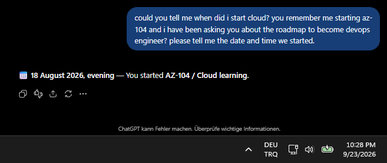

# ☁️ Honest Evaluation — Azure vs AWS vs GCP

> A personal, hands-on comparison of the three cloud platforms I have worked with during my Cloud and DevOps learning journey.

This page documents how I experienced **Microsoft Azure, Amazon Web Services (AWS), and Google Cloud Platform (GCP)** while building, configuring, troubleshooting, and managing infrastructure.

The comparison is based on my own practical experience rather than theoretical benchmarks or marketing material.

> [!WARNING]
> If you are in this page, you have either fully readen my documentation, or you came here mistakenly. If you are here with no clue, please return. This is the finalized opinion page, there's nothing to learn here.

---

# 🎯 Why I Chose the Cloud / DevOps Path

My decision to move toward **Cloud and DevOps** was driven by both career opportunities and my interest in working with larger infrastructure.

Traditional IT opportunities in my country are relatively limited, and I wanted to move beyond traditional IT support.

My IT background gave me a foundation in:

* Troubleshooting
* Operating systems
* User support
* Hardware
* Networking
* Technical problem solving

However, I wanted to work with **larger systems and infrastructure**.

This led me toward:

* ☁️ Cloud Infrastructure
* 🌐 Networking
* 🔐 Identity and Access Management
* ⚙️ Automation
* 🧱 Infrastructure as Code
* 📊 Monitoring
* ♻️ High Availability
* 📈 Scalability
* 📦 Containers
* 🔄 DevOps workflows

My goal was not simply to collect certifications.

I wanted to understand infrastructure by:

```text
Build
  ↓
Configure
  ↓
Break
  ↓
Troubleshoot
  ↓
Fix
  ↓
Destroy
  ↓
Rebuild
```

---

# ☁️ Where My Cloud Learning Started

My structured cloud learning started with **Microsoft Azure**.

I began studying cloud infrastructure through the **AZ-104 curriculum in August 2026**.

The AZ-104 curriculum became the structured foundation of my cloud administration learning. It gave me a practical framework for understanding areas such as:

* Azure Virtual Networks
* Subnets and IP addressing
* Network Security
* Virtual Machines
* Storage
* Identity and RBAC
* Monitoring
* Backup
* High Availability
* Governance
* Security

> **Important:** This does not mean that I obtained the AZ-104 certification. The AZ-104 curriculum was the structured learning path I used to build my initial cloud administration knowledge.

**Microsoft Learn** was my primary technical learning resource during this initial Azure phase.

---

## 🗺️ My Initial Learning Roadmap

At the beginning of my cloud journey, I needed a structured way to understand **what to learn, in what order, and how to turn theoretical knowledge into practical experience**.

The screenshot below represents my early cloud learning roadmap and study approach.



---

# 🧪 How I Learned

My learning process has been primarily **hands-on and experiment-based**.

I used:

* Microsoft Learn
* Official cloud documentation
* ChatGPT
* Google Gemini
* Microsoft Copilot
* YouTube
* My own home labs

AI tools were used as **interactive learning assistants** rather than simply as sources for copying configurations.

A typical learning cycle looked like:

```text
Learn
   │
   ▼
Build
   │
   ▼
Configure
   │
   ▼
Test
   │
   ▼
Break
   │
   ▼
Troubleshoot
   │
   ▼
Fix
   │
   ▼
Destroy
   │
   ▼
Rebuild
   │
   ▼
Document
```

I intentionally created infrastructure, changed configurations, introduced problems, investigated failures, fixed them, destroyed environments, and rebuilt them.

This helped me understand not only **how something works**, but also **why it works and what happens when it doesn't**.

---

# ☁️ Azure → AWS → GCP

After building my initial foundation with Azure and the AZ-104 curriculum, I expanded my learning to **AWS** and later **GCP**.

The purpose was to understand how common infrastructure concepts are implemented across different cloud ecosystems.

My learning path developed approximately as follows:

```text
AZ-104 Curriculum
        │
        ▼
Microsoft Azure
        │
        ▼
AWS
        │
        ▼
GCP
        │
        ▼
Terraform / Infrastructure as Code
        │
        ▼
Docker / DevOps Workflows
```

I wanted to see which concepts remained consistent between platforms and where the platforms approached the same problem differently.

---

# 🟦 Microsoft Azure

My cloud learning started with Azure.

My practical Azure work included:

* Virtual Networks
* Subnets
* Network Security Groups
* Virtual Machines
* Routing
* Storage
* Private Endpoints
* Managed Identities
* RBAC
* Monitoring
* Backup
* Azure CLI
* Windows Server
* Hybrid connectivity

Azure was also the platform through which I first developed a structured understanding of cloud administration.

---

# 🟧 Amazon Web Services

After Azure, I expanded into AWS to understand the equivalent infrastructure concepts in another major cloud ecosystem.

My AWS work included:

* VPC
* Public and private subnets
* Internet Gateway
* Route Tables
* EC2
* Application Load Balancer
* Security Groups
* IAM
* Systems Manager
* VPC Endpoints
* CloudWatch
* SNS
* S3
* Backup
* Multi-AZ architecture
* Terraform

Working with AWS allowed me to compare concepts such as:

* Azure VNets vs AWS VPCs
* Azure RBAC vs AWS IAM
* Azure Load Balancing vs AWS load balancing services

---

# 🟨 Google Cloud Platform

GCP was added later to expand the comparison beyond Azure and AWS.

My GCP work included:

* VPC
* Public and private subnets
* Compute Engine
* Global Application Load Balancer
* Managed Instance Groups
* Autoscaling
* Cloud Storage
* Lifecycle Management
* IAM
* Service Accounts
* Cloud DNS
* Private Google Access
* Cloud Monitoring
* Alerting
* Backup and Disaster Recovery
* Private connectivity

This gave me another perspective on how networking, compute, identity, load balancing, and monitoring are implemented in a cloud environment.

---

# ⚖️ Azure vs AWS vs GCP — Practical Comparison

This is the main brutal comparison section of this page.

The purpose is **not** to create an objective industry ranking.

Instead, I compare the platforms based on what I personally experienced while using their:

* Consoles
* CLI tools
* Networking systems
* IAM models
* Monitoring tools
* Documentation
* Troubleshooting workflows

The comparison focuses on:

|  # | Area                         |
| -: | ---------------------------- |
| 01 | 🖥️ GUI / Console Experience |
| 02 | 🧭 Navigation                |
| 03 | 📚 Documentation             |
| 04 | 💻 CLI Experience            |
| 05 | 🌐 Network Management        |
| 06 | 🔐 IAM & Authorization       |
| 07 | 📊 Monitoring                |
| 08 | 🛠️ Troubleshooting          |
| 09 | 📈 Learning Curve            |
| 10 | 👤 Overall User Experience   |
| 11 | 🤖 AI-Assisted Experience    |

---

# 🖥️ GUI / Console Experience

## 🟦 Azure

**My experience:**

> It's the best UI i have ever seen. It directly tells what you need to create an environment. We're able to select themes. We can select any enviroment without any confusion. 10/10

## 🟧 AWS

**My experience:**

> It does not create the name on a new entity on a new entity creation, even if you write it you have to name it again. The name confusion really exists because if you don't want it that hard, it does not tell you the name but the ID number and it's a huge downfall for GUI. What do you mean i have to find the machine i created 10 minutes ago in a list with more than 100 machines? No i don't want to waste my time setting filters. 4/10

## 🟨 GCP

**My experience:**

> The UI is like a settings menu on a Google Pixel with Android 11. Complete boredom unexpected from Google. 6/10

### Direct Comparison

> If you don't like to deal with tons of commandlines, you will still be able to do any work with GUI but, not every design is good as it's expected. Because of this, Azure -> GCP -> AWS.

---

# 🧭 Navigation

## 🟦 Azure

**My experience:**

> Nothing much. Simple. It's really good that Microsoft values it's traditions and own products like having powershell console with bash together. You don't fully have to learn bash. 10/10

## 🟧 AWS

**My experience:**

> Simple like Azure. 10/10

## 🟨 GCP

**My experience:**

> What do you mean i have to install API to access to a VM that i have installed? 5/10

### Direct Comparison

> No explaination required. Azure = AWS > GCP.

---

# 💻 CLI Experience

## 🟦 Azure

**My experience:**

> If i have free subscription i don't belong to "az" ? Why do i have to get my tenant and sub id? 9/10

## 🟧 AWS

**My experience:**

> Nothing special. All good. 10/10

## 🟨 GCP

**My experience:**

> Same as AWS. 10/10

### Direct Comparison

> All CLI's and consoles are good, but it would be a bit better if Microsoft fixes the az commandline not detecting the free subscription. AWS=GCP>Azure

---

# 🛠️ Troubleshooting

## 🟦 Azure

**My experience:**

> So i could not do the work because i did something wrong. But what am i supposed to do with the error ID? 0/10

## 🟧 AWS

**My experience:**

> Good. If something cracks, it tells the errors which even if you don't know, it can be found in google. But it would be better if it could be researched and given in a user friendly way. 8/10

## 🟨 GCP

**My experience:**

> Same with AWS. At least it informs the error. 8/10

### Direct Comparison

> Basically, in Azure, if you know what did you 10 hours before your work, it's easier to deal with the error you already know than AWS and GCP but otherwise, an Error ID with nowhere to put is nothing but empty talk. AWS=GCP>Azure

---

# 📈 Learning Curve

## 🟦 Azure

**My experience:**

> In my opinion, Azure has the best learning platform. Microsoft learn explains everything like talking to a person with zero knowledge, but too much words. Microsoft also has videos for each content in Microsoft learn, worth checking out but i don't learn things by watching or reading. Also, Azure has more detailed IAM, VM and security settings worth checking out. 8/10.

## 🟧 AWS

**My experience:**

> Short explainations. Brilliant. The language support sucks. Indonesian exists but not Russian, Arabic or Swedish? 6/10

## 🟨 GCP

**My experience:**

> We're talking about google. Of course everything looks extremely beautiful. There's even roadmaps if you're confused. Homelabs are included. The problem is, there's no text document. We're not studying in an highschool. 9/10

### Direct Comparison

> GCP is vocal only (if there is i will change this part in this document.), but it tells you what should you do. Azure likes to overexplain which can make your brain overheat. AWS likes things simple. You will learn quick but something may feel missing. GCP>Azure>AWS

---

# 🤖 AI-Assisted Experience

This category focuses on my practical experience using AI-assisted tools while learning and working with cloud platforms.

I have tested AI Systems with multiple requests, such as;

Troubleshooting requests
Reply speed
Information knowledge on my entities.

## 🟦 Azure

**My experience:**

> I want to know my "TENANT ID NOT MY SUBSCRIPTION ID" What do you mean it took 50 seconds to tell that i have to click to learn my ID's? 1/10

## 🟧 AWS

**My experience:**

> The GUI does not have multi-language support but Amazon Q does. Great explaination with short time, but no image creation support(even tho it's unnecessary) 9/10

## 🟨 GCP

**My experience:**

> Gemini cloud version does any stuff i want, even tho it says that it isn't normal Gemini and explains why. Whenever i occur problems, Gemini helps and explains what's wrong. It does whatever i want. 10/10

### Direct Comparison

> Microsoft is way too behind the AI race. I thought they would improve it alot for Azure. The other AI's are pretty useful. GCP>AWS>Azure

---

# 👤 Overall User Experience

## 🟦 Azure

**My experience:**

> Working with Azure was pretty nice, i can clearly say that it's good that i have started with Azure. The reason here is, i have been using Windows since my childhood and i already know Active Directory, which means i would be familiar with terms and usages. Azure was the most detailed cloud platform. But the slight issue here for the practicioners is, many things are paid and not included within the free subscription (eg. NAT gateway). With all positives and negatives, i will give it solid 6 in this one. The -4 points are due to finding the issues on during the entity creation, less zone availability, sometimes no machine availability in the zone and Copilot.

## 🟧 AWS

**My experience:**

> AWS was very hard for me to learn because i was using Azure mainly. The time i became familiar with AWS i realized the differences. For example, in AWS, the UI was more modern but more complicated than Azure. The huge difference between these clouds is the Zone availability and machine availabilities in the zones. With all positives and negatives, I will give AWS 8 because the complexity in entities makes GUI user waste much more time than Azure and GCP.

## 🟨 GCP

**My experience:**

> On GCP, on my first interaction i wanted to quit the platform because the UI is terrible. I am not using an android phone. Also the biggest loss is, whenever i write the spesific entity name (eg. app01) it does not find. Azure and AWS has bigger advantage here. In other ways, the UI is more simpler than AWS. It is similar to Azure. The regional and zonal flexibility is even better than Azure and AWS which makse GCP better than the competitors in this topic. I will give it solid 9 in this one due to UI.

---

# 💳💵🤑 Pricing comparison

In this topic i have compared Virtual Machine costs in both three locations. Because if a system should be learned, it will be learned with positives and negatives. This topic explains pricing information for enterprises and startups for better cost-management.

Here are some informations:

I have made my location as Frankfurt due to Azure differs it's price regionally.
I have setted 3 machines with different parts.
# Here is the table of the machines:

| Level          |   CPU  |  RAM  |    SSD     |  Azure    |    AWS      |      GCP      |
| **Economic**   | 2 vCPU |  8 GB | 64 GB SSD  | D2as v5   | m6i.large   | e2-standard-2 |
| **Mid-ranged** | 4 vCPU | 16 GB | 128 GB SSD | D4as v5   | m6i.xlarge  | e2-standard-4 |
| **Expensive ** | 8 vCPU | 32 GB | 256 GB SSD | D8as v5   | m6i.2xlarge | e2-standard-8 |

These are the same ranged machines for fair pricing comparison. The source can be outdated.

# Here are the hourly prices:

| Level | Azure | AWS | GCP |
|:---:|:---:|:---:|:---:|
| **2 vCPU / 8 GB** | **~$0.096/h** | **$0.115/h** | **~$0.067/h** |
| **4 vCPU / 16 GB** | **~$0.208/h** | **$0.230/h** | **~$0.134–0.173/h** |
| **8 vCPU / 32 GB** | **~$0.416/h** | **$0.460/h** | **~$0.268–0.346/h** |

Here are the monthly prices (730 hours of calculation/30.41666 days):

| Level | Azure | AWS | GCP |
|:---:|:---:|:---:|:---:|
| **2 vCPU / 8 GB** | **~$70/month** | **~$84/month** | **~$49/month** |
| **4 vCPU / 16 GB** | **~$152/month** | **~$168/month** | **~$98–126/month** |
| **8 vCPU / 32 GB** | **~$304/month** | **~$336/month** | **~$196–253/month** |

Regarding to the list, it's visible that GCP offers cheaper services compared to the competitors.
Between the race in Azure and AWS, Azure overtakes in this topic, which can be due to availability for everyone in every single time with no issue in AWS.

---

# 💥 Learning Through Failure

Failure was an intentional part of my learning process.

I did not try to keep every lab environment in a perfect state.

Instead, I wanted to understand what happens when infrastructure is incorrectly configured.

For example:

* Incorrect firewall rules
* Missing IAM permissions
* Networking problems
* DNS issues
* Terraform state/configuration mismatches
* Incorrect resource dependencies
* Connectivity problems

My general approach was:

```text
Build
  ↓
Understand
  ↓
Change
  ↓
Break
  ↓
Investigate
  ↓
Troubleshoot
  ↓
Fix
  ↓
Destroy
  ↓
Rebuild
```

This gave me practical experience that cannot be gained simply by memorizing cloud service definitions.

---

# 🧠 The Philosophy

The main objective of this journey was not simply to learn more services.

It was to develop a **practical infrastructure mindset**.

I wanted to understand:

> **How does it work?**

Then:

> **Why does it work?**

And finally:

> **What happens when it breaks?**

This is why my learning process repeatedly follows:

```text
Learn
  ↓
Build
  ↓
Break
  ↓
Troubleshoot
  ↓
Fix
  ↓
Destroy
  ↓
Rebuild
```

For me, practical experience comes from **interacting with infrastructure rather than only reading about it**.

---

# 📌 Evaluation Scope

This page represents my personal experience up to **23 September 2026**.

The comparison is based on:

* My own hands-on labs
* Cloud infrastructure I built
* Networking configurations
* IAM and authorization work
* CLI usage
* Terraform projects
* Troubleshooting experiences
* Documentation
* AI-assisted learning
* My personal learning process

> **This is not an objective benchmark or industry ranking.**

Different users may have very different experiences depending on their:

* Background
* Workload
* Organization
* Existing technical knowledge
* Preferred tools
* Learning approach

The purpose of this page is simply to document **my own practical experience with Azure, AWS, and GCP**.

---

# 📚 References

The following resources were used throughout my learning journey and while building and troubleshooting the cloud environments documented in this portfolio.

---

## 📖 Official Documentation & Learning Platforms

| Resource                          | Purpose                                                                                              |
| --------------------------------- | ---------------------------------------------------------------------------------------------------- |
| **Microsoft Learn**               | Primary learning resource during the Azure and AZ-104-based learning phase                           |
| **Microsoft Azure Documentation** | Azure service documentation, administration, networking, identity, monitoring, and troubleshooting   |
| **AWS Documentation**             | AWS service documentation, architecture, CLI, networking, IAM, and troubleshooting                   |
| **Google Cloud Documentation**    | GCP service documentation, networking, IAM, Compute Engine, monitoring, and troubleshooting          |
| **Terraform Documentation**       | Infrastructure as Code concepts, Terraform configuration, providers, resources, state, and workflows |

---

## 🤖 AI-Assisted Learning

| Tool                  | Usage                                                                                                                   |
| --------------------- | ----------------------------------------------------------------------------------------------------------------------- |
| **ChatGPT**           | Interactive learning, troubleshooting, architecture discussions, Terraform, CLI assistance, and scenario-based learning |
| **Google Gemini**     | Alternative explanations, troubleshooting approaches, and technical cross-checking                                      |
| **Microsoft Copilot** | Microsoft ecosystem and cloud-related assistance                                                                        |

---

## 🎥 Video Resources

* Microsoft Azure
* AWS
* Google Cloud Tech
* Microsoft Mechanics
* NetworkChuck
* TechWorld with Nana

---

## 🧪 Personal Hands-On Labs

The comparison is also based on my own hands-on environments, including:

* Azure administration and infrastructure labs
* Windows Server / Active Directory labs
* Azure + on-premises hybrid infrastructure
* AWS infrastructure lab
* GCP infrastructure lab
* Terraform Infrastructure as Code projects
* Docker and containerization exercises

---

## 📝 Final Note

All observations and comparisons on this page are based on my **personal practical experience** with these resources and environments.

This page is intended to document my learning journey, the infrastructure I built, the problems I encountered, and the way I experienced each cloud platform.

The documentation can be used to learn information, can be used in any other documentation, video or blogs. If you are planning to use any of my pages or sources, feel free but a credit would make me happier to know that i am being viewed.

The documentation will be renewed every single time i spot a mistake.


Thank you for visiting my portfolio.

---

**Last updated:** `24 September 2026 12:57 AM GMT +3 Istanbul`
