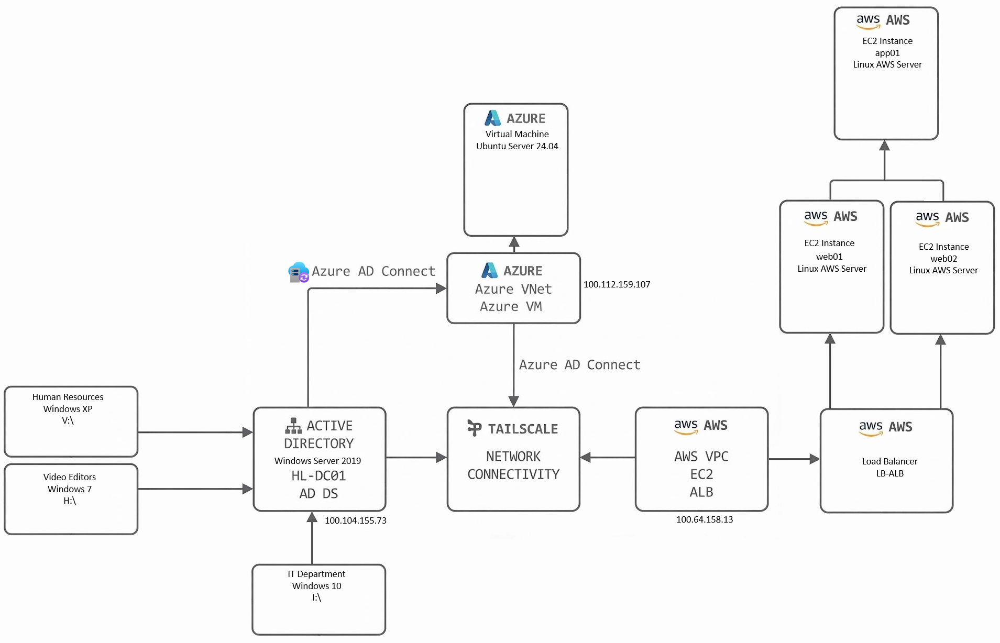
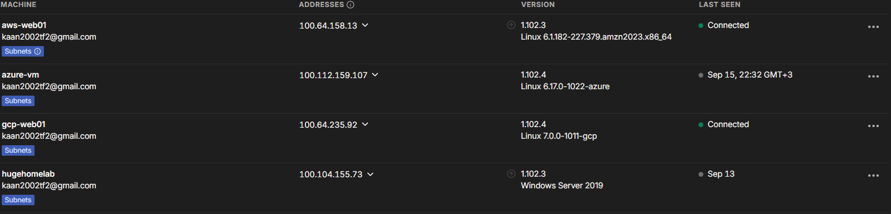
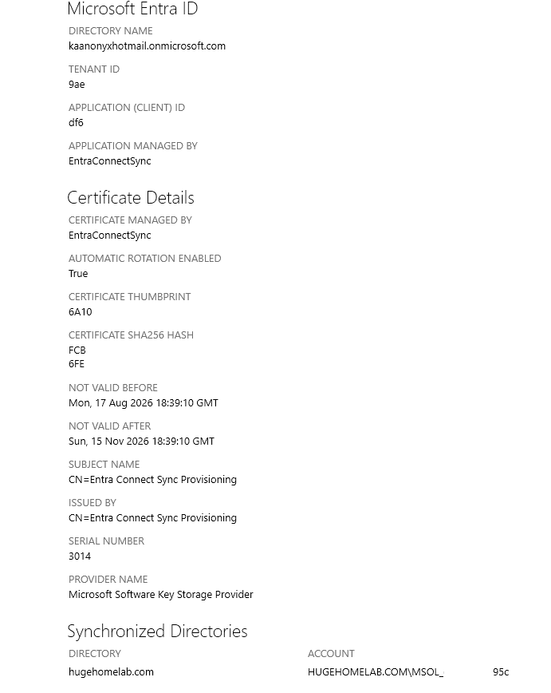
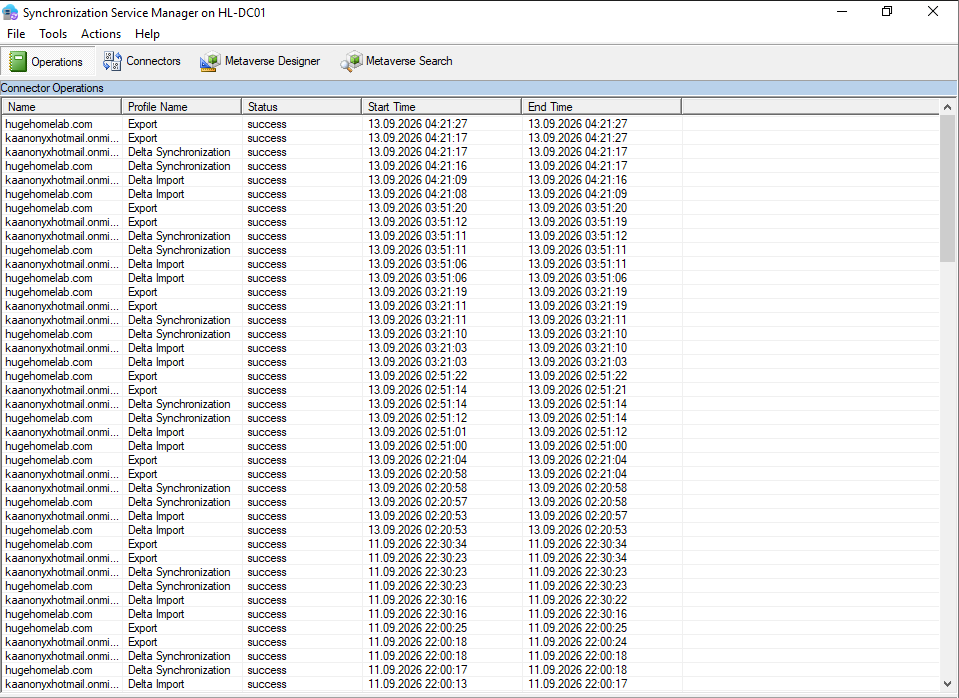
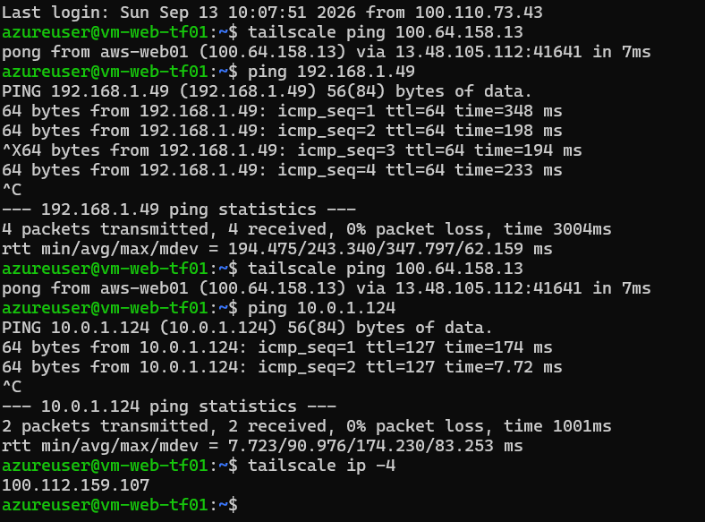
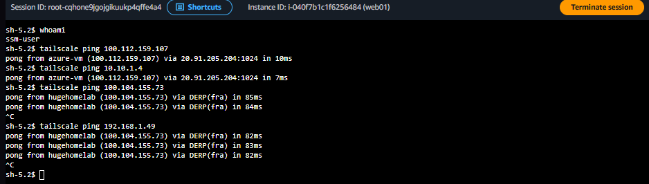

# 🔗 Hybrid-Cloud-Labor

Ein praktisches Hybrid-Cloud-Labor, das **Microsoft Azure, Amazon Web Services und eine On-Premises-Active-Directory-Umgebung** miteinander verbindet.

Das Ziel des Projekts ist es, Cloud-Plattformen mit einer bestehenden **On-Premises-Infrastruktur** zu verbinden und praktische Szenarien für **hybride Konnektivität, hybride Identität und die Kommunikation zwischen verschiedenen Umgebungen** zu demonstrieren.

---

## 📌 Projektübersicht

Das Projekt umfasst die folgenden Umgebungen und Technologien:

* Microsoft Azure
* Amazon Web Services
* On-Premises Active Directory
* Tailscale
* Hybride Identität
* DNS
* Netzwerkverbindung

Die drei Umgebungen können über das Hybridnetzwerk miteinander kommunizieren.

Die wichtigste hybride Integration innerhalb der Umgebung besteht zwischen **On-Premises Active Directory und Microsoft Azure**.

Die AWS-Umgebung wird als separate Cloud-Infrastruktur betrieben, ist jedoch über Tailscale weiterhin Teil des gesamten Hybridnetzwerks.

---

## 🏗️ Architektur



Die Architektur besteht aus drei Hauptumgebungen:

* ☁️ Microsoft Azure
* ☁️ Amazon Web Services
* 🪟 On-Premises Active Directory

Alle drei Umgebungen sind über **Tailscale** miteinander verbunden und ermöglichen dadurch die Netzwerkkommunikation zwischen den verschiedenen Infrastrukturumgebungen.

Die primäre Verbindung für die hybride Identität besteht zwischen **On-Premises Active Directory und Azure** über Azure AD Connect.

---

## 1. 🔗 Hybride Konnektivität — Tailscale

**Tailscale stellt die Netzwerkkonnektivität zwischen den On-Premises-, Azure- und AWS-Umgebungen bereit.**

Anstatt separate VPN-Verbindungen zwischen jeder Umgebung einzurichten, stellt Tailscale ein gemeinsames privates Netzwerk bereit, über das Systeme aus den verschiedenen Infrastrukturumgebungen miteinander kommunizieren können.

### Konnektivität

```text
                    HYBRID NETWORK
                         │
                  ┌──────▼──────┐
                  │  Tailscale  │
                  │ Private VPN │
                  └──────┬──────┘
                         │
          ┌──────────────┼──────────────┐
          │              │              │
          ▼              ▼              ▼
   ON-PREMISES        AZURE            AWS
   Active Directory   VNet             VPC
   Windows Server     Azure VM         EC2
```

Tailscale wird als **Netzwerkkonnektivitätsschicht** verwendet, während die eigentlichen Dienste und Identitäten weiterhin von ihren jeweiligen Plattformen verwaltet werden.

Dadurch können Systeme in allen drei Umgebungen über eine private Netzwerkverbindung miteinander kommunizieren.

### Abgedeckte Bereiche

* Private Netzwerkverbindung
* Kommunikation zwischen Umgebungen
* On-Premises → Azure Verbindung
* On-Premises → AWS Verbindung
* Azure → AWS Verbindung
* Tailscale Subnet Routing
* Hybride Netzwerkkommunikation

Zum Beispiel können wir von unserem On-Premises-Windows-Server **„HL-DC01“** aus eine Verbindung zur AWS-virtuellen Maschine **web01** herstellen.

### 📸 Screenshot — Tailscale-Konnektivität



---

## 2. 🪟🔗☁️ On-Premises Active Directory ↔ Azure

Dies ist die **wichtigste hybride Integration** innerhalb des Projekts.

Die On-Premises-Windows-Server-Umgebung stellt die Active-Directory-Infrastruktur bereit, während Microsoft Azure die Cloud-Identität und Infrastrukturkomponenten bereitstellt.

Die beiden Umgebungen sind über folgende Komponenten miteinander verbunden:

* **Netzwerkverbindung über Tailscale**
* **Identitätssynchronisierung über Azure AD Connect**

Dadurch entsteht eine praktische **hybride Identitätsumgebung**, in der Benutzer aus dem On-Premises-Active-Directory mit Azure synchronisiert werden können.

### Hybrid-Identitätsfluss

```text
        ON-PREMISES
             │
             │
     ┌───────▼─────────┐
     │   HL-DC01       │
     │ Windows Server  │
     │                 │
     │ Active Directory│
     └────────┬────────┘
              │
              │ Azure AD Connect
              │
              ▼
     ┌──────────────────┐
     │ Microsoft Azure  │
     │                  │
     │ Azure Identity   │
     │ Cloud Resources  │
     └──────────────────┘
```

Azure AD Connect synchronisiert Identitäten zwischen der On-Premises-Active-Directory-Umgebung und Azure.

Dies zeigt, wie ein Unternehmen seine bestehende On-Premises-Active-Directory-Infrastruktur beibehalten und gleichzeitig seine Identitätsumgebung in die Cloud erweitern kann.

### Hybride Komponenten

* On-Premises Active Directory
* Windows Server Domain Controller
* Azure AD Connect
* Azure-Identität
* Benutzersynchronisierung
* Tailscale-Netzwerkverbindung

### 📸 Screenshot 01 — Azure AD Connect



### 📸 Screenshot 02 — Synchronisierung



---

## 3. ☁️ Microsoft Azure

Azure ist eine der Haupt-Cloud-Plattformen innerhalb der hybriden Infrastruktur.

Die Azure-Umgebung umfasst:

* Virtual Network
* Subnetze
* Windows Server
* Private Endpoint
* Private DNS
* Managed Identity

Die Azure-Umgebung ist über Tailscale mit der On-Premises-Infrastruktur verbunden.

Azure ist außerdem über die Integration mit der On-Premises-Active-Directory-Umgebung Bestandteil der hybriden Identitätsarchitektur.

### 📸 Screenshot — Azure-Konnektivität



---

## 4. ☁️ Amazon Web Services

AWS ist die zweite Cloud-Plattform innerhalb des Hybrid-Cloud-Portfolios.

Die AWS-Umgebung umfasst:

* VPC
* Öffentliche und private Subnetze
* EC2
* Security Groups
* Application Load Balancer

Die AWS-Infrastruktur wird als separate Cloud-Umgebung betrieben und mit Terraform verwaltet.

AWS ist über das gemeinsame Tailscale-Netzwerk mit den On-Premises- und Azure-Umgebungen verbunden.

Dadurch kann die AWS-Infrastruktur am gesamten Hybridnetzwerk teilnehmen, ohne Teil der Active-Directory-Identitätssynchronisierung zu sein.

### 📸 Screenshot — AWS-Konnektivität



---

## 5. 🪟 On-Premises Active Directory

Die On-Premises-Umgebung basiert auf Windows Server und stellt die zentrale Identitäts- und Windows-Infrastruktur der Organisation bereit.

Die Umgebung umfasst:

* Active Directory Domain Services
* DNS
* DHCP
* Group Policy
* Dateifreigaben
* Windows-Clients

Die Active-Directory-Umgebung ist über **Azure AD Connect** mit Azure integriert.

Benutzeridentitäten werden zwischen dem On-Premises-Active-Directory und Azure synchronisiert.

Die On-Premises-Umgebung ist außerdem über Tailscale Teil des Hybridnetzwerks.

---

## 6. 🌐 Hybride Kommunikation

Die drei Umgebungen kommunizieren über das Tailscale-Netzwerk:

```text
                 ┌─────────────────────┐
                 │      TAILSCALE      │
                 │ Hybrid Connectivity │
                 └──────────┬──────────┘
                            │
          ┌─────────────────┼─────────────────┐
          │                 │                 │
          ▼                 ▼                 ▼
   ┌─────────────┐   ┌─────────────┐   ┌─────────────┐
   │ ON-PREMISES │   │    AZURE    │   │     AWS     │
   │             │   │             │   │             │
   │ HL-DC01     │◄─►│ Azure VNet  │◄─►│ AWS VPC     │
   │ AD DS       │   │ Azure VM    │   │ EC2         │
   │ DNS / DHCP  │   │             │   │ ALB         │
   └──────┬──────┘   └─────────────┘   └─────────────┘
          │
          │
          │ Azure AD Connect
          │
          ▼
   ┌─────────────────┐
   │ Azure Identity  │
   │ Hybrid Identity │
   └─────────────────┘
```

Der wichtige Unterschied besteht darin, dass **Tailscale die Netzwerkverbindung bereitstellt**, während **Azure AD Connect für die Identitätssynchronisierung zuständig ist**.

Daher:

**Tailscale = Netzwerkkonnektivität**

**Azure AD Connect = Hybride Identität**

Diese Trennung ermöglicht es, sowohl **hybride Netzwerke** als auch **hybride Identitäten** innerhalb derselben Umgebung zu demonstrieren.

---

## 📌 Fokus des Hybrid-Labors

Dieses Projekt demonstriert eine praktische hybride Infrastruktur, die **On-Premises Active Directory, Microsoft Azure und AWS** miteinander verbindet.

Die wichtigste hybride Integration besteht zwischen **On-Premises Active Directory und Azure**, wobei Azure AD Connect die Identitätssynchronisierung bereitstellt.

Auf Netzwerkebene verbindet **Tailscale alle drei Umgebungen** und ermöglicht dadurch die Kommunikation zwischen On-Premises-, Azure- und AWS-Systemen innerhalb der hybriden Infrastruktur.

Das Projekt demonstriert daher:

* Hybride Netzwerke
* Hybride Identität
* Integration von Active Directory mit Azure
* Azure AD Connect
* Cloud-übergreifende Konnektivität
* On-Premises-zu-Cloud-Kommunikation
* Azure → AWS Kommunikation
* AWS → On-Premises Kommunikation
* Private Konnektivität auf Basis von Tailscale
