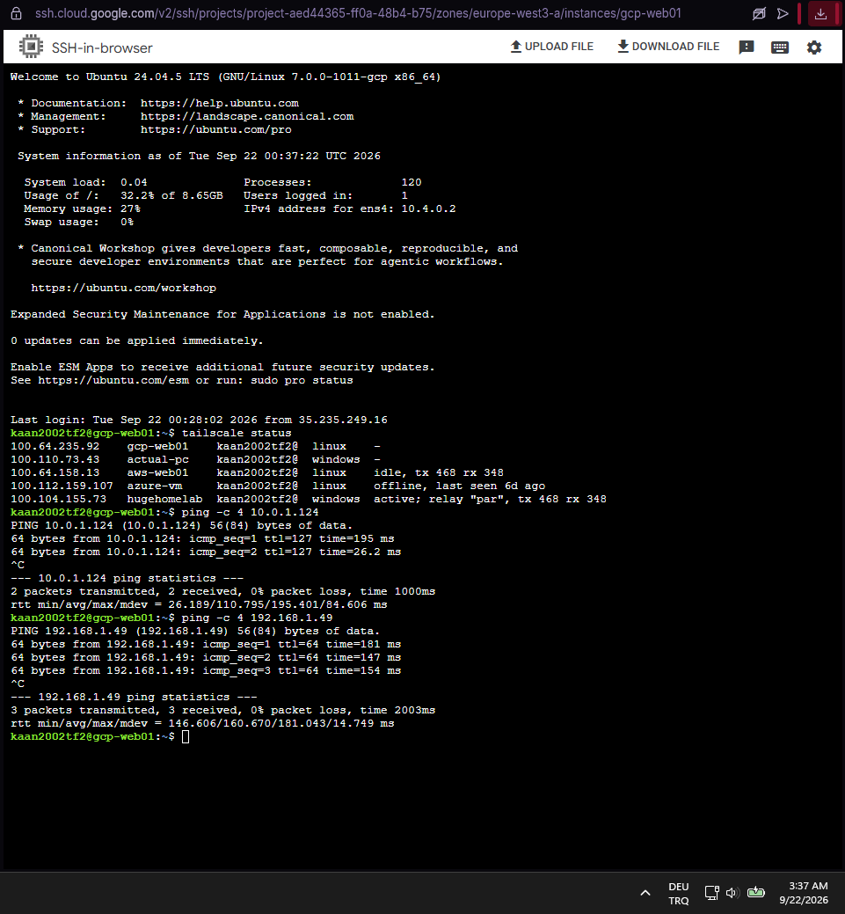

# 🔗 Hybrid Cloud Lab

**Microsoft Azure, Amazon Web Services, Google Cloud Platform ve On-Premises Active Directory ortamlarını** bir araya getiren pratik bir hibrit bulut laboratuvarı.

Projenin amacı, bulut platformlarını mevcut bir **On-Premises altyapıya** bağlamak ve pratik **hibrit bağlantı, hibrit kimlik ve ortamlar arası iletişim** senaryolarını göstermektir.

---

## 📌 Proje Genel Bakış

Proje aşağıdaki ortamları ve teknolojileri içermektedir:

* Microsoft Azure
* Amazon Web Services
* Google Cloud Platform
* On-Premises Active Directory
* Tailscale
* Hybrid Identity
* DNS
* Network Connectivity

Dört ortam, hibrit ağ üzerinden birbiriyle iletişim kurabilir.

Ortam içerisindeki en önemli hibrit entegrasyon, **On-Premises Active Directory ile Microsoft Azure** arasındadır.

AWS ve Google Cloud Platform ortamları ayrı cloud altyapıları olarak yönetilirken, Tailscale üzerinden genel hibrit ağa dahil olmaktadır.

---

## 🏗️ Mimari


Mimari dört ana ortamdan oluşmaktadır:

* ☁️ Microsoft Azure
* ☁️ Amazon Web Services
* ☁️ Google Cloud Platform
* 🪟 On-Premises Active Directory

Dört ortamın tamamı **Tailscale** üzerinden birbirine bağlanarak farklı altyapı ortamları arasında network connectivity sağlanmaktadır.

Ana hibrit kimlik bağlantısı, **On-Premises Active Directory ile Azure** arasında Azure AD Connect kullanılarak oluşturulmuştur.

---

## 1. 🔗 Hibrit Bağlantı — Tailscale

**Tailscale, On-Premises, Azure, GCP ve AWS ortamları arasındaki network connectivity katmanını sağlar.**

Her ortam arasında ayrı VPN bağlantıları oluşturmak yerine Tailscale, sistemlerin farklı altyapı ortamları arasında iletişim kurmasını sağlayan ortak bir private network oluşturur.

### Bağlantı

```text
                        HYBRID NETWORK
                              │
                       ┌──────▼──────┐
                       │  Tailscale  │
                       │ Private VPN │
                       └──────┬──────┘
                              │
       ┌──────────────┬──────────────┬────────────┐
       │              │              │            │
       ▼              ▼              ▼            ▼
ON-PREMISES         AZURE           AWS          GCP
Active Directory    VNet            VPC          VPC
Windows Server      Azure VM        EC2         GCP VM
```

Tailscale **network connectivity katmanı** olarak kullanılırken, gerçek servisler ve kimlikler kendi platformları tarafından yönetilmektedir.

Bu yapı sayesinde üç cloud ortamındaki ve On-Premises altyapıdaki sistemler private network connectivity üzerinden iletişim kurabilir.

### Kapsanan Konular

* Private network connectivity
* Cross-environment communication
* On-Premises → Azure bağlantısı
* On-Premises → AWS bağlantısı
* On-Premises → GCP bağlantısı
* Azure → AWS bağlantısı
* GCP → AWS bağlantısı
* Tailscale subnet routing
* Hybrid network communication

Örneğin, On-Premises Windows Server makinemiz **HL-DC01** üzerinden AWS **WEB01** sanal makinesine bağlanabiliriz.

### 📸 Ekran Görüntüsü — Tailscale Connectivity


---

## 2. 🪟🔗☁️ On-Premises Active Directory ↔ Azure

Bu, projedeki **ana hibrit entegrasyondur**.

On-Premises Windows Server ortamı Active Directory altyapısını barındırırken, Microsoft Azure cloud identity ve infrastructure bileşenlerini sağlar.

İki ortam hem:

* **Tailscale üzerinden network connectivity**
* **Azure AD Connect üzerinden identity synchronization**

kullanılarak birbirine bağlanmaktadır.

Bu yapı, On-Premises Active Directory'den başlayan kullanıcı kimliklerinin Azure'a senkronize edildiği pratik bir **hybrid identity** ortamı oluşturur.

### Hybrid Identity Akışı

```text
        ON-PREMISES
             │
             │
     ┌───────▼─────────┐
     │   HL-DC01       │
     │ Windows Server  │
     │                 │
     │ Active Directory│
     └────────┬────────┘
              │
              │ Azure AD Connect
              │
              ▼
     ┌──────────────────┐
     │ Microsoft Azure  │
     │                  │
     │ Azure Identity   │
     │ Cloud Resources  │
     └──────────────────┘
```

Azure AD Connect, On-Premises Active Directory ile Azure arasındaki kimlikleri senkronize eder.

Bu yapı, mevcut On-Premises Active Directory altyapısının korunurken identity ortamının cloud'a genişletilmesini göstermektedir.

### Hibrit Bileşenler

* On-Premises Active Directory
* Windows Server Domain Controller
* Azure AD Connect
* Azure identity
* User synchronization
* Tailscale network connectivity

### 📸 Ekran Görüntüsü 01 — Azure AD Connect


### 📸 Ekran Görüntüsü 02 — Synchronization


---

## 3. ☁️ Microsoft Azure

Azure, hibrit altyapı içerisindeki ana cloud platformlarından biridir.

Azure ortamı şunları içerir:

* Virtual Network
* Subnets
* Windows Server
* Private Endpoint
* Private DNS
* Managed Identity

Azure ortamı Tailscale üzerinden On-Premises altyapıya bağlanmaktadır.

Azure ayrıca On-Premises Active Directory ile entegrasyonu sayesinde hibrit identity mimarisine katılmaktadır.

### 📸 Ekran Görüntüsü — Azure Connectivity


---

## 4. ☁️ Amazon Web Services

AWS, hibrit cloud portföyündeki ikinci cloud platformudur.

AWS ortamı şunları içerir:

* VPC
* Public and private subnets
* EC2
* Security Groups
* Application Load Balancer

AWS altyapısı ayrı bir cloud ortamı olarak yönetilir ve Terraform ile yönetilmektedir.

AWS, ortak Tailscale network üzerinden On-Premises ve Azure ortamlarına bağlanmaktadır.

Bu sayede AWS, Active Directory identity synchronization mimarisinin bir parçası olmadan genel hibrit network'e katılabilir.

### 📸 Ekran Görüntüsü — AWS Connectivity


---

## 5. 🪟 On-Premises Active Directory

On-Premises ortamı Windows Server üzerinde oluşturulmuş olup kurumun merkezi identity ve Windows altyapı servislerini sağlar.

Ortam şunları içerir:

* Active Directory Domain Services
* DNS
* DHCP
* Group Policy
* File Sharing
* Windows clients

Active Directory ortamı **Azure AD Connect** kullanılarak Azure ile entegre edilmiştir.

Kullanıcı kimlikleri On-Premises Active Directory ile Azure arasında senkronize edilmektedir.

On-Premises ortamı ayrıca Tailscale üzerinden hibrit network'e katılmaktadır.

---

## 6. ☁️ Google Cloud Platform

GCP, hibrit cloud portföyündeki diğer cloud platformudur.

GCP ortamı şunları içerir:

* VPC
* Public and private subnets
* Compute Engine
* Global External Application Load Balancer
* Managed Instance Group
* Cloud Storage

GCP altyapısı ayrı bir cloud ortamı olarak yönetilir ve **On-Premises ve AWS ortamlarına Tailscale üzerinden bağlanır**.

GCP bu ortamlarla network connectivity sağlar ancak Active Directory identity synchronization sürecine dahil değildir.

### 📸 Ekran Görüntüsü — GCP Connectivity



---

## 7. 🌐 Hibrit İletişim

Dört ortam Tailscale network üzerinden iletişim kurmaktadır:

```text
                 ┌─────────────────────┐
                 │      TAILSCALE      │
                 │ Hybrid Connectivity │
                 └──────────┬──────────┘
                            │
     ┌──────────────────────┼───────────────────────────────────┐
     │                      │                                   │
     ▼                      ▼                                   ▼
┌─────────────┐      ┌─────────────┐      ┌─────────────┐   ┌─────────────┐
│ ON-PREMISES │      │    AZURE    │      │     AWS     │   │     GCP     │
│             │      │             │      │             │   │             │
│ HL-DC01     │◄────►│ Azure VNet  │◄────►│ AWS VPC     │◄─►│ GCP VPC     │
│ AD DS       │      │ Azure VM    │      │ EC2         │   │ Compute     │
│ DNS / DHCP  │      │             │      │ ALB         │   │ Global LB   │
└──────┬──────┘      └─────────────┘      └─────────────┘   │ Cloud       │
       │                                                    │ Storage     │
       │                                                    └─────────────┘
       │
       │ Azure AD Connect
       ▼
┌─────────────────┐
│ Azure Identity  │
│ Hybrid Identity │
└─────────────────┘
```

Buradaki önemli ayrım:

**Tailscale = Network Connectivity**

**Azure AD Connect = Hybrid Identity**

Tailscale network connectivity sağlarken Azure AD Connect identity synchronization sağlar.

Bu ayrım sayesinde lab, aynı ortam içerisinde hem **hybrid networking** hem de **hybrid identity** konularını göstermektedir.

---

## 📌 Hybrid Lab Odağı

Bu proje **On-Premises Active Directory, Microsoft Azure, GCP ve AWS** ortamlarını birbirine bağlayan pratik bir hybrid infrastructure yapısını göstermektedir.

Ana hibrit entegrasyon, Azure AD Connect'in identity synchronization sağladığı **On-Premises Active Directory ve Azure** arasındadır.

Network katmanında ise **Tailscale dört ortamın tamamını birbirine bağlayarak** On-Premises, Azure, GCP ve AWS sistemlerinin iletişim kurmasını sağlar.

Proje aşağıdaki konuları göstermektedir:

* Hybrid networking
* Hybrid identity
* Active Directory integration with Azure
* Azure AD Connect
* Cross-cloud connectivity
* On-Premises to cloud communication
* Azure to AWS communication
* GCP to AWS communication
* AWS to On-Premises communication
* GCP to On-Premises communication
* Tailscale-based private connectivity
