# ☸️ Kubernetes Altyapı & Production Lab

Bu proje, yerel bir Kubernetes cluster üzerinde oluşturulmuş pratik bir Kubernetes ortamını göstermektedir. Lab; container orchestration, networking, storage, configuration management, security, scaling, workload management, Helm ve troubleshooting konularını kapsamaktadır.

Projede ayrıca Kubernetes manifestleri kullanılarak deploy edilen ve daha sonra tekrar kullanılabilir bir Helm chart'a dönüştürülen production-style bir uygulama bulunmaktadır.

---

## 📌 Proje Genel Bakışı

Kubernetes lab'ı, Kubernetes yönetimi ve uygulama deployment konusunda pratik deneyim kazanmak amacıyla oluşturulmuştur.

Ortam aşağıdaki konuları içermektedir:

* Kubernetes cluster yönetimi
* Pod, Deployment ve ReplicaSet
* Service ve internal networking
* ConfigMap ve Secret
* PersistentVolume ve PersistentVolumeClaim
* Liveness ve readiness probe'ları
* Resource request ve limitleri
* Horizontal Pod Autoscaling
* Ingress ve HTTP routing
* NetworkPolicy
* RBAC ve ServiceAccount
* StatefulSet ve headless Service
* Job ve CronJob
* DaemonSet
* Helm chart ve release yönetimi
* Production-style application deployment
* Troubleshooting ve failure senaryoları

---

## 🏗️ Architecture

### Architecture Diagram

Lab, workload management, internal services, persistent storage, networking ve Helm-managed application'lar içeren yerel bir Kubernetes cluster üzerinde çalışmaktadır.

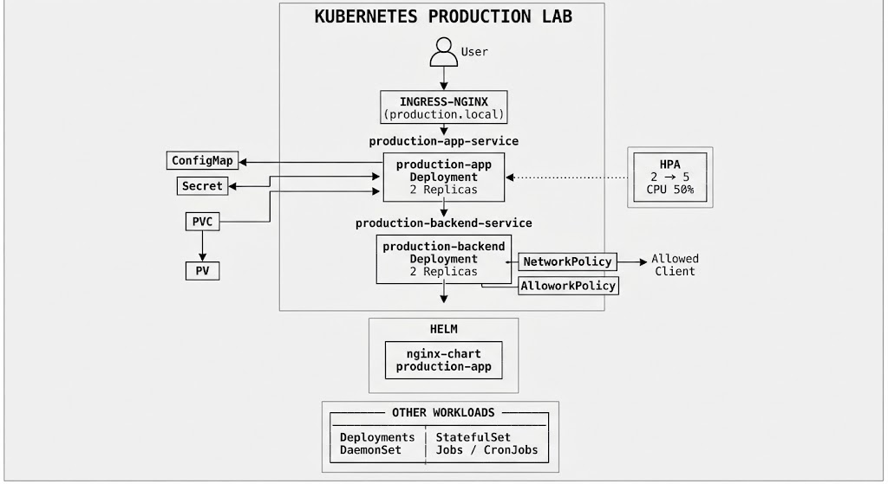

---

## 1. ⚙️ Kubernetes Cluster

Kubernetes ortamı, control-plane node ve standart Kubernetes control-plane bileşenleri içeren yerel bir cluster üzerinde çalışmaktadır.

### Configuration

| Resource            | Configuration           |
| ------------------- | ----------------------- |
| Cluster             | `desktop-control-plane` |
| Kubernetes Version  | `v1.36.1`               |
| Container Network   | Kind networking         |
| DNS                 | CoreDNS                 |
| Metrics             | Metrics Server          |
| Storage Provisioner | Local Path Provisioner  |

### 📸 Screenshot 02 — Cluster

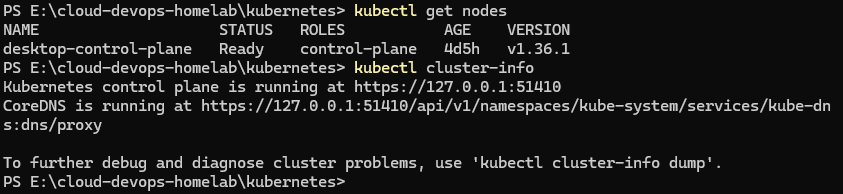

---

## 2. 📦 Workloads

Lab içerisinde Deployment, Pod, ReplicaSet ve StatefulSet gibi farklı Kubernetes workload türleri kullanılmaktadır.

Production workload'larında application availability sağlamak amacıyla birden fazla replica kullanılmaktadır.

### 📸 Screenshot 03 — Workloads

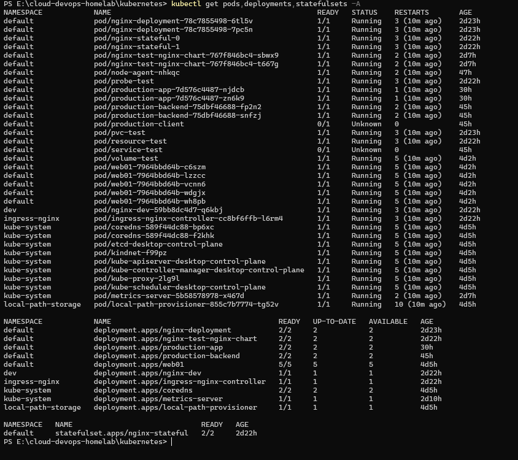

---

## 3. 🌐 Services & Networking

Kubernetes Service'leri uygulamaları expose etmek ve stabil network endpoint'leri sağlamak için kullanılmaktadır.

Lab içerisinde:

* ClusterIP Service
* NodePort Service
* LoadBalancer Service
* Headless Service

bulunmaktadır.

### 📸 Screenshot 04 — Services

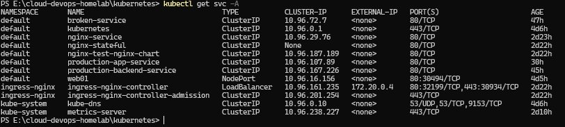

---

## 4. ⚙️ ConfigMaps & Secrets

Application configuration ve sensitive configuration değerleri container image'larından ayrılarak Kubernetes ConfigMap ve Secret kaynakları kullanılarak yönetilmektedir.

Production application içerisinde her iki resource da kullanılmaktadır.

### 📸 Screenshot 05 — ConfigMaps & Secrets

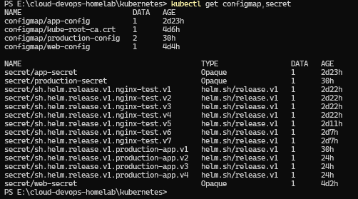

---

## 5. 💾 Persistent Storage

Persistent storage, PersistentVolume ve PersistentVolumeClaim kullanılarak uygulanmıştır.

Production application, local storage provisioner tarafından desteklenen bir PVC kullanmaktadır.

### Configuration

| Resource      | Configuration        |
| ------------- | -------------------- |
| PVC           | `production-storage` |
| Size          | `1Gi`                |
| Access Mode   | `RWO`                |
| Storage Class | `standard`           |
| Status        | `Bound`              |

### 📸 Screenshot 06 — Storage

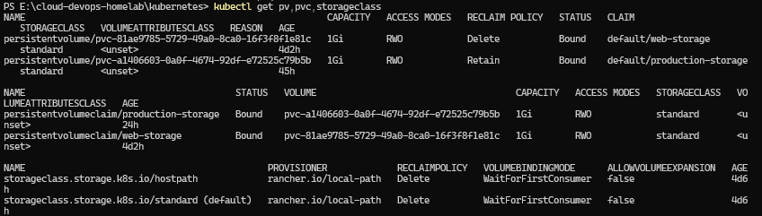

### 📸 Screenshot 07 — Persistence Test

Persistence mekanizması, application Pod'unun yeniden oluşturulması ve persistent storage'ın kullanılabilir durumda kaldığının doğrulanmasıyla test edilmiştir.

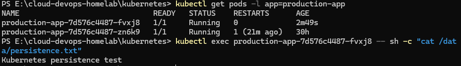

---

## 6. ❤️ Health Checks

Application health durumunu kontrol etmek için liveness ve readiness probe'ları kullanılmaktadır.

* **Liveness probe** — container'ın yeniden başlatılması gerekip gerekmediğini belirler.
* **Readiness probe** — Pod'un traffic almaya hazır olup olmadığını belirler.

### 📸 Screenshot 08 — Probes

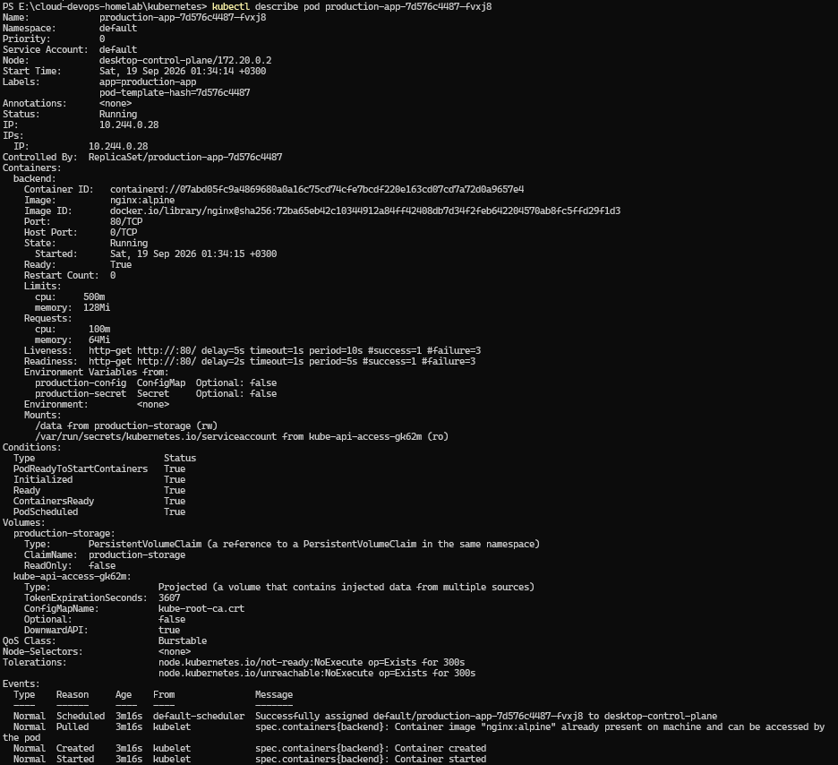

---

## 7. 📈 Resources & Autoscaling

Workload'lar için resource requests ve limits yapılandırılmıştır.

Ayrıca Horizontal Pod Autoscaling uygulanmıştır.

### Configuration

| Resource                 | Min Replicas | Max Replicas |  Target |
| ------------------------ | -----------: | -----------: | ------: |
| `production-app`         |            2 |            5 | 50% CPU |
| `production-backend`     |            2 |            5 | 50% CPU |
| `nginx-test-nginx-chart` |            2 |            5 | 50% CPU |

### 📸 Screenshot 09 — Resources & HPA

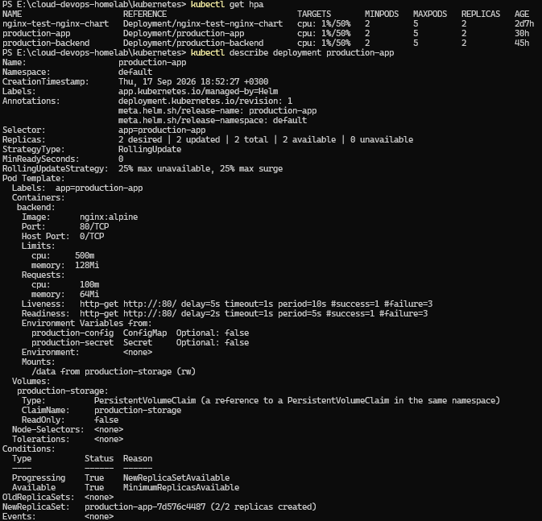

---

## 8. 🌐 Ingress & Network Security

Ingress, external HTTP traffic'i Kubernetes Service'lerine yönlendirmek için kullanılmaktadır.

NetworkPolicy ise Pod-to-Pod communication kontrolü için kullanılmaktadır.

Production application içerisinde production client'tan gerekli application traffic'ine izin veren bir NetworkPolicy bulunmaktadır.

### 📸 Screenshot 10 — Ingress & NetworkPolicy

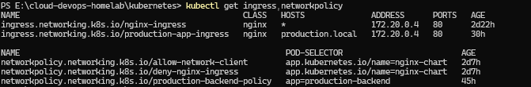

---

## 9. 🔐 RBAC & ServiceAccounts

Kubernetes RBAC, cluster resource'larına erişimi kontrol etmek için kullanılmaktadır.

ServiceAccount'lar workload'lara kontrollü identity sağlamak amacıyla kullanılmaktadır.

### 📸 Screenshot 11 — RBAC

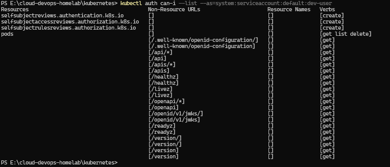

---

## 10. 🖥️ DaemonSet

DaemonSet, gerekli Kubernetes node üzerinde bir Pod çalıştırmak için kullanılmaktadır.

Lab içerisinde `node-agent` isimli bir DaemonSet bulunmaktadır.

### 📸 Screenshot 12 — DaemonSet

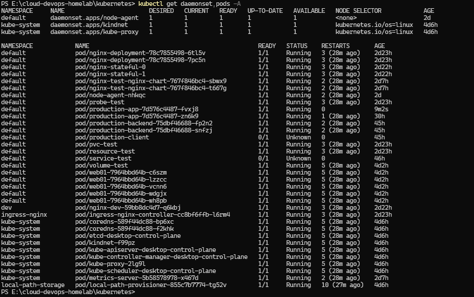

---

## 11. 🗄️ StatefulSet & Headless Service

StatefulSet, stabil Pod identity gerektiren workload'lar için kullanılmaktadır.

Lab içerisinde:

* `nginx-stateful`
* İki StatefulSet replica
* Headless Service
* Stable Pod naming

bulunmaktadır.

### 📸 Screenshot 13 — StatefulSet

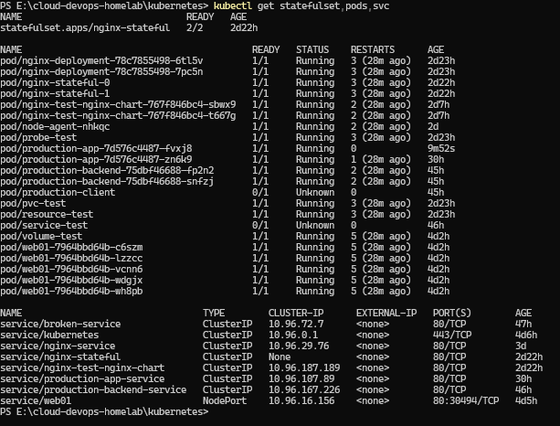

---

## 12. ⏱️ Jobs & CronJobs

Kubernetes Job ve CronJob kaynakları one-time ve scheduled workload'ları göstermek amacıyla kullanılmıştır.

### 📸 Screenshot 14 — Jobs

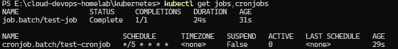

---

## 13. ⛵ Helm

Helm, Kubernetes application'larını package etmek ve deploy etmek için kullanılmaktadır.

Lab içerisinde iki Helm chart bulunmaktadır:

```text
nginx-chart/
production-app/
```

Chart'lar aşağıdaki kaynakları kullanmaktadır:

* `Chart.yaml`
* `values.yaml`
* Helm templates
* Services
* Deployments
* HPA
* Ingress
* ConfigMaps
* Secrets
* PVC

### 📸 Screenshot 15 — Helm Chart

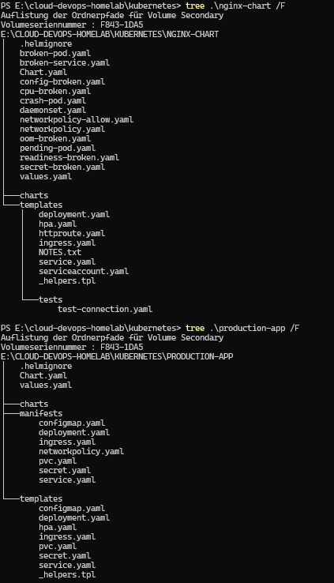

---

## 14. 🚀 Helm Releases

Cluster içerisinde iki adet deployed Helm release bulunmaktadır.

| Release          | Chart                  | Revision | Status   |
| ---------------- | ---------------------- | -------: | -------- |
| `nginx-test`     | `nginx-chart-0.1.0`    |        7 | deployed |
| `production-app` | `production-app-0.1.0` |        4 | deployed |

### 📸 Screenshot 16 — Helm Releases

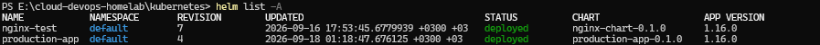

---

## 15. 🏭 Production Application

Production-style bir application Kubernetes resource'ları kullanılarak deploy edilmiş ve daha sonra Helm chart'a dönüştürülmüştür.

Application içerisinde:

* Deployment
* Service
* ConfigMap
* Secret
* PersistentVolumeClaim
* Ingress
* NetworkPolicy
* HPA

bulunmaktadır.

Production deployment iki replica ile çalışmaktadır.

### 📸 Screenshot 17 — Production Stack

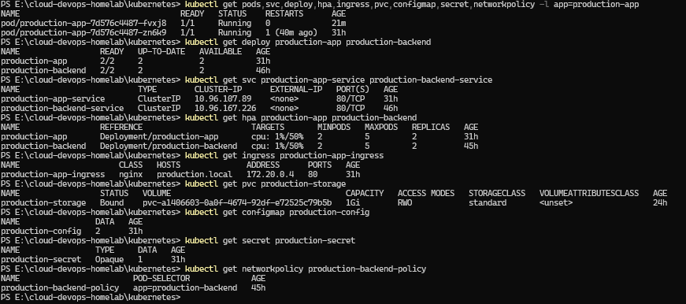

---

## 16. 🧪 Production Testing

Production application, yapılandırılmış Kubernetes networking path üzerinden test edilmiştir.

Test, application'ın erişilebilir olduğunu ve doğru şekilde response verdiğini doğrulamaktadır.

### 📸 Screenshot 18 — Production Test

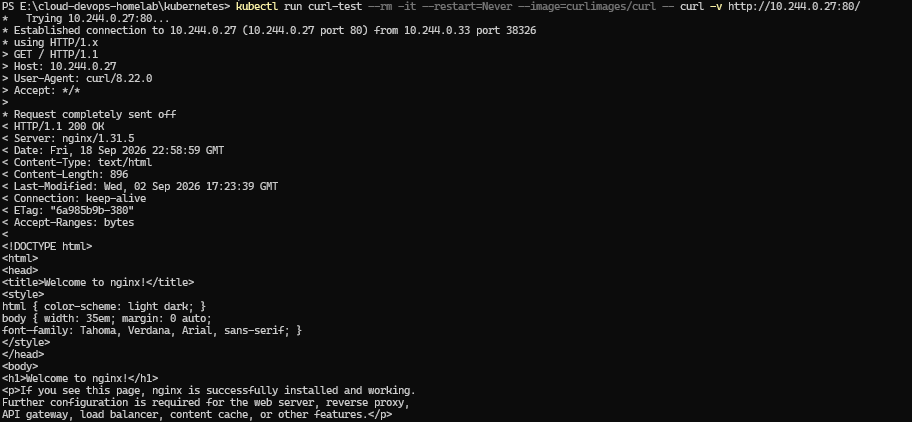

---

## 17. ⛑️ Troubleshooting

Lab içerisinde yaygın Kubernetes problemlerini teşhis etmek amacıyla bilerek hatalı kaynaklar oluşturulmuştur.

### Troubleshooting Scenarios

| Scenario                     | Manifest                |
| ---------------------------- | ----------------------- |
| Broken Pod                   | `broken-pod.yaml`       |
| Crashing Pod                 | `crash-pod.yaml`        |
| Pending Pod                  | `pending-pod.yaml`      |
| Broken Service               | `broken-service.yaml`   |
| Configuration Failure        | `config-broken.yaml`    |
| CPU Resource Problem         | `cpu-broken.yaml`       |
| OOM Condition                | `oom-broken.yaml`       |
| Readiness Failure            | `readiness-broken.yaml` |
| Secret Configuration Failure | `secret-broken.yaml`    |

### 📸 Screenshot 19 — Troubleshooting

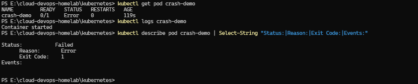

### 📸 Screenshot 20 — Network Troubleshooting

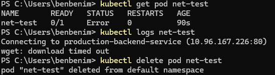

---

## 🛠️ Technologies

* Kubernetes
* kubectl
* Kind
* Docker
* Helm
* YAML
* Nginx
* Kubernetes Ingress
* NetworkPolicy
* RBAC
* Persistent Volumes
* Horizontal Pod Autoscaling

---

## 📚 Skills Demonstrated

* Kubernetes cluster administration
* Container orchestration
* Deployment ve ReplicaSet yönetimi
* Service networking
* Ingress configuration
* Configuration ve Secret management
* Persistent storage
* Health monitoring
* Resource management
* Horizontal Pod Autoscaling
* Network security
* RBAC
* Stateful workload yönetimi
* Scheduled workload yönetimi
* DaemonSet
* Helm-based deployment
* Kubernetes troubleshooting
* Production-style application deployment

---

## 🚀 Next Steps

* Advanced Kubernetes networking
* Advanced Helm templating
* CI/CD integration with Kubernetes
* Container registry integration
* GitOps workflows
* AKS, EKS ve GKE gibi cloud Kubernetes servisleri

---

## 📌 Project Status

**Status:** Completed ✅

Lab; local Kubernetes environment içerisinde pratik Kubernetes administration, application deployment, networking, storage, security, scaling, Helm ve troubleshooting konularını başarıyla göstermektedir.
