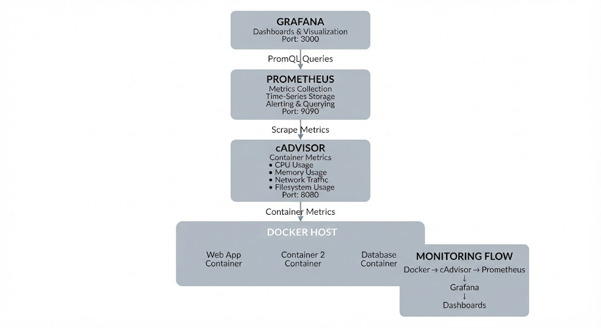
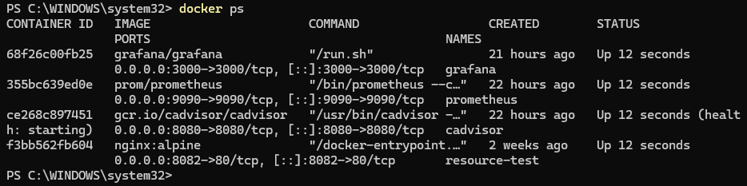
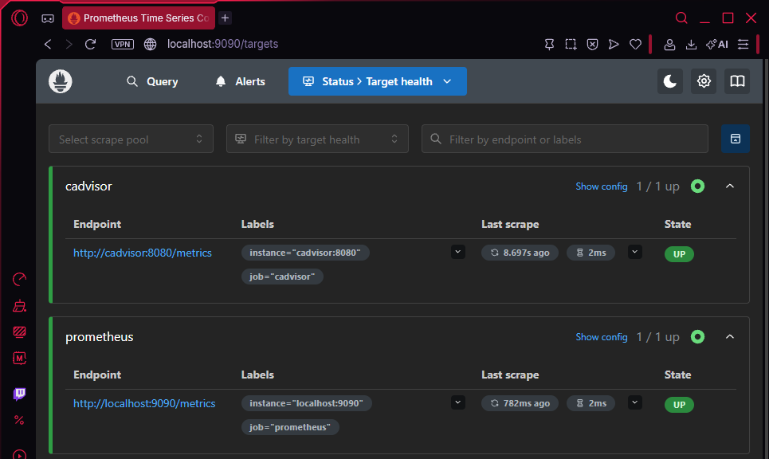
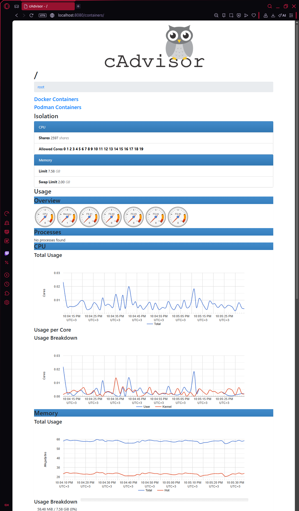
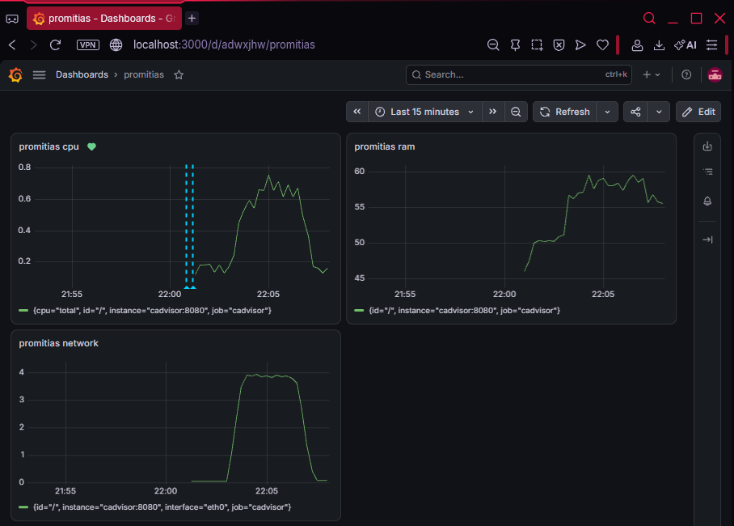
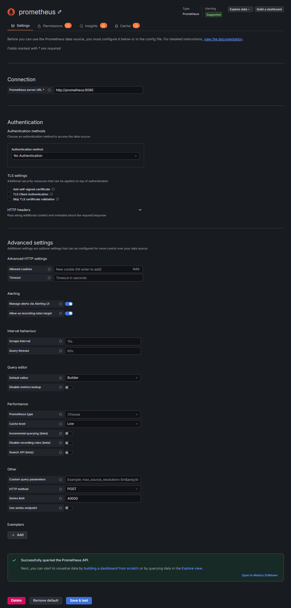
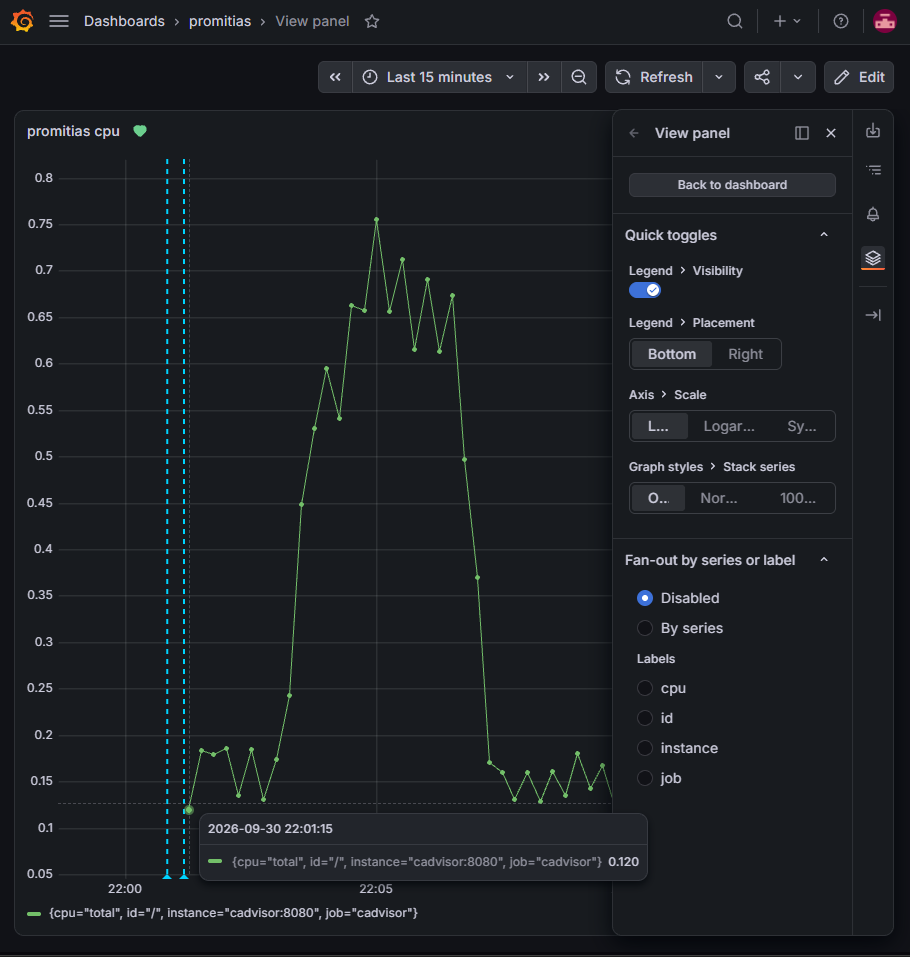

# 📊 Prometheus & Grafana Monitoring Lab

A practical monitoring and observability laboratory built with Prometheus, Grafana, cAdvisor, and Docker.

The main goal of this laboratory is to monitor containerized workloads, collect infrastructure metrics, and visualize system and container performance through Grafana dashboards.

---

## 📌 Project Overview

This laboratory demonstrates a container-based monitoring stack using:

* Prometheus
* Grafana
* cAdvisor
* Docker
* Prometheus exporters and metrics
* Monitoring dashboards
* Container resource monitoring

The environment was built to gain hands-on experience with monitoring concepts commonly used in Cloud and DevOps environments.

---

## 🏗️ Architecture

The monitoring stack consists of the following components:

```text
                    ┌─────────────────────┐
                    │       Grafana       │
                    │   Visualization     │
                    │      Port 3000      │
                    └──────────┬──────────┘
                               │
                               │ Prometheus Data Source
                               ▼
                    ┌─────────────────────┐
                    │     Prometheus      │
                    │   Metrics Storage   │
                    │      Port 9090      │
                    └──────────┬──────────┘
                               │
                    Scrapes Metrics
                               │
              ┌────────────────┴────────────────┐
              │                                 │
              ▼                                 ▼
     ┌─────────────────┐              ┌─────────────────┐
     │     cAdvisor    │              │     Docker      │
     │ Container Metrics│              │   Containers    │
     │     Port 8080   │              │                 │
     └─────────────────┘              └─────────────────┘
```

### 📸 Screenshot 01 — Monitoring Architecture



---

## 1. 🐳 Docker Monitoring Environment

The monitoring stack runs using Docker containers.

The environment includes:

| Component  | Purpose                        | Port   |
| ---------- | ------------------------------ | ------ |
| Prometheus | Metrics collection and storage | `9090` |
| Grafana    | Metrics visualization          | `3000` |
| cAdvisor   | Container resource metrics     | `8080` |

Docker Compose is used to manage the monitoring services.

### 📸 Screenshot 02 — Docker Containers



---

## 2. 📈 Prometheus

Prometheus is responsible for collecting and storing time-series metrics.

It periodically scrapes configured targets and makes the collected metrics available through its query interface.

### Prometheus Configuration

The Prometheus configuration defines the monitoring targets and scrape intervals.

Example configuration:

```yaml
global:
  scrape_interval: 15s

scrape_configs:
  - job_name: prometheus
    static_configs:
      - targets:
          - localhost:9090

  - job_name: cadvisor
    static_configs:
      - targets:
          - cadvisor:8080
```

### 📸 Screenshot 03 — Prometheus Targets



---

## 3. 🔍 cAdvisor

cAdvisor provides container-level resource and performance metrics.

The laboratory uses cAdvisor to monitor Docker containers and expose metrics that Prometheus can scrape.

Monitored information includes:

* CPU usage
* Memory usage
* Network traffic
* Container activity
* Filesystem usage

### 📸 Screenshot 04 — cAdvisor



---

## 4. 📊 Grafana

Grafana is used to visualize the metrics collected by Prometheus.

Prometheus was configured as the Grafana data source.

The Grafana environment allows metrics to be explored through dashboards and panels.

### 📸 Screenshot 05 — Grafana Dashboard



---

## 5. 🔗 Prometheus & Grafana Integration

Prometheus was configured as the primary data source for Grafana.

The integration follows this workflow:

```text
Docker Containers
       │
       ▼
    cAdvisor
       │
       │ Metrics
       ▼
   Prometheus
       │
       │ Queries
       ▼
     Grafana
       │
       ▼
    Dashboard
```

This demonstrates a basic monitoring pipeline from container metrics collection to visualization.

### 📸 Screenshot 06 — Grafana Prometheus Data Source



---

## 6. 📉 Metrics & Visualization

The Grafana dashboard was used to visualize container performance metrics.

Examples include:

* CPU usage
* Memory usage
* Network activity
* Container resource consumption

The dashboard provides a centralized view of the monitored environment.

### 📸 Screenshot 07 — Container Metrics



---

## 7. 🧪 Monitoring Verification

The monitoring stack was tested by verifying that:

* Docker containers were running
* Prometheus was accessible
* Prometheus targets were reachable
* cAdvisor was exposing metrics
* Grafana was accessible
* Grafana successfully queried Prometheus
* Container metrics were visible in dashboards

### Verification

Prometheus:

```text
http://localhost:9090
```

Grafana:

```text
http://localhost:3000
```

cAdvisor:

```text
http://localhost:8080
```

### 📸 Screenshot 08 — Monitoring Verification


---

## 🛠️ Technologies

**Monitoring**

Prometheus · Grafana · cAdvisor

**Containers**

Docker · Docker Compose

**Metrics**

CPU · Memory · Network · Container Metrics

**Visualization**

Grafana Dashboards

---

## 📚 Skills Demonstrated

* Prometheus configuration
* Metrics collection
* Time-series monitoring
* Grafana dashboard configuration
* Grafana data sources
* Container monitoring
* cAdvisor
* Docker Compose
* Infrastructure observability
* Monitoring troubleshooting
* Basic Cloud/DevOps observability practices

---

## 🚀 Next Steps

Planned improvements for the monitoring laboratory:

* Node Exporter
* Linux host monitoring
* Alertmanager
* Prometheus alert rules
* Grafana alerting
* Persistent monitoring data
* Additional dashboards
* Cloud infrastructure monitoring
* Integration with CI/CD pipelines

---

## 📌 Project Status

This laboratory is a completed hands-on monitoring and observability project.

The environment successfully demonstrates container monitoring with cAdvisor, metric collection with Prometheus, and metric visualization through Grafana.

The laboratory may continue to evolve with additional exporters, alerting, dashboards, and cloud monitoring scenarios.
