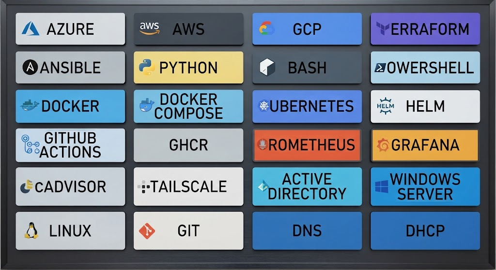

# ☁️ Cloud & DevOps Lab Portfolio

>[!WARNING]
>Da sich meine Deutschkenntnisse derzeit noch auf einem grundlegenden Niveau befinden, habe ich diese deutsche Version mit Unterstützung künstlicher Intelligenz erstellt. Auf diese Weise möchte ich sicherstellen, dass die Inhalte möglichst klar und verständlich vermittelt werden. Vielen Dank für Ihr Verständnis.


Dies ist ein praxisorientiertes Portfolio, das meine Entwicklung vom IT Support hin zu Cloud Infrastructure und DevOps dokumentiert.

Der Schwerpunkt dieses Portfolios liegt auf dem Aufbau, der Konfiguration, der Fehlerbehebung und der Automatisierung realer Infrastrukturen anstatt ausschließlich auf theoretischem Lernen.

Unten ist eine visuelle Übersicht der Umgebungen, mit denen ich gearbeitet habe:



---

## ☁️ Cloud-Plattformen

### Microsoft Azure

Praxisorientiertes Azure-Infrastruktur-Lab mit folgenden Themen:

* Azure Virtual Networks
* Subnetze
* Network Security Groups
* Virtuelle Maschinen
* Routing
* Private Endpoints
* Managed Identities
* Azure Storage
* Azure CLI
* Windows Server

[Azure Lab ansehen →](az/readme.en.md)

---

### Amazon Web Services

Praxisorientiertes AWS-Infrastruktur-Lab mit folgenden Themen:

* VPC
* Öffentliche und private Subnetze
* Internet Gateway
* Route Tables
* EC2
* Application Load Balancer
* Security Groups
* IAM
* Systems Manager
* VPC Endpoints
* CloudWatch
* SNS
* S3
* Multi-AZ-Architektur

Die Infrastruktur wird mit Terraform verwaltet.

[AWS Lab ansehen →](aws/readme.en.md)

---

### Google Cloud Platform

Praxisorientiertes GCP-Infrastruktur-Lab mit folgenden Themen:

* VPC
* Öffentliche und private Subnetze
* Compute Engine
* Global Application Load Balancer
* Managed Instance Group & Autoscaling
* Cloud Storage & Lifecycle Management
* IAM & Service Accounts
* Cloud DNS
* Private Google Access
* Cloud Monitoring & Alerting
* Backup & Disaster Recovery
* Private Konnektivität zwischen AWS und GCP

[GCP Lab ansehen →](gcp/readme.en.md)

---

## 🪟 Windows & Identity

### Active Directory

Praxisorientierte Windows-Server- und Active-Directory-Umgebung mit folgenden Themen:

* Active Directory Domain Services
* DNS
* DHCP
* Group Policy
* Organizational Units
* Benutzer- und Computerverwaltung
* PowerShell
* Windows Server Administration

[Active Directory Lab ansehen →](ad/readme.en.md)

---

## 🔗 Hybrid Cloud

### Azure + AWS + Active Directory + Tailscale

Ein Hybrid-Infrastrukturprojekt, das Cloud-Plattformen mit On-Premises-Identität und Infrastruktur verbindet.

Der Schwerpunkt liegt auf:

* Hybrid Identity
* Active-Directory-Integration
* Azure
* AWS
* Tailscale
* DNS
* Networking
* Cloud Connectivity
* Plattformübergreifender Infrastruktur

[Hybrid Cloud Lab ansehen →](hybrid/readme.en.md)

---

## 🏗️ Infrastructure as Code

### Terraform

Praxisorientierte Infrastructure-as-Code-Arbeit mit Fokus auf die Verwaltung von Cloud-Infrastruktur durch deklarative Konfiguration.

Aktuelle Themen:

* AWS-Infrastruktur
* VPC Networking
* EC2
* Load Balancing
* IAM
* Monitoring
* Storage
* Variablen und Locals
* Data Sources
* Resource Dependencies
* Terraform State Management
* Infrastructure Planning und Deployment

[Terraform Lab ansehen →](terraform/readme.en.md)

---

## ⚙️ Automation & Configuration Management

### Ansible

Praxisorientierte Konfigurationsverwaltung und Automatisierung mit Ansible.

Aktuelle Themen:

* Ansible Roles
* Playbooks
* Service Management
* Paketinstallation
* Templates
* Handler
* UFW Firewall Configuration
* Idempotente Konfiguration

[Ansible Lab ansehen →](ansible/readme.en.md)

### Python

Wird für Cloud-Automatisierung und Infrastrukturaufgaben eingesetzt, einschließlich AWS/GCP Inventory, Health Checks, JSON-Reporting, API-Nutzung und automatisierten Tests.

### Bash

Wird für Linux-Systemadministration und Automatisierungsaufgaben eingesetzt.

### PowerShell

Wird für Windows-Systemadministration, Active Directory und Automatisierungsaufgaben eingesetzt.

---

## 🐳 Container

### Docker

Praxisorientierte Arbeit mit Containerisierung, insbesondere zum Erstellen, Ausführen und Verwalten containerisierter Anwendungen.

Aktuelle Themen:

* Docker Images und Container
* Dockerfiles und Multi-Stage Builds
* Volumes und Networks
* Docker Compose
* Nginx und PostgreSQL
* Docker Security und Secrets
* Docker Hub und CI/CD

[Docker Lab ansehen →](docker/readme.en.md)

---

## ☸️ Container-Orchestrierung

### Kubernetes

Praxisorientiertes Kubernetes-Lab mit folgenden Themen:

* Pods, Deployments & Services
* ConfigMaps & Secrets
* Storage & Networking
* Ingress & NetworkPolicies
* HPA & RBAC
* StatefulSets, DaemonSets & Jobs
* Helm
* Production Deployment & Troubleshooting

[Kubernetes Lab ansehen →](kubernetes/readme.en.md)

---

## 🔄 CI/CD

### GitHub Actions

Praxisorientierte CI/CD-Automatisierung mit GitHub Actions.

Aktuelle Themen:

* Automatisierte Tests
* Docker Image Builds
* GitHub Container Registry
* Self-hosted Runner
* Automatisiertes Deployment
* CI/CD Pipelines

[CI/CD Lab ansehen →](cicd/readme.en.md)

---

## 📊 Monitoring & Observability

### Prometheus & Grafana

Praxisorientiertes Monitoring-Setup für containerisierte Umgebungen.

Aktuelle Themen:

* Prometheus
* PromQL
* cAdvisor
* Container-Metriken
* CPU- und RAM-Monitoring
* Netzwerk-Metriken
* Grafana Dashboards
* Alerting
* Docker Monitoring

[Monitoring Lab ansehen →](monitor/readme.en.md)

---

## 📝 Cloud System Comparisons

Praxisorientierter Vergleich der Cloud-Plattformen, mit denen ich gearbeitet habe, anhand folgender Kriterien:

* GUI / Console Experience
* Benutzerfreundlichkeit der Navigation
* Dokumentation
* CLI Experience
* Networking
* IAM und Berechtigungen
* Monitoring
* Troubleshooting
* Lernkurve
* Allgemeine Benutzererfahrung

[Website ansehen →](hm/readme.en.md)

---

## 🛠️ Technologien

**Cloud**

Azure · AWS · GCP

**Infrastructure as Code**

Terraform

**Automation & Configuration Management**

Ansible · Python · Bash · PowerShell

**Container**

Docker · Kubernetes

**CI/CD**

GitHub Actions

**Monitoring & Observability**

Prometheus · Grafana · cAdvisor

**Networking**

VNet · VPC · Subnets · Routing · NSGs · Security Groups · Load Balancing · DNS · Tailscale

**Identity & Systems**

Active Directory · IAM · Windows Server · Linux · Group Policy

---

## 🎯 Lernpfad

```text
IT Support
    │
    ▼
Microsoft Azure
    │
    ▼
Active Directory
    │
    ▼
   AWS
    │
    ▼
Hybrid Cloud
    │
    ▼
Terraform
    │
    ▼
  Docker
    │
    ▼
Kubernetes
    │
    ▼
Automation & CI/CD
    │
    ▼
Monitoring
    │
    ▼
Cloud / DevOps
```

---

## 📌 Über dieses Portfolio

Dieses Portfolio dokumentiert praxisorientierte Labs, die ich während der Entwicklung meiner Kenntnisse im Bereich Cloud Infrastructure und DevOps aufgebaut habe.

Jedes Projekt dient dazu, praktische Kenntnisse durch Konfiguration, Testing, Troubleshooting und Automatisierung zu vertiefen.

Das Portfolio wird kontinuierlich weiterentwickelt, während neue Technologien und Projekte hinzukommen.
